## Introducción

En algunos casos, una fuente puede carecer de un glifo que es esencial para su uso en tu aplicación. Las fuentes árabes presentan problemas especiales aquí, porque la forma del glifo depende no solo de su posición en la palabra, sino también de los atributos de la propia letra. Así, usando la secuencia sin sentido *babab*, la letra *beh* tiene tres formas diferentes dependiendo de si aparece inicialmente, en el medio o al final. Sin embargo, usando la secuencia sin sentido *dadad*, la letra *dal* tiene una sola forma, no importa dónde ocurra en la palabra.

Las fuentes bajo licencias abiertas (por ejemplo, [GPL](http://gnu.org/copyleft/gpl.html) u [OFL](http://scripts.sil.org/OFL-FAQ_web)) permiten al usuario realizar modificaciones. Si adaptas una fuente que estaba originalmente bajo una licencia abierta y luego la distribuyes, debes conservar los avisos de derechos de autor e información de licencia del autor original, aunque puedes añadir una nota al final del aviso de derechos de autor cubriendo tu contribución.

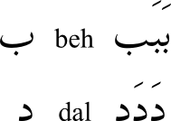

Este capítulo te guía a través de la adición de un glifo a una fuente árabe. La fuente que usaremos es [Graph](http://openfontlibrary.org/en/font/graph), y el glifo que añadiremos es *peh* (U+067E), que no ocurre en el árabe mismo, pero designa *p* en algunos idiomas para los que se usa la escritura árabe. (Para una lista completa de los glifos disponibles para la escritura árabe, ver las [tablas Unicode](http://www.unicode.org/charts)).

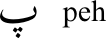

## Haz una copia de trabajo de la fuente

Descarga la fuente de la página web y descomprímela. Inicia FontForge y carga la fuente. Guárdala como un archivo *sfd*, editando el nombre sugerido para que diga **GraphNew.sfd** antes de guardar.

## Renombra la fuente

### ¿Por qué debo renombrar la fuente?

Si no renombras la fuente, tu fuente adaptada no se instalará por separado de la original &mdash; tendrás que desinstalar la fuente original primero. También es sensato renombrar la fuente si vas a distribuir tus adaptaciones &mdash; si el autor original de la fuente ha reservado el nombre de la fuente bajo el mecanismo de Nombre de Fuente Reservado (Reserved Font Name - RFN), ese nombre original solo puede usarse con la versión de la fuente del autor original.

### Cambia los datos del nombre

Selecciona **Element > Font Info** (Elemento > Información de la fuente), y en el panel *PS Names* (Nombres PS), cambia *Fontname*, *Family Name*, y *Name For Humans* a **GraphNew**.

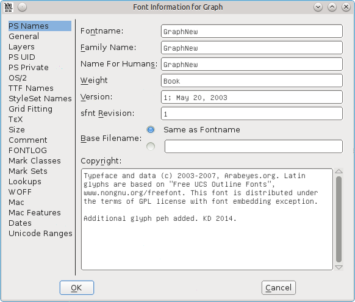

Si lo deseas, puedes colocar un mensaje 'Additional glyphs added by' (Glifos adicionales añadidos por) después del texto que ya está en la entrada para *Copyright*.

En el panel *TTF Names* (Nombres TTF), los nombres para *Family* y *Fullname* se toman de las entradas de *PS Names*, y ya deberían estar mostrando *GraphNew* (no puedes editarlos directamente). Cambia las entradas para *Preferred Family* y *Compatible Full* a **GraphNew**. Estos cambios de nombre ahora te permitirán instalar esta fuente junto con la original si lo deseas.

Si lo deseas, puedes colocar un mensaje 'Additional glyphs added by' después del texto que ya está en la entrada para *Designer* (Diseñador).

Haz clic en **OK** para guardar estos cambios. Recibirás un mensaje sobre la generación de un nuevo UniqueID (XUID) para la fuente &mdash; haz clic en **Change** (Cambiar).

## Añade el glifo para la forma aislada de *peh*

Ve a la sección árabe de la tabla de fuentes: selecciona **View &mdash; Go to** (Ver &mdash; Ir a), haz clic en el cuadro desplegable y selecciona **Arabic**, luego haz clic en **OK**.

Hacer clic en una celda en la tabla de fuentes mostrará su número Unicode y nombre en azul en la parte superior del panel. Ve a la posición 1662, que se mostrará en azul como *1662 (0x67e) U+067E "uni067E" ARABIC LETTER PEH*. La celda debajo del glifo de referencia contiene una X gris, mostrando que la fuente no incluye este glifo.

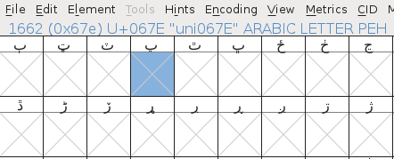

Haremos *peh* copiando *beh* (U+0628) y cambiando su único punto por tres puntos.

Haz clic en la celda *beh* (posición 1576), luego haz clic derecho y selecciona **Copy** (Copiar). Luego haz clic derecho en la celda *peh* y selecciona **Paste** (Pegar). Ahora que *beh* está copiado en la celda *peh*, lo siguiente es cambiar el punto.

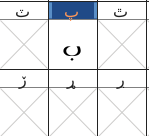

Encuentra un glifo con tres puntos &mdash; *sheen* (posición 1588, U+0634) servirá. Haz doble clic en la celda &mdash; esto abrirá un panel de diseño de glifo. Presiona <kbd>V</kbd> para asegurar que la herramienta de puntero (punta de flecha) en la caja de herramientas esté seleccionada, y presiona <kbd>Z</kbd> y agranda el panel para darte una buena vista del glifo.

Haz clic y arrastra para que los nodos de los tres puntos sobre sheen cambien de color de rosa a beige. Si accidentalmente incluyes u omites un nodo, deselecciónalo o selecciónalo presionando <kbd>Shift</kbd> y haciendo clic. Presiona <kbd>Alt</kbd> + <kbd>C</kbd> para copiar.

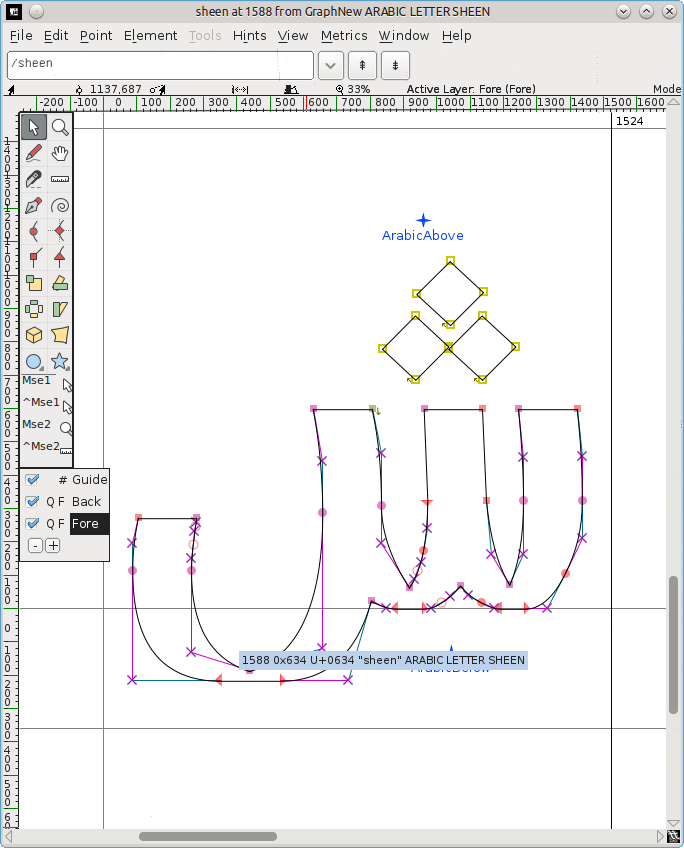

Vuelve a la tabla de fuentes y haz doble clic en la celda *peh* &mdash; esto cargará *peh* en otra pestaña en el panel de diseño de glifo, junto a la pestaña *sheen*.

Haz clic y arrastra para resaltar el punto debajo de *peh*, luego presiona <kbd>Delete</kbd>. Presiona <kbd>Alt</kbd> + <kbd>V</kbd> para pegar los tres puntos, que probablemente aparecerán sobre el cuerpo de *peh*. Deja los nodos de los puntos resaltados para que puedas invertirlos y moverlos más fácilmente.

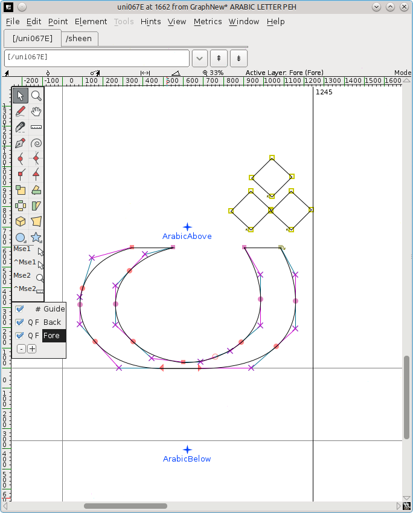

Invierte los puntos: selecciona la herramienta de voltear (dos triángulos con una línea discontinua roja entre ellos) de la caja de herramientas. (Alternativamente, haz clic derecho en el medio de los puntos, y selecciona **Flip the selection** (Voltear la selección) del menú emergente). Haz clic en uno de los nodos de los puntos y arrastra el ratón ligeramente a la izquierda o derecha.

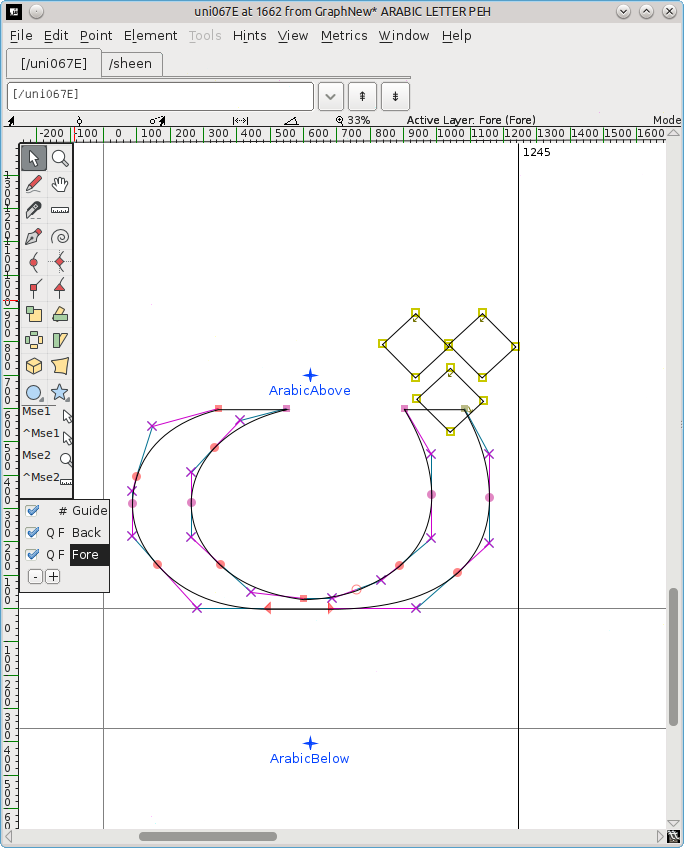

Mueve los puntos invertidos: presiona <kbd>V</kbd> para seleccionar la herramienta de puntero de nuevo, haz clic en uno de los nodos de los puntos, y arrástralos hacia abajo debajo del cuerpo del glifo. Posiciónalos centralmente, sobre la marca *ArabicBelow*.

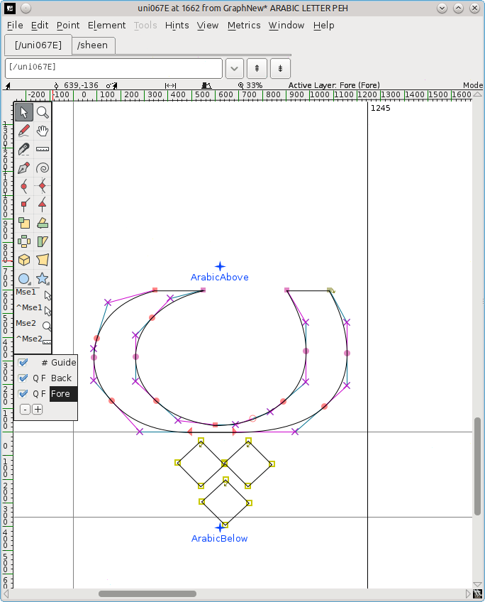

Cierra el panel de diseño de glifo. Ahora debería haber un nuevo glifo para *peh* en la tabla de fuentes. Guarda la fuente adaptada (**File > Save**).

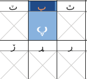

## Añade los glifos para las formas conectadas de *peh*

Sin embargo, esta es solo la forma aislada del glifo. Si intentas usar tu fuente adaptada, encontrarás que las formas inicial, media y final no están disponibles. Estas tienen que crearse por separado.

>Estas formas se construyen como glifos no codificados (glifos cuya codificación es -1 en las convenciones de FontForge). No tienen ranuras predefinidas." (Khaled Hosny)

Selecciona **Encoding > Add Encoding Slots** (Codificación > Añadir ranuras de codificación) e introduce el número de glifos que quieres &mdash; en este caso, 3. FontForge añadirá el mismo número de ranuras al final de la fuente, y serás movido allí en la tabla de fuentes. Las últimas tres celdas (posiciones 65537, 65538, 65539) tienen un signo de interrogación como glifo de referencia, y es en esas celdas donde añadirás los glifos no codificados repitiendo el proceso anterior.

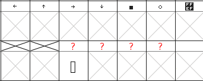

Ten en cuenta que si por error empiezas a escribir cuando la tabla de fuentes todavía tiene el foco, te mueves a la sección europea en la parte superior. Para volver al final, selecciona <strong>View > Go to</strong>, haz clic en el cuadro desplegable y selecciona <strong>Not a Unicode Character</strong>, y luego haz clic en <strong>OK</strong>.

### Crea la forma final

Sube un poco la tabla de fuentes hasta que llegues a un conjunto de glifos árabes en la posición 65152 (U+FE80) en adelante. En U+FE90 (posición 65168) verás un glifo *behfinal* &mdash; haz clic en él y presiona <kbd>Ctrl</kbd> + <kbd>C</kbd> para copiarlo. Baja hasta la antepenúltima celda en la tabla (posición 65537), haz clic en ella, y presiona <kbd>Ctrl</kbd> + <kbd>V</kbd> para pegar el glifo *behfinal*.

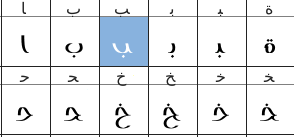

Haz clic derecho en la celda y selecciona **Glyph Info** (Info de glifo). La convención de nomenclatura es usar el número del glifo aislado + un sufijo para la forma, así que cambia *Glyph Name* a **uni067E.fina**, y haz clic en **OK**. El signo de interrogación en la celda de referencia cambiará a *peh*.

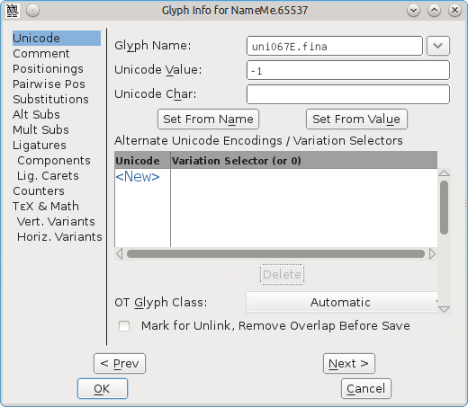

Obtén los tres puntos: haz doble clic en *sheen* (U+FEB5) para cargarlo en el panel de diseño de glifo, selecciona los tres puntos y presiona <kbd>Ctrl</kbd> + <kbd>C</kbd>.

Haz doble clic en el nuevo *pehfinal* para cargarlo en el panel de diseño de glifo, haz clic y arrastra para resaltar los nodos del punto y presiona <kbd>Delete</kbd>.

<kbd>Ctrl</kbd> + <kbd>V</kbd> para insertar los tres puntos de *sheen*, voltéalos, y muévelos a su posición debajo del cuerpo del glifo. Presiona <kbd>Ctrl</kbd> + <kbd>S</kbd> para guardar la tabla de fuentes revisada.

### Crea las formas inicial y media

Copia la forma inicial U+FE91 (posición 65169) a la penúltima celda (posición 65538), elimina el punto único y pega los tres puntos.

Haz clic derecho en la celda, selecciona **Glyph Info**, cambia *Glyph Name* a **uni067E.init**, y haz clic en **OK**.

Copia la forma media U+FE92 (posición 65170) a la última celda (posición 65539), elimina el punto único y pega los tres puntos.

Haz clic derecho en la celda, selecciona **Glyph Info**, cambia *Glyph Name* a **uni067E.medi**, y haz clic en **OK**.

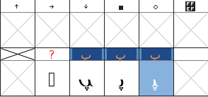

Selecciona **File > Save** para guardar la tabla de fuentes revisada.

## Añade las búsquedas (lookups)

La forma aislada tiene que estar mapeada (vinculada) a sus formas inicial, media y final.

Selecciona **Element > Font Info > Lookups** (Elemento > Información de la fuente > Búsquedas).

Haz clic en el **+** al lado de la entrada *'init' Initial Forms in Arabic lookup 2*. Esto abrirá un submenú del mismo nombre. Haz clic en este submenú.

El botón *Edit Data* a la derecha ahora estará disponible &mdash; haz clic en él.

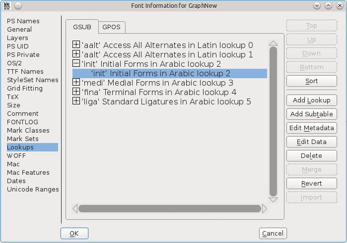

En el panel *Lookup Subtable* que aparece, asegúrate de que el botón *Unicode* esté marcado. Baja la lista de caracteres hasta que llegues al final.

En el cuadro al lado de *Default Using Suffix* (Predeterminado usando sufijo), introduce el sufijo relevante (en este caso, **init**), y luego haz clic en **Default Using Suffix**.

Se añadirá un nuevo mapeo a la lista de caracteres, de uni067E (la forma aislada de *peh*) a uni067E.init (la forma inicial).
Haz clic en **OK**.

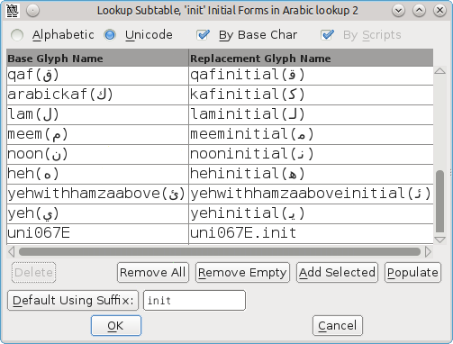

Haz lo mismo para los submenús bajo las entradas *'medi' Medial Forms in Arabic lookup 2* y *'fina' Terminal Forms in Arabic lookup 2*, eligiendo *medi* y *fina* como el sufijo relevante.

Haz clic en **OK** de nuevo para cerrar el panel, y guarda la tabla de fuentes (<kbd>Ctrl</kbd> + <kbd>S</kbd>).

Ten en cuenta que *Default Using Suffix* solo parece funcionar en glifos en el bloque Unicode 06 (*Arabic*) &mdash; los glifos en Unicode 07 (*Arabic Supplement*), por ejemplo *ain* con dos puntos pueden tener que añadirse manualmente haciendo clic en la línea marcada *New* y escribiendo los nombres.

### Genera la fuente adaptada

Selecciona **File > Generate Fonts** (Archivo > Generar fuentes).

En el menú desplegable que muestra *PS Type 1 (Binary)*, selecciona **TrueType**, y comprueba que el nombre de archivo dice *GraphNew.ttf*.

Navega a donde quieras guardar la fuente, y luego haz clic en **Generate** (Generar). Haz clic en **Yes** y **Generate** a los dos mensajes de información que aparecen.

Luego puedes usar tu procedimiento normal de instalación de fuentes para instalar la fuente adaptada. El nuevo glifo *peh* se puede usar entonces junto con los glifos existentes en los mismos ejemplos sin sentido que al principio de este capítulo:

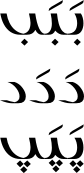

Ten en cuenta que si estás usando una fuente en LibreOffice y haces cambios a esa fuente, necesitas reiniciar LibreOffice para que vea cualquier cambio &mdash; de lo contrario usará la versión anterior de la fuente, y no la que tiene los nuevos cambios.

Gracias a [Khaled Hosny](http://khaledhosny.org) por su consejo sobre el uso de FontForge para editar glifos árabes.

## Lecturas adicionales

* [Este hilo sobre auto-hinting árabe mejorado](http://lists.nongnu.org/archive/html/freetype-devel/2015-08/msg00016.html) tiene un consejo sobre cómo dibujar las partes superpuestas de los glifos árabes.
