La creación de las letras mayúsculas debe seguir un patrón muy similar a la creación de las letras minúsculas. Empiezas diseñando letras clave cuyas formas y características se presten al diseño de caracteres que compartan una forma común. Al igual que con las letras minúsculas, la frecuencia con la que se usan las letras también sigue siendo un factor importante en la elección de las letras.

Las dos primeras letras a diseñar son "H" y "O". El diseño de estas letras no debe ser solo en relación entre sí, sino también en relación con las letras minúsculas existentes.

Es en esta etapa donde determinas la proporción de las minúsculas con respecto a las mayúsculas. Puedes querer ajustar las ascendentes y descendentes de tus minúsculas o ajustar tus mayúsculas a las minúsculas para crear la proporción que se adapte al propósito de tu diseño.

El peso de los trazos en las mayúsculas a menudo necesita ser algo más pesado que los trazos de las minúsculas. Puedes querer crear un experimento de interpolación para encontrar rápidamente cuánto más pesados deben ser.

El siguiente conjunto de letras a considerar añadir son A E S I N y o bien P o D y tal vez V.

Dependiendo del estilo de la fuente que estés haciendo, puedes encontrar que las letras mayúsculas requieren más variación en anchura que la que tienes en las letras minúsculas. La anchura de la E, S y P puede ser sustancialmente más estrecha que la H o puede ser similar.

Generalmente la N y V son similares a la H pero ligeramente más anchas.

<table border="0" cellpadding="13"><tbody><tr><td>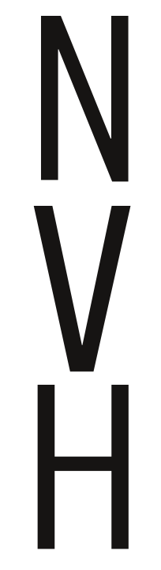</td>
<td>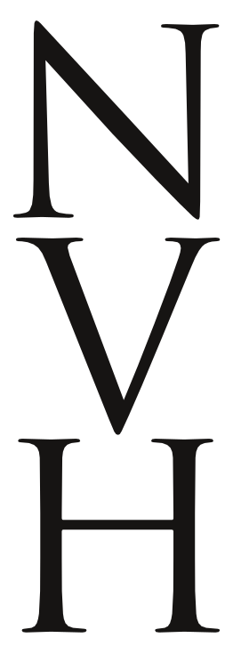</td>
<td>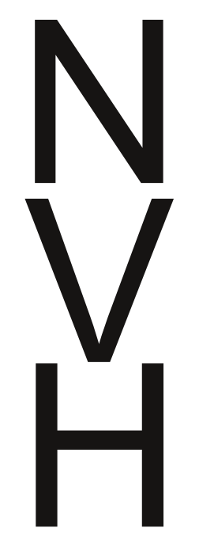 </td>
</tr></tbody></table>

La D puede ser similar a la H o bastante más ancha.

<table border="0" cellpadding="13"><tbody><tr><td>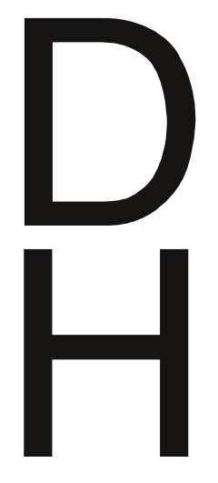</td>
<td> 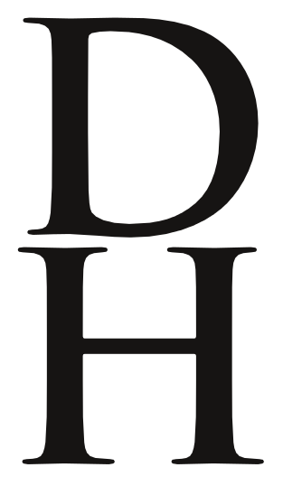</td>
<td> 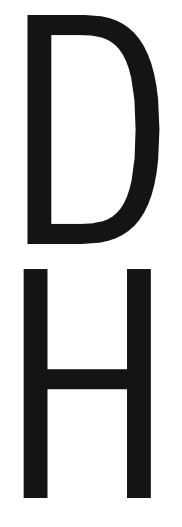</td>
</tr></tbody></table>

La forma de la O puede decirte bastante sobre la C, G y Q. La forma de la H te dice un poco sobre la I y J y el lado izquierdo de B D E F K L P R.

También te dice un poco sobre la T y U. La forma de la A puede decirte bastante sobre la forma de la V.

<table border="0" cellpadding="13"><tbody><tr><td>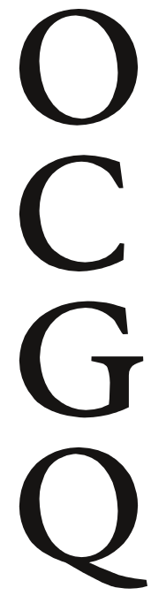</td>
<td style="text-align: center;"> 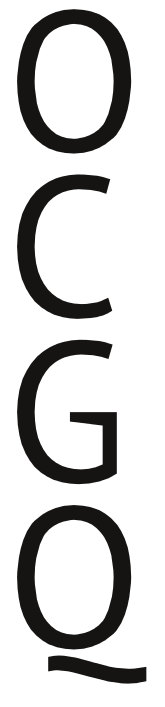</td>
<td>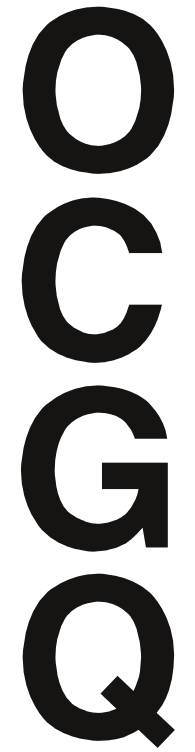</td>
</tr><tr><td></td>
<td>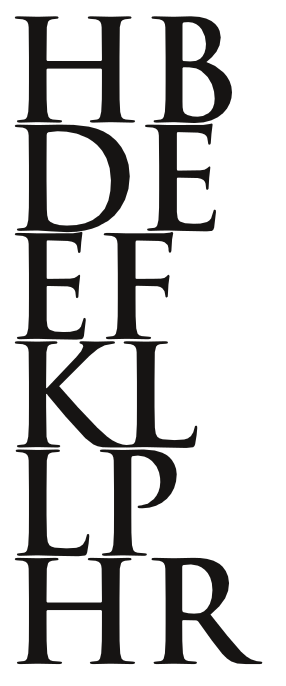</td>
<td>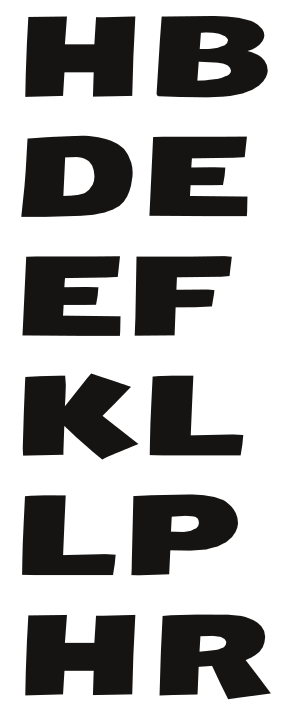</td>
</tr></tbody></table>

La forma y proporciones de la V te dicen un poco sobre cómo diseñar Y W X. La forma de la Z es distintiva.

<table border="0" cellpadding="13"><tbody><tr><td>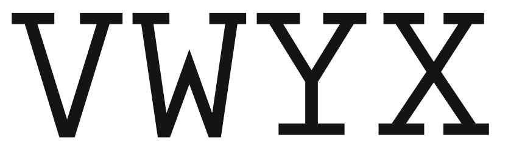</td>
</tr><tr><td> 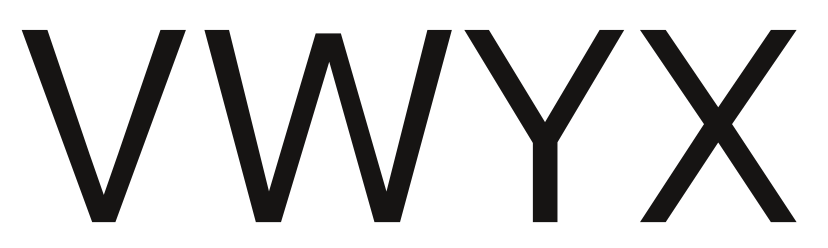</td>
</tr><tr><td> 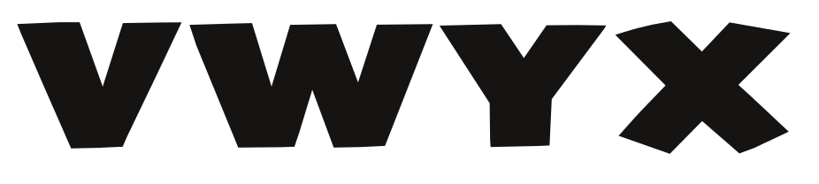</td>
</tr><tr><td> 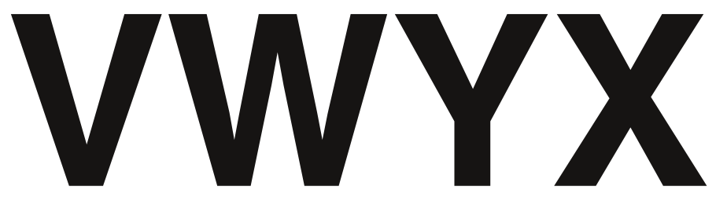</td>
</tr></tbody></table>
