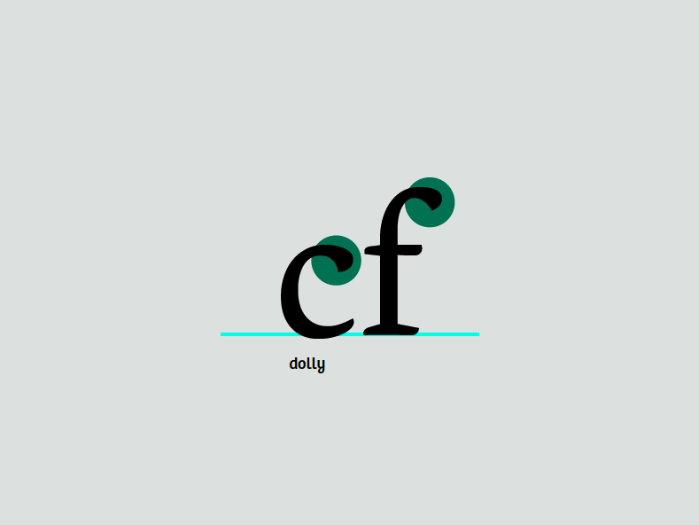
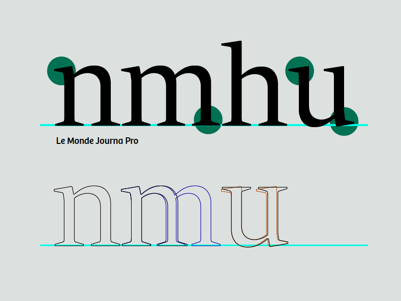
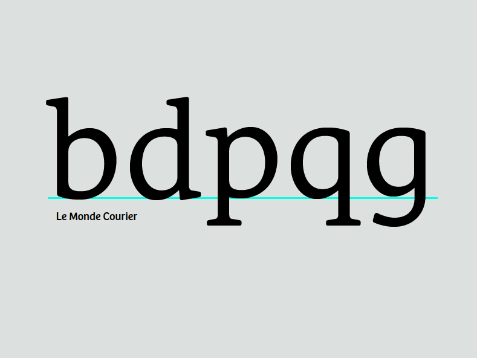
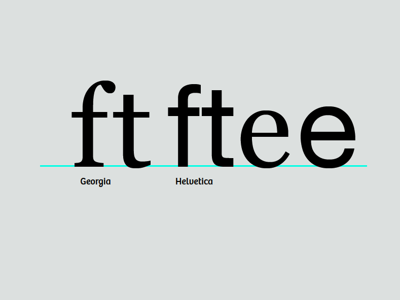
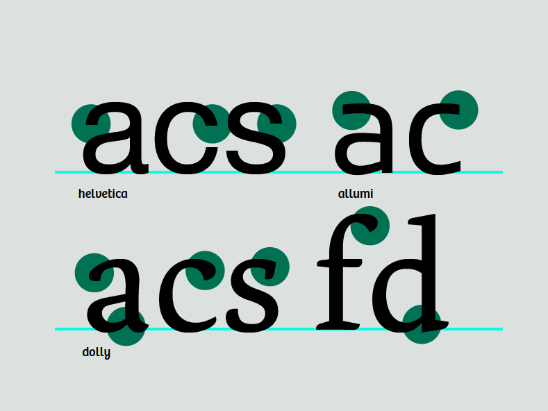
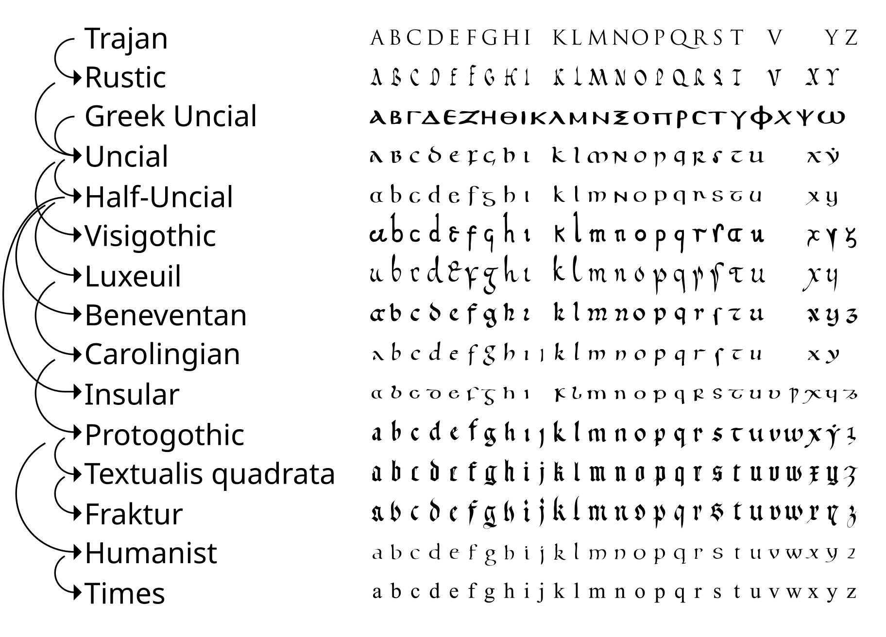

Es posible que hayas notado en las fuentes que has visto antes que, aunque cada letra tiene su propia forma, todas se relacionan entre sí. Al deconstruir cuidadosamente unos pocos glifos, obtienes los bloques de construcción de casi todos los demás.

Observa la similitud entre los terminales superiores en esta c y f:

Sus formas indican que pertenecen al mismo grupo, aunque sean sutilmente diferentes. Los terminales son uno de los rasgos identificativos de una fuente, y generalmente se repiten en muchas de las formas de las letras.

Sin embargo, la dependencia excesiva de la modularidad muestra sus propias marcas en un diseño, y por lo tanto debe evitarse &mdash; a menos que ese sea el aspecto que deseas.

## Procediendo con las otras letras minúsculas

Ya has hecho tu letra 'n'. A partir de ella, puedes derivar fácilmente la 'm', la 'h' y la 'u' clonando, estirando y rotando, respectivamente. Hay cambios sutiles en el espaciado de las astas en la 'm' y la 'u'. En la imagen de abajo, la 'u' ha cambiado no solo su espaciado sino sus serifas. Esto no sucede automáticamente; depende de ti entrar ahí y empujar los puntos.

La 'i' se puede derivar del asta de la 'n'. La 'l' se puede hacer a partir del asta de la 'n' con algunos ajustes.

### Haciendo la 'd' a partir del asta de la 'h' y la 'o'

Abre la ventana de glifo para la letra 'd' haciendo doble clic debajo de la 'd' en la vista de fuente. Desde la vista de fuente, copia la 'o' y pégala en la ventana de glifo para la letra 'd'. Luego haz lo mismo para la 'h'. En este punto puedes eliminar la parte de la 'h' que no vas a usar. Coloca las piezas restantes juntas para que se parezcan a una 'd'.

Claramente, hay más trabajo que hacer aquí. Haremos algunos ajustes. Estrecha el lado derecho de la 'o' donde se encuentra con el asta.

Para mejorar el espaciado óptico y permitir que la forma se vea más equilibrada, haz un poco de espacio en la serifa añadiendo un punto al asta y empujando los puntos inferiores hacia la derecha.

A continuación se muestra una superposición de la forma inicial y la nueva forma.

Ahora que sabes cómo ensamblar a partir de partes existentes, puedes hacer otras letras similares. Ten en cuenta las sutilezas que hacen que cada letra sea individual, pero aún parte de una familia.

### Derivando la 'b', 'p' y 'q'

Ahora que tienes la 'd', volteando y rotando puedes hacer una 'b', 'p' y 'q' razonables. De nuevo, sé consciente de cómo las serifas y el contraste difieren en cada letra. Tu fuente no tiene que hacer esto exactamente de la misma manera, pero es una de las cosas en las que debes pensar.

### Haz la 'g'

Puedes empezar con la 'q', estirando y alterando la cola, para hacer la 'g' de un solo anillo. Ninguna forma se parece mucho a la 'g' binocular (de dos anillos). La 'g' binocular generalmente necesita ser notablemente más ligera para verse bien cuando se coloca con otras letras.

### Pasando a la 'f' y la 't'

La 't' tiene una ascendente, pero generalmente es más corta que las ascendentes de las otras letras minúsculas. En comparación, la 'f' es mucho más alta y generalmente invade el espacio de la letra de al lado. Ambas tienen barras transversales que generalmente están a la misma altura, anchura y grosor. A menudo puedes copiar de una a otra.

### Ahora haz la 'e'

La 'e' se basará libremente en la 'o'. La barra transversal de la 'e' es más baja que la de la 't', pero tiene el mismo grosor. El gancho en la parte inferior de la 'e' se basará en la parte inferior de la 't'.

### De la 'e' viene la 'c'

Crear la 'c' a partir de la 'e' implica eliminar la barra transversal y añadir el terminal en la parte superior. El terminal superior de la 'c' puede ser similar a los terminales superiores de otras letras como la 'a', 'f' y 'r'. Los terminales de la 'c' también pueden formar la base para la 's'. La 'e' también puede influir en las proporciones de tu 'a'.

### 'v', 'w', 'x', 'y' y 'z'

Estas letras son algo difíciles porque no tienen formas que estén relacionadas con las otras letras. Esto significa que tienes que lanzarte y dibujar la 'v'. Haz el trazo descendente tan grueso como tus astas gruesas, y haz el trazo ascendente tan delgado como los trazos más delgados en tus otras letras. Una vez que tienes la 'v', tienes un plan básico para la 'w' y la 'y'. Para la 'x' y la 'y', concéntrate en coincidir con el contraste del resto del diseño mientras compensas las ilusiones que ocurren en las formas diagonales y diagonales cruzadas.

### Relación con las mayúsculas

Mientras trabajas en las minúsculas, puede ser útil recordar que sus formas resultan de un proceso de siglos mediante el cual las letras mayúsculas romanas, con sus robustas serifas, fueron cambiando gradualmente para hacer más fácil escribirlas rápidamente en cursiva con una pluma. La re-adición de serifas a estas formas cursivas, ahora ampliamente aceptada, era en ese momento históricamente anacrónica.

<figure>

<figcaption>Crédito de la imagen: Matteo P. Ferla (Usuario:Squidonius), <a href="https://commons.wikimedia.org/wiki/File:Evolution_of_minuscule.svg">Wikimedia Commons</a></figcaption>
</figure>
