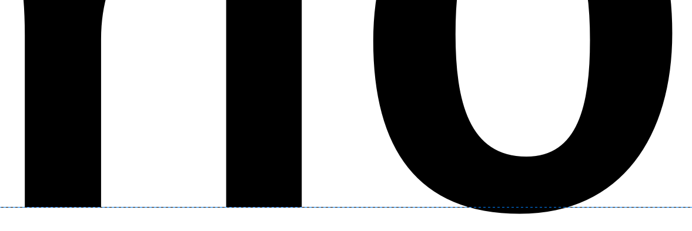
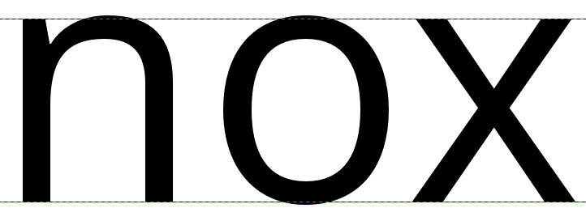
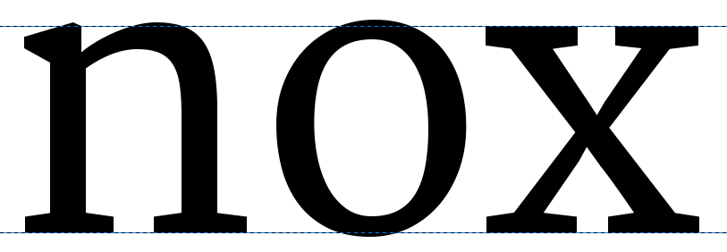
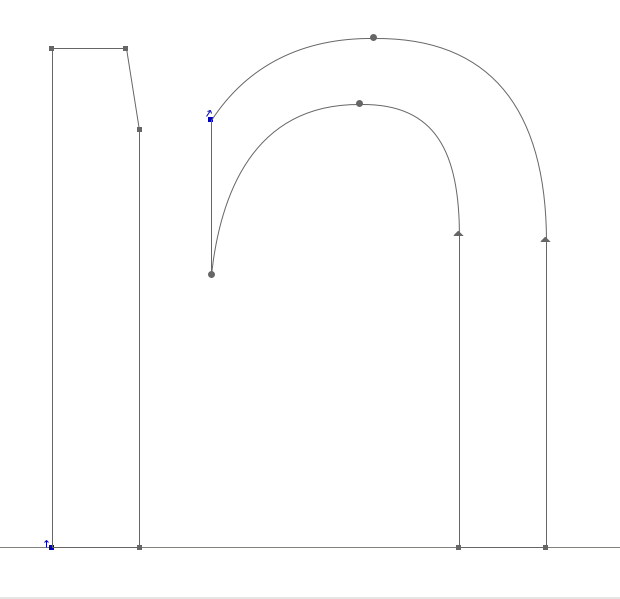
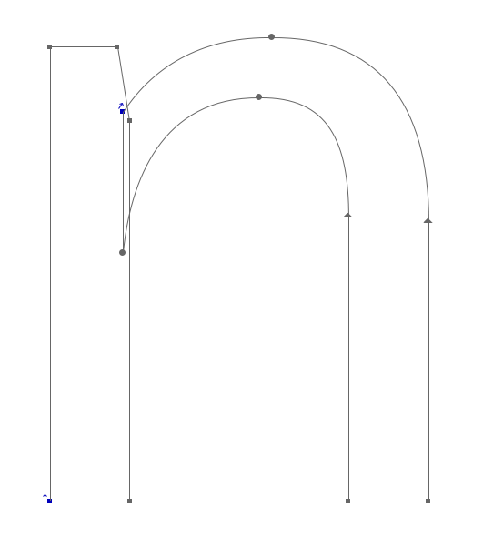
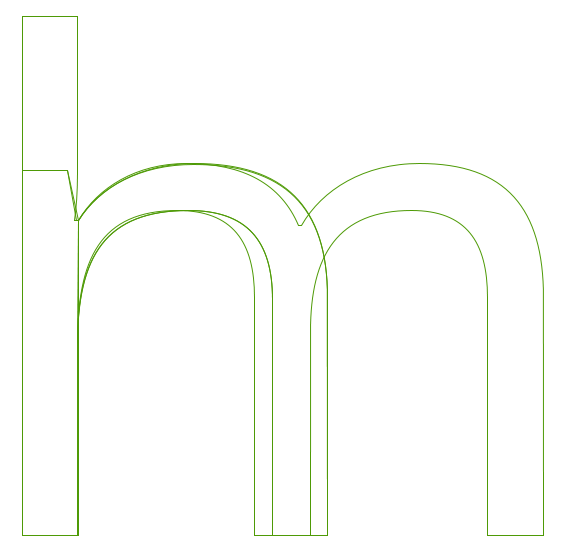
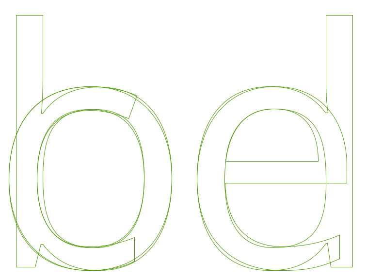
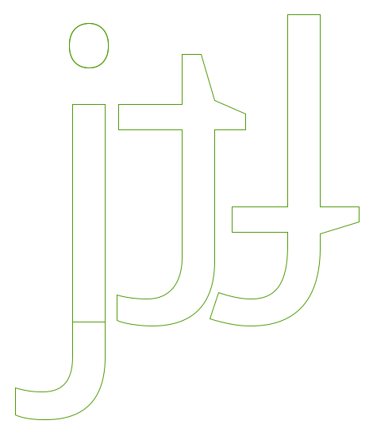

Hay muchos enfoques para diseñar una fuente. Puede ser útil deconstruir los procesos más grandes involucrados para empezar rápidamente, y proporcionar una base sólida para los caracteres de toda una fuente.
Un enfoque popular y valioso para esto es diseñar primero los caracteres ‘o’ y ‘n’, concretando elementos esenciales de forma, espacio y equilibrio, antes de unirlos para la formación de otros caracteres. Crear los caracteres ‘o’ y ‘n’ minúsculos puede proporcionarnos algunas de las formas y estructuras fundamentales que sustentarán todos los demás caracteres que se necesiten.

Aunque el diseño de la ‘o’ puede parecer algo bastante simple, todas las características mencionadas en el capítulo [“¿Qué es una fuente tipográfica?”] entran en juego. La elección que hagas sobre cada característica debe ser una elección deliberada.

## Rebases inferiores y superiores (Underhangs and Overshoots)

Una forma en que los efectos ópticos impactan en el diseño tipográfico es en cómo aparecen las curvas y los bordes rectos al ojo.
Por ejemplo, para que una curva y un borde recto parezcan estar alineados correctamente en la [línea base](Glossary.md#Baseline), la curva debe situarse en realidad un poco por debajo de la línea, produciendo un [*rebase inferior*](Glossary.md#Undershoot) (undershoot). La porción del carácter que se sumerge justo debajo de la línea base para parecer que está sentada en la línea base se llama [*rebase inferior*](Glossary.md#Underhang) (underhang) &mdash; demostrado abajo. Sin rebase inferior, los caracteres con curvas alrededor de la línea base parecerán desalineados dentro de una línea de texto.

De manera similar al rebase inferior, se necesita un área de *rebase superior* (overshoot) para proporcionar la ilusión de alineación en la [altura X](Glossary.md#X-height) y en la [altura de Mayúsculas](Glossary.md#Cap-height) (ver abajo).

## Diseñando la ‘o’ minúscula

El diseño de la ‘o’ no es solo una cuestión de la parte negra de la letra. Mientras que la ‘o’ proporciona el peso y la forma muy básicos del anillo (bowl), el blanco &mdash; o [contraforma](Glossary.md#Counter) &mdash; proporciona el tamaño y la forma utilizados por el resto de la fuente.
En términos generales, también podemos observar que la forma redonda de la ‘o’ se repetirá en otros caracteres. Estos incluyen la b, c, d, e, p, y q, y la forma también implicará la conformación y formas de curvas dentro de cualquier otro carácter de la fuente, como la O, C, D, y Q.

Además, el blanco dentro de la ‘o’ debe utilizarse al diseñar el espaciado de nuestra fuente; la ‘o’ establece el ritmo de referencia de los espacios utilizados entre todos los demás glifos en la fuente también. Estos dos valores están muy relacionados, así que esencialmente necesitarás diseñar la cantidad de espacio en blanco que son los [márgenes laterales](Glossary.md#Side_Bearing) de tu ‘o’ también. Como principio general, con la excepción de las fuentes inclinadas o cursivas, la ‘o’ debe tener la misma cantidad de espacio en los lados izquierdo y derecho, y el espacio en blanco entre una cadena de caracteres ‘o’ debe equilibrar el espacio en blanco dentro de las ‘o’s.

Aquí nos adentramos bien en el territorio del espaciado y la métrica, por lo que incluso en esta etapa temprana puedes querer echar un vistazo al capítulo [“Espaciado, métricas y kerning”], que cubre las implicaciones básicas del espaciado en una fuente.
Eso debería llevarte a un carácter ‘o’ bien espaciado, lo que te ayudará con el diseño de la ‘n’.

## Diseñando la ‘n’ minúscula

Una vez que estés contento con la forma y el espaciado de tu carácter ‘o’ minúsculo como se muestra con una cadena de muestra, el siguiente paso de este enfoque es crear una ‘n’ minúscula de forma adecuada, equilibrada y bien espaciada, que insertarás en tu cadena de ‘o’s.

Si miramos la anatomía de una ‘n’, podemos dividirla en dos o tres componentes que consisten en un [*fuste*](Glossary.md#Stem) (o asta) y una <i>curva</i>.
Este enfoque puede darnos un atajo para mantener el equilibrio y la armonía dentro de nuestros caracteres a medida que se forman, y a medida que nuestro conjunto de caracteres crece. Mirando la muestra de ‘n’ abajo; se divide en dos componentes. Estos componentes separados se combinan para formar una ‘n’, pero los mismos componentes pueden reutilizarse más tarde al formar otros caracteres; p.ej., el fuste a la izquierda de la ‘n’ puede usarse para formar el fuste del lado izquierdo de todos los demás caracteres minúsculos.

Llevándote hacia adelante de nuevo al capítulo sobre [“Espaciado, métricas y kerning”], el diseño del carácter ‘n’ debe mantener el ritmo con el proceso de espaciado de los caracteres ‘n’ y ‘o’ juntos.

Ahora, reuniendo los métodos que has utilizado para crear un carácter ‘n’ y ‘o’, estás listo para expandir el conjunto de caracteres minúsculos. Las cualidades de los componentes de fuste y curva de la ‘n’ y la ‘o’ informarán la forma en que puedes formar otros caracteres.
Si estudiamos los caracteres de abajo de [Open Sans], podemos ver las relaciones entre los aspectos formales de caracteres separados y cómo pueden repetirse, con algunos ajustes, para formar los componentes de nuestra fuente.

[“¿Qué es una fuente tipográfica?”]: What_Is_a_Font.html
[“Espaciado, métricas y kerning”]: Spacing_Metrics_and_Kerning.html
[Open Sans]: http://opensans.com/
