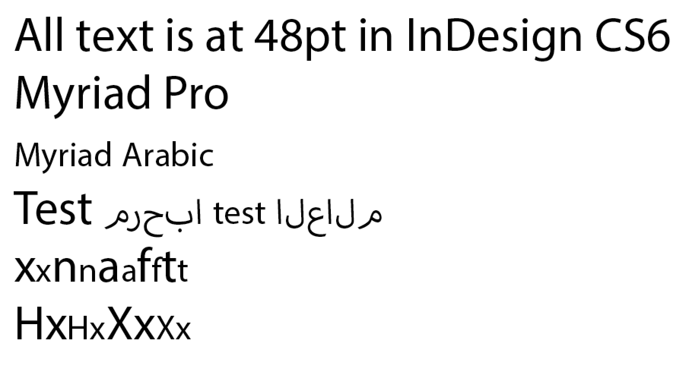
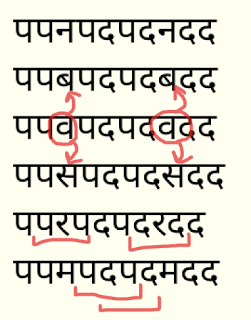

_Gracias a Adam Twardoch, Erin McLaughlin, Neelakash Kshetrimayum, Dan Reynolds, Pooja Saxena, Dr Girish Dalvi por contribuir con muchas de las ideas en esta página._

Diseñar una tipografía [Devanagari](http://en.wikipedia.org/wiki/Devanagari) nueva y original sigue un proceso muy parecido al proceso para una latina nueva y original. El beneficio único de _libre_ en las fuentes libres es que puedes modificarlas y reutilizarlas para nuevos propósitos que sus creadores iniciales nunca pensaron &mdash; por ejemplo, diseñar una Devanagari y adaptar una fuente latina existente para que vaya con ella.

## Glifos Devanagari

Las fuentes Devanagari contienen estos diferentes tipos de glifos:

* consonantes (36)
* vocales independientes (28)
* maatras vocálicos
* espacio(s) entre palabras
* numerales Devanagari (10)
* numerales latinos (nuevos, o si ya están presentes entonces ajustados para funcionar dentro de texto puramente Devanagari)
* compuestos nukta
* medias formas (half-forms)
* ligaduras (conjuntos de caracteres únicos)
* maatras vocálicos "I" de diferentes longitudes
* puntuación, marcas y símbolos Devanagari
* puntuación, marcas y símbolos latinos (nuevos, o ajustados si ya están presentes)
* letras latinas

Consulta el [Capítulo 12 de Unicode sobre escrituras indias](http://www.unicode.org/versions/Unicode8.0.0/ch12.pdf) ([Página Unicode de Devanagari](http://www.unicode.org/charts/PDF/U0900.pdf)), así como la [página de desarrollo de fuentes OpenType Devanagari de Microsoft](http://www.microsoft.com/typography/OpenTypeDev/devanagari/intro.htm) para aprender más sobre estos glifos y cómo funciona el motor de modelado (shaping) índico.

Es útil hacer algo de caligrafía o estudiar de cerca manuales de escritura para aprender cómo funciona la escritura, para que entiendas qué letras deben ser como qué otras letras en estructura. [Estas dos páginas del Manual de Caligrafía Devanagari de Aksharaya](https://groups.google.com/d/msg/googlefonts-discuss/XRYMYHZpUVc/_mLQWbr8rp8J) se pueden usar como referencia para el ángulo de la pluma y las proporciones de las letras.

## Qué hacer primero

Al diseñar una tipografía Devanagari y latina, es importante empezar dibujando las latinas junto con las Devanagari. En las primeras etapas están el diseño de los glifos "clave", para establecer la personalidad de la tipografía a través de formas fundamentales y espaciado (que en latín puede ser 'adhesion' o 'videospan'). Diseña los glifos de "extremos de altura" más bajos y más altos temprano en el proceso.

Necesitarás muchos signos vocálicos para comenzar a probar la textura y la escala.

El profesor de tipografía en IIT Bombay, Dr. Girish Dalvi, escribió en su tesis doctoral,

> A través de los resultados de este estudio podemos deducir que las diez letras अ इ ए ख त भ द ध थ ष pueden capturar casi todas las propiedades formales de las letras Devanagari restantes. Dentro de estas letras, las letras अ इ ख भ द ध ष son las más críticas ya que definen características para la mayoría de las letras. Por lo tanto, podemos sugerir que diseñando estas letras primero; el proceso de diseño de fuentes Devanagari se puede simplificar para los estudiantes así como para los diseñadores de tipos ya que las letras restantes se pueden derivar de estas.

Erin McLaughlin sugirió estos glifos como una progresión inicial: **पाव + किमीनुफू + भरसगदह + र्मों ड्डू (extremos de altura) + यथधआछड … continuar conjunto de caracteres** y sugirió centrarse en el signo vocálico "Au" + reph + combinación anusvara!, la Ma está ahí solo para la posteridad.

Los glifos de extremos de altura te permiten determinar las métricas verticales, y cómo escalar los dos sistemas de escritura para que funcionen juntos. Adobe publica familias tipográficas muy grandes que cubren ortografías muy diferentes. Estas se dividen en familias con proporciones generales compartidas: Myriad Pro tiene latín, griego y cirílico, pero los diseños hebreo y árabe se empaquetan como familias separadas que incluyen diseños latinos **modificados**.

Aquí están Myriad Pro Latin y Myriad Arabic yuxtapuestos:



(Observa la clara decisión de los diseñadores de Adobe: la altura de mayúsculas del latín en Myriad Arabic es la altura de x del Myriad Pro Latin).

Ten en cuenta que en el conjunto de caracteres Lohit, los glifos más bajos son formas destinadas a ir debajo de caracteres que descienden muy por debajo de la línea base:

(Vattu es la forma debajo de la base de reph. Ver la página de [terminología de Microsoft](https://docs.microsoft.com/en-us/typography/develop/convert-a-devangarai-font-to-unicode-otl) para más detalles).

Idealmente, estos deberían apilarse debajo de tu ligadura (conjunct) de apilamiento vertical más baja, como el ejemplo a la izquierda (Lohit, que no encaja verticalmente del todo, está a la derecha):

## Enfoque de espaciado

El diseño de fuentes latinas implica típicamente una serie de cadenas de espaciado como esta,

> HHxHOHOxOO
> nnXnonoXoo

donde la X representa la letra en la que estás enfocado en espaciar, y el concepto es mirar esta letra junto a un carácter de lados algo planos y un carácter redondo.

Pa, y Va o Da son equivalentes Devanagari:

> पपXपवपवXवव
> पपXपदपदXदद

Al comenzar un proyecto, empieza llenando una página completamente con Pa para obtener el equilibrio correcto de grosor de trazo, tamaño de contraforma y espaciado.

> पपपपपपपपपपपपपपपपपपपपप

Una vez que la Pa tiene el "color" correcto, puedes empezar a añadir estos otros caracteres básicos y comunes:

> पपपवपपपपपवपववपपव (va, aleatorizado)
> पपपापपपपापपाप (Aa maatra, aleatorizado)
> पपपदपपपपपदपददपपद (da, aleatorizado)


Luego, puedes empezar a usar las cadenas de espaciado mostradas arriba, para añadir más glifos:

> पपरपदपदरदद
> पपकपदपदकदद
> पपलपदपदलदद
> पपपीपदपदपीदद

¡y así sucesivamente!

Querrás mirar estos en una lista larga como esa, para que puedas comparar de un glifo a otro, mientras te desplazas hacia abajo &mdash; tanto en pantalla como impreso. Hacer una comprobación vertical es más efectivo que solo una línea larga de texto continuo. He aquí por qué:

Cuando miras las cadenas de espaciado en columnas verticales, puedes comparar fácilmente el espaciado con las líneas previamente arriba y abajo del carácter actual. De la misma manera que podemos reconocer fácilmente "ríos" en texto justificado mal compuesto, será más fácil ver huecos blancos o puntos oscuros en el espaciado si estás comparando contra una cadena de espaciado que permanece constante.

La cadena de espaciado anterior te permite comparar formas muy dispares, para que el espaciado sea más uniforme en todo (en lugar de que todos los caracteres redondos estén demasiado sueltos o demasiado apretados).

Y los cuatro glifos en el medio, Pa/Da/Pa/Da te permiten comparar el carácter probado contra dos conjuntos de tres, si solo miras Pa/Da/Pa o Da/Pa/Da.



Después de dibujar y espaciar un puñado de vocales y consonantes, podrás hacer un número limitado de palabras con solo esas letras, y comenzar a probar tu diseño con texto real.

## Estructura de Desglose del Trabajo (WBS)

En cualquier proyecto de diseño de tipografía, es una gran idea esbozar una Estructura de Desglose del Trabajo.

Para alguien muy experimentado, es posible diseñar los pesos iniciales ligero y negrita de una tipografía Devanagari en alrededor de 4–6 meses.

Aquí hay un cronograma de muestra para una familia interpolada de 9 pesos, verticales e inclinados, de un diseño 'sans' algo simple, por un diseñador muy experimentado:

|Semana|Objetivo|Glifos|
|--:|:--|--:|
|1|Establecer el diseño en 7–10 glifos clave|10|
|2|Refinar, diseñar glifos más altos, igualar alturas y pesos al latín en regular y negrita, probar renderizado en pantalla con ttfautohint|20|
|3|Refinar proporciones con comentarios de lectores nativos|40|
|4|Obtener comentarios de lectores nativos, refinar y añadir más ligaduras|100|
|5|Obtener comentarios de lectores nativos, refinar y añadir más ligaduras|200|
|6|Obtener comentarios de lectores nativos, refinar y añadir más ligaduras|300|
|7|Obtener comentarios de lectores nativos, refinar y añadir más ligaduras|400|
|8|Obtener comentarios de lectores nativos, refinar y añadir más ligaduras|500|
|9|Obtener comentarios de lectores nativos, refinar y añadir más ligaduras|600|
|10|Obtener comentarios de lectores nativos, refinar y añadir más ligaduras|700|
|11|Obtener comentarios de lectores nativos, refinar y añadir más ligaduras|800|
|12|Obtener comentarios de lectores nativos, refinar y añadir más ligaduras|900|
|13|Derivar negrita|1,800|
|14|Refinamientos, kerning, pruebas con comentarios de lectores nativos|1,800|
|15|Extrapolación y limpieza de pesos finos y negros, generación y limpieza de estilos inclinados|3,600|
|16|Refinamiento de estilos interpolados|3,600|
|17|Refinamiento general de espaciado, kerning y pruebas en todos los estilos|3,600|
|18|Finalización|3,600|

Es posible que quieras trabajar con una fuente que no tenga fuentes disponibles, solo tablas binarias OpenType GPOS/GSUB.
Hay algunas herramientas que pueden convertir esas en la sintaxis FEA de Adobe, incluyendo FontForge, pero la salida de cada herramienta requerirá reelaboración a mano.

El FDK de Adobe contiene una herramienta 'spot', que se puede usar así:

```
spot -t GSUB=7 Font.otf > GSUB.fea
```

El proyecto Noto tiene un [dump_otl.py](https://github.com/googlei18n/nototools/blob/master/nototools/dump_otl.py)

La aplicación propietaria 'Fontlab Studio' y 'OpenType Master' también tienen convertidores.

## Recursos útiles

### Introducciones

* [Devanagari &mdash; Linotype](https://www.linotype.com/6896/devanagari.html)

### Dónde buscar inspiración e ideas

Mira las fuentes Devanagari de la [Indian Type Foundry](https://www.indiantypefoundry.com/), y aquellas que acaban de ser lanzadas a través de Google Fonts, para inspiración sobre la variación de formas de letras.

Otro buen lugar para buscar sitios de periódicos "e-paper" en hindi para ver fuentes reales en uso &mdash; los anuncios suelen tener más diversidad en fuentes. [Jagran](http://epaper.jagran.com) es un e-paper indio de muy gran circulación.

Flickr también es una buena fuente de ideas para imágenes:

* [Nagari Script (Sánscrito y Hindi)](https://www.flickr.com/groups/devanagari-script/)
* [escritura devanagari](https://www.flickr.com/groups/37703106@N00/)
* [escrituras índicas e indias](https://www.flickr.com/groups/indicscripts/)
* [Devanagari](https://www.flickr.com/photos/pauldhunt/sets/72157603715699186)

#### Fuentes históricas

Consigue copias de Introduction to the Devanagari Script por H. M. Lambert, Oxford University Press 1953 y Typography of Devanagari (tres volúmenes) por B. S. Naik, Directorate of Languages, Bombay 1971.

Más allá de eso, hay al menos dos fuentes generales de tipos del siglo XIX de Europa que vale la pena mirar: las tipografías de Gran Bretaña y las de Alemania (principalmente de Leipzig). Estos tipos se usaron más para la composición de textos en sánscrito que para textos en hindi.

También intenta encontrar muestras de tipografías de texto de los siglos XIX y XX de fundiciones de tipos indias. Son significativamente menos europeizadas, como podrías esperar. Hay cosas extrañas en las caras sanscritas académicas europeas del siglo XIX que no parecen aparecer en la tipografía india del siglo XX en absoluto. Estas fuentes indias son probablemente más difíciles de encontrar en bibliotecas occidentales, pero tal vez Erin McLaughlin tenga más pistas. El Linotype Devanagari de Matthew Carter de la década de 1970 se basa en tipografías de la fundición Nirnaya Sagar, por ejemplo. Muestras de sus tipos, y los tipos de la Bombay Type Foundry, deberían ser accesibles en alguna universidad occidental y/o bibliotecas nacionales. También valdría la pena mirar el Devanagari de Monotype y el Linotype Devanagari (la versión de 1970 y la actualización de 1980/90, no la original de 1935, que solo llevaba el mismo nombre).

No hay tipo Devanagari en Typefounders in The Netherlands (Charles Enschede, Harry Carter 1978). Hagas lo que hagas, no mires los tipos de Bodoni de su manual de 1818.

Algún tipo Devanagari hecho en Alemania por H. Berthold AG se puede ver en Alphabete und Schriftzeichen des Morgen- und des Abendlandes, de la Reichsdruckerei, Berlín 1924, p. 45–47.

### Artículos

* Sarang Kulkarni escribió ["Issues with Devanagari Display Type (PDF)"](http://www.typoday.in/2013/spk_papers13/sarang-kulkarni-typographyday2013.pdf) (Problemas con el tipo de pantalla Devanagari).
* Yashodeep Gholap escribió [Designing a Devanāgarī text font for newspaper use (PDF)](http://www.typoday.in/2012/spk_papers/yashodeep-gholap-typographyday2012.pdf) (Diseñando una fuente de texto Devanāgarī para uso en periódicos).
* Disertación de MATD de Vaibhav Singh, [Devanagari in multi-script typography](http://issuu.com/typefacedesign/docs/vaibhav_singh_dissertation) (Devanagari en tipografía multi-escritura).

### Lohit2 Devanagari

Lohit2 Devanagari se puede usar como base para nuevas fuentes OFL usando su Lista de Glifos y código de Diseño OpenType. Está disponible como [fuentes originales de FontForge](https://github.com/pravins/lohit2/tree/master/devanagari) o como una [descarga zip UFO](https://github.com/frank-trampe/lohit2/archive/master.zip).

### Diseño OpenType

* [Página de desarrollo de fuentes OpenType Devanagari de Microsoft](http://www.microsoft.com/typography/OpenTypeDev/devanagari/intro.htm)

### Anatomía Devanagari

* [Gramática de Escritura Devanagari de TDIL (PDF)](http://www.tdil-dc.in/tdildcMain/articles/82170Devanagari%20Script%20Behaviour%20for%20Hindi%20%20ver%201.4.10.pdf).
* [Dos páginas del Manual de Caligrafía Devanagari de Aksharaya](https://groups.google.com/d/msg/googlefontdirectory-discuss/XRYMYHZpUVc/_mLQWbr8rp8J), que se pueden usar como referencia para el ángulo de la pluma y las proporciones de las letras.
* El profesor Girish Davli de IIT Bombay IDC (comparable al MIT Media Lab de EE. UU.) publicó este [artículo de Anatomía Devanagari (PDF)](https://web.archive.org/web/20130913220315/http://www.idc.iitb.ac.in/resources/dt-jan-2009/Anatomy%20of%20Devanagari.pdf).

Si eres nuevo en la escritura Devanagari, es importante ser consciente del estrés de pluma caligráfico tradicional, que es diferente que en latín. Aquí hay una demostración rápida del ángulo del trazo, y cómo las curvas se ponderaban tradicionalmente. Tu diseño será más exitoso, y parecerá menos "latinizado", si dibujas tus curvas de acuerdo con estos principios de peso, en lugar de cortar y pegar partes de letras del alfabeto latino.

<iframe width="560" height="315" src="//www.youtube-nocookie.com/embed/_P-Ty512SyA?rel=0" frameborder="0" allowfullscreen></iframe>
La [página Unicode de Devanagari](http://www.unicode.org/charts/PDF/U0900.pdf) muestra las letras básicas, pero no las ligaduras.

### Herramientas de prueba

El soporte de Adobe InDesign para Fuentes OpenType para escrituras no europeas solo se volvió confiable con Creative Cloud, y [la opción de párrafo World Ready Composer debe estar habilitada](http://blogs.adobe.com/vikrant/2012/05/indesign-cs6-indic-support-and-preferences/); incluso la última versión se puede mejorar. Las implementaciones libres de [harfbuzz](https://freedesktop.org/wiki/Software/HarfBuzz/) y Microsoft OpenType son las más completas, por lo que debes probar tus fuentes en las últimas versiones de Chrome, Firefox y Microsoft Word, tanto en Windows como en Mac OS X, para asegurar que los errores en modelado se deban a las fuentes y no al motor subyacente.

[La página de prueba Devanagari de Pablo Impallari](http://www.impallari.com/testing/index-devanagari.php) (con [fuentes en GitHub!](https://github.com/impallari/font-testing-page/)) proporciona algunos diseños de prueba listos para usar, y puedes arrastrar y soltar tu OTF o TTF directamente en la página para cargarlo.

[Type Tools de Pooja Saxena](https://anexasajoop.github.io/devanagari-type-tools) (con [fuentes en GitHub!](https://github.com/anexasajoop/devanagari-type-tools)) genera textos de prueba para combinaciones de letras.

El [Adhesion Text Devanagari](http://www.adhesiontext.com/devanagari/) es una versión especial de una herramienta construida por Miguel Sousa para hacer texto simulado compuesto solo por las palabras posibles de escribir con los glifos que ya has dibujado. Inserta los glifos (अआईईउऊ etc) que has dibujado, y saldrán algunas palabras de muestra para que las uses en pruebas.

[Devanaguide](http://devanaguide.huertatipografica.com/) de Huerta Tipográfica es una herramienta de código abierto para ver y comparar diferentes fuentes devanagari.
También te permite escribir un texto y previsualizarlo en todas las fuentes al mismo tiempo.
Devanaguide también incluye una [lista de palabras Devanagari](https://github.com/andrestelex/devanaguide/blob/master/deva-dictionary.txt) que es útil para el diseño de texto de prueba.

### Otros enlaces

[Books & References for Devanagari typography Projects](http://dsquare.in/devft/en/books.php) es una lista de recursos que probablemente cumplirá la mayoría de los requisitos de investigación de la mayoría de los proyectos. Compilada por el profesor Girish Davli de IIT Bombay IDC.

### Discusiones del foro

Typophile

* [Adobe Devanagari](http://typophile.com/node/95460)

Google Fonts Directory Discuss

* [A note on conventions for the placement of shoulder line, descenders, ascenders and so forth in relation to the latin?](https://groups.google.com/forum/#!topic/googlefontdirectory-discuss/TaX0NKHket4)
* [Starting from Lohit2](https://groups.google.com/forum/#!topic/googlefontdirectory-discuss/VAhs5MnjZ30) and [pdf](https://groups.google.com/forum/#!topic/googlefontdirectory-discuss/_3gtTalzKUQ)
* [Adobe Glyph Lists](https://groups.google.com/forum/#!topic/googlefontdirectory-discuss/q8CQHVxVZ0Y)
* [rVocalic and rrVocalic](https://groups.google.com/forum/#!topic/googlefontdirectory-discuss/eYmmBQENBb8)
* [Devanagari Character Priorities](https://groups.google.com/forum/#!topic/googlefontdirectory-discuss/7dtNw8wwJzI)
