Un diacrítico es una marca añadida a, o que se combina con, una letra, a menudo utilizada para cambiar el valor sonoro de la letra a la que se añade la marca. Algunas marcas diacríticas (como el 'agudo' y el 'grave') a menudo se llaman acentos. Las marcas diacríticas pueden aparecer encima o debajo de una letra, dentro de ella, o entre dos letras.

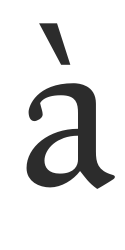
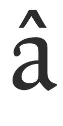
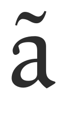
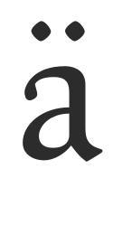
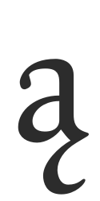
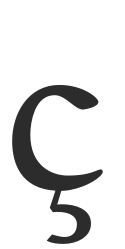

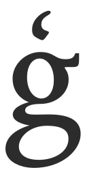
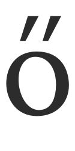

### Algunos ejemplos de diacríticos

Minúscula 'a con grave' (unicode u+00e0).
Creada en una fuente combinando el glifo de la 'a' minúscula (unicode u+0061) y el glifo de 'acento grave combinable' (unicode u+0300).

Minúscula 'a con circunflejo' (unicode u+00e2).
Creada en una fuente combinando el glifo de la 'a' minúscula (unicode u+0061) y el glifo de 'acento circunflejo combinable' (unicode u+0302).

Minúscula 'a con ogonek' (unicode u+0105).
Creada en una fuente combinando el glifo de la 'a' minúscula (unicode u+0061) y el glifo de 'ogonek combinable' (unicode u+0328).

Minúscula 'c con cedilla' (unicode u+00e7).
Creada en una fuente combinando el glifo de la 'c' minúscula (unicode u+0063) y el glifo de 'cedilla combinable' (unicode u+0327).

Minúscula 'o con doble agudo' (unicode u+0151).
Creada en una fuente combinando el glifo de la 'o' minúscula (unicode u+006f) y el glifo de 'acento doble agudo combinable' (unicode u+030b).

FontForge puede crear automáticamente caracteres acentuados de dos maneras principales.

1. FontForge contiene información rudimentaria sobre dónde colocar las marcas diacríticas, por lo que puede construir automáticamente la mayoría de los caracteres acentuados.
2. Para un control mucho mayor de la colocación de diacríticos, FontForge puede colocar marcas diacríticas basándose en la posición de puntos de ancla creados por el usuario.

Cabe señalar aquí que si no estás utilizando anclas y tablas de búsqueda para posicionar las marcas diacríticas, entonces, si el glifo de una marca diacrítica particular no está presente en tu fuente, FontForge utilizará en su lugar un carácter espaciado similar. Por ejemplo, si la marca combinable 'acutecomb' (u+0301) no está presente, FontForge utilizará el carácter estándar 'acute' (u+00b4) cuando construya automáticamente cualquier glifo acentuado agudo. Si el 'acutecomb' está presente, FontForge siempre lo usará, a menos que fuerces específicamente a FontForge a usar caracteres espaciados para construir glifos acentuados.

## Colocación automática básica de marcas diacríticas de FontForge

En el menú 'Element' (Elemento) de FontForge hay una función 'Build' (Construir) que se puede utilizar para crear caracteres acentuados, ciertos caracteres compuestos y algunos caracteres duplicados. Para construir automáticamente caracteres acentuados, FontForge utiliza la función 'Element > Build > Build Accented Glyph' (Elemento > Construir > Construir glifo acentuado). Esta función también se puede realizar con la combinación de teclas <kbd>Ctrl</kbd> + <kbd>Shift</kbd> + <kbd>A</kbd>. Así, usando el ejemplo de construir el carácter 'a aguda' (u+00e1), necesitaríamos haber creado ya la 'a' minúscula (u+0061) y el glifo 'acutecomb' (u+0301). Luego seleccionando la ranura del carácter 'a aguda' y usando la función 'Element > Build > Build Accented Glyph', FontForge colocará una referencia al glifo de la 'a' minúscula y una referencia al glifo 'acutecomb' en la ranura del carácter 'a aguda' (ver abajo).

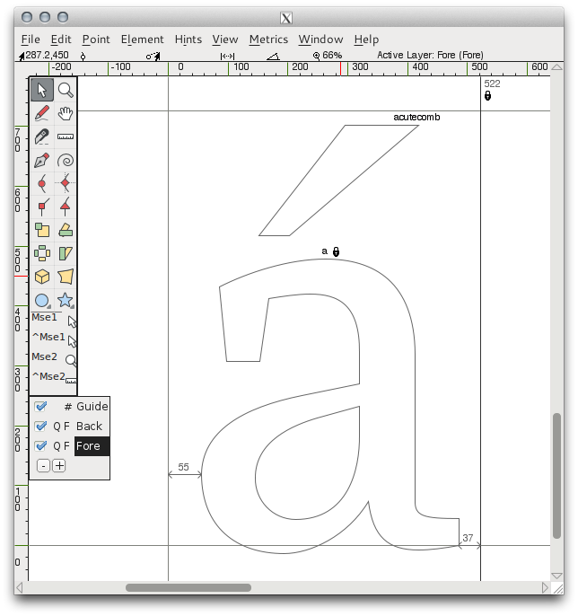

Esta colocación automática de marcas diacríticas puede ser ajustada mediante preferencias, que se encuentran en la sección 'accents' (acentos) del menú de preferencias de FontForge 'File > Preferences > Accents' (Archivo > Preferencias > Acentos) (ver abajo).

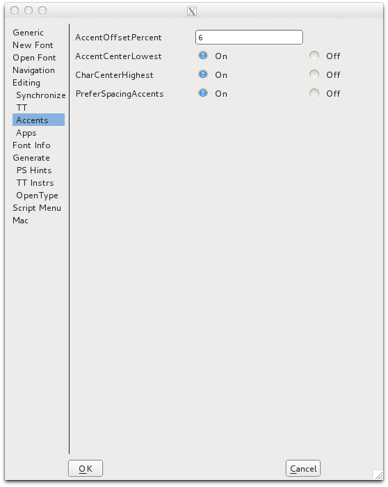

'PreferSpacingCharacters' forzará a FontForge a construir glifos acentuados con caracteres espaciados incluso si los caracteres combinables apropiados están presentes. Esta opción se ignora cuando se usan anclas para posicionar marcas diacríticas.

'AccentOffsetPercent' controla la cantidad de espacio vertical entre el glifo base y el glifo de marca. El valor introducido aquí es un porcentaje del cuadrado em de la fuente. Así que un valor de '6' desplazará el glifo de marca del glifo base en un 6 por ciento del cuadrado em de la fuente.

Las preferencias para la colocación horizontal del glifo de marca también se pueden establecer. Seleccionar 'On' para la preferencia 'AccentCenterLowest' centrará el glifo de acento por el punto más bajo del glifo base.

Seleccionar 'AccentCenterHighest' a 'On' centrará el acento por el punto más alto del glifo base.

Seleccionar ambas preferencias anteriores a 'Off' centrará el acento en el ancho del glifo base. Seleccionar ambas preferencias anteriores a 'On' centrará el acento por el ancho de la ranura del carácter.

## Uso de Puntos de Ancla para colocar diacríticos

La forma más precisa y eficiente de construir caracteres acentuados en FontForge es usar 'puntos de ancla'.

Los puntos de ancla permiten un control fino del posicionamiento exacto de la marca diacrítica en relación con cada glifo base en los caracteres acentuados. Así, en el caso del carácter 'a ogonek', el glifo base 'a' se posicionará normalmente, y el glifo de marca 'ogonek' se posicionará de modo que el punto de ancla del glifo de marca coincida con el punto de ancla en el glifo base.

En el ejemplo de abajo de creación de un carácter 'a ogonek', se ha creado una clase de ancla llamada 'bottom' (fondo). En el glifo de la 'a' minúscula, el ancla 'bottom' se coloca en la parte inferior del fuste de la 'a'. Esta es la forma de 'glifo base' del ancla.

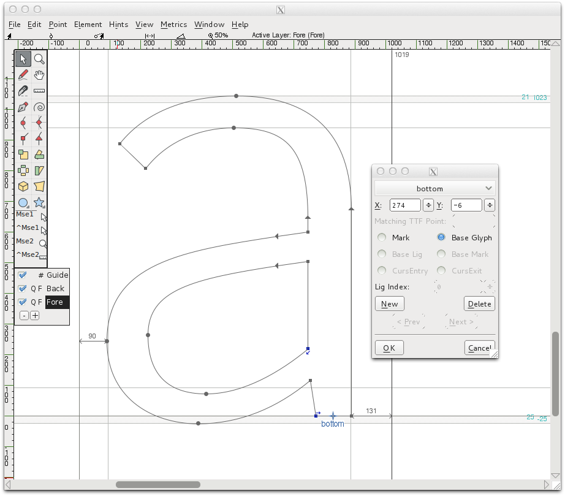

En el glifo 'ogonek' el ancla 'bottom' se coloca en la parte superior del glifo ogonek, en la forma de un ancla de 'marca'.

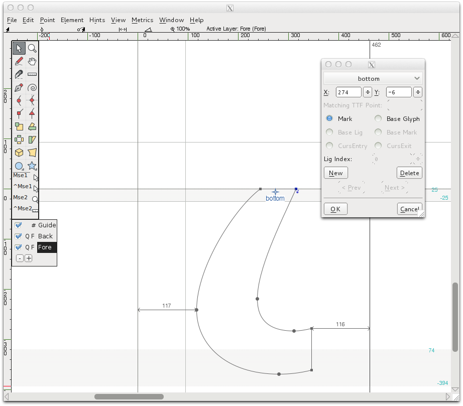

Luego, cuando se construye el carácter 'a ogonek' (usando la función 'Build Accented Character') el punto de ancla de marca 'bottom' se colocará en la misma ubicación que el punto de ancla base 'bottom', asegurando que el glifo ogonek referenciado se coloque correctamente al pie del fuste del glifo 'a' referenciado. Esta colocación exacta y automática no habría sido posible sin usar puntos de ancla para posicionar los glifos base y de marca.

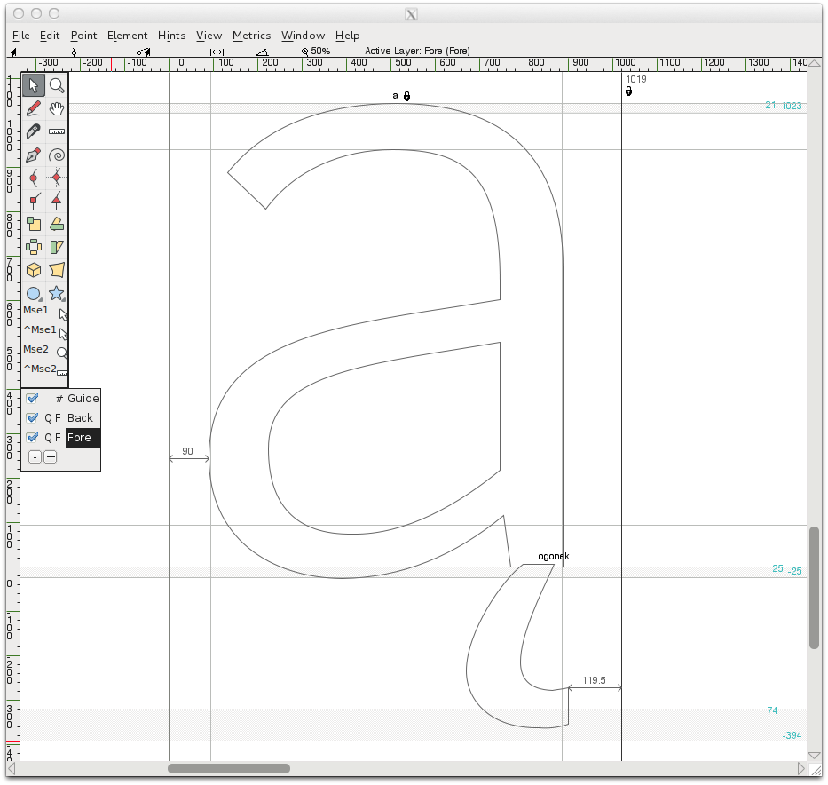

### Creación de puntos de ancla para colocar marcas diacríticas (posicionamiento de marca a base)

FontForge utiliza características de búsqueda conocidas como 'mark-to-base' (marca a base) para crear y posicionar puntos de ancla. Estas búsquedas de marca a base se pueden crear y editar en la sección GPOS Lookups de la Información de la Fuente de tu fuente ('Element > Font Info > Lookups > GPOS').

Desde la ventana GPOS Lookups, haz clic en 'Add Lookup' (Añadir Búsqueda) y elige el Tipo 'Mark to Base Position' (Posición de Marca a Base), luego elige 'Mark Positioning' (Posicionamiento de Marca) de la columna 'New' del panel Feature (Característica). Haz clic en 'OK' para cerrar la ventana.

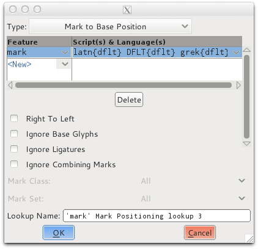

Con la nueva búsqueda seleccionada, haz clic en 'Add Subtable' (Añadir Subtabla). En la ventana resultante puedes crear tus clases de ancla.

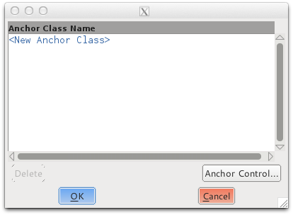

En este ejemplo, se han creado dos clases de ancla, 'top' (arriba) y 'bottom' (abajo). La clase de ancla 'top' se usará para posicionar marcas diacríticas que se colocan encima de los glifos, y el ancla 'bottom' se usará para posicionar marcas debajo de los glifos.

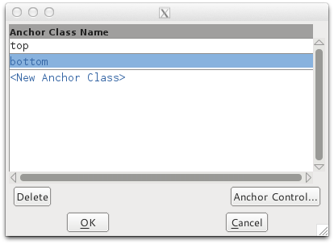

Para colocar un ancla con un glifo, simplemente usa el clic derecho del ratón en una ventana de edición de glifo, y selecciona la función 'Add Anchor' (Añadir Ancla) del menú de clic derecho.
El cuadro de diálogo que aparece te permite asignar si el ancla es un ancla de base o de marca. La posición del ancla también se puede ajustar finamente desde este cuadro de diálogo. Alternativamente, el ancla se puede mover arrastrándola a la posición con el ratón, o usando las teclas de flecha. El punto de ancla también se puede editar haciendo clic derecho en el punto de ancla y eligiendo 'get info' (obtener información) del menú del clic del ratón.

### Control de Clases de Ancla

FontForge también contiene una interfaz gráfica útil para controlar la posición de clases enteras de puntos de ancla, permitiendo al usuario ajustar finamente la posición de, por ejemplo, todos los acentos agudos a la vez en una fuente, o todas las anclas en una clase contenida en caracteres que hacen referencia a la 'e' minúscula. En los ejemplos a continuación podemos ver cómo usar esta interfaz gráfica para ajustar finamente la posición de todos los acentos agudos en una fuente y una clase de anclas a través de todos los caracteres que hacen referencia al glifo de la 'e' minúscula.

Una vez que hayas creado clases de ancla dentro de tus búsquedas de posición marca a base y añadido anclas a algunos glifos, puedes controlar estas clases desde 'Element > Font Info > Lookups > GPOS' y luego editando una subtabla que contenga clases de ancla. Entonces verás esta ventana;

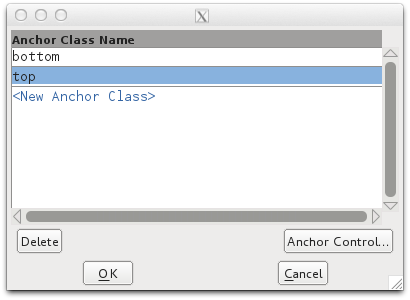

Desde aquí, selecciona la clase que deseas editar y haz clic en el botón 'Anchor Control' (Control de Ancla). Se te presentará una interfaz gráfica para esa clase. En los ejemplos a continuación estamos editando el control de la clase 'top'. En el primer ejemplo, la 'e' minúscula ha sido seleccionada de la sección 'Bases' del menú desplegable. Cuando se selecciona un glifo base, todos los caracteres que hacen referencia a ese glifo y contienen un ancla base 'top' se mostrarán en el panel de vista previa. Luego podemos ajustar la posición del ancla base 'top' para ver cómo afecta la posición de todos los glifos que contienen el ancla de marca 'top'.

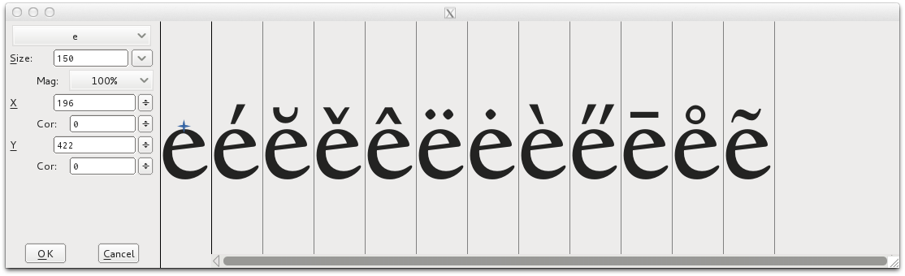

En el segundo ejemplo, abajo, el glifo 'agudo' ha sido seleccionado de la sección 'Marks' (Marcas) del menú desplegable. Cuando se selecciona un glifo de marca, entonces todos los glifos que hacen referencia al glifo seleccionado y contienen un ancla de marca 'top' se mostrarán para previsualización.

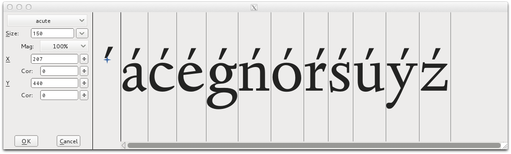

## Otros recursos

* [Contexto de Diacríticos](http://urtd.net/projects/cod/about)
* [Sobre Diacríticos](http://ilovetypography.com/2009/01/24/on-diacritics/)
* [Proyecto de Diacríticos en Typo.cz](http://diacritics.typo.cz/)
* [Problemas del diseño de diacríticos para tipos de letra de escritura latina](http://scripts.sil.org/ProbsOfDiacDesign)
* [Estándares de Diseño de Diacríticos (para idiomas basados en el latín)](http://www.microsoft.com/typography/developers/fdsspec/diacritics.htm)
* [Dave Foster sobre las Æ](https://twitter.com/fostertype/status/610292546971893760)
