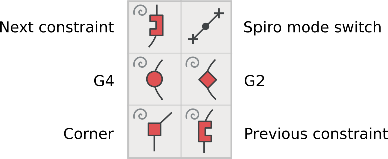
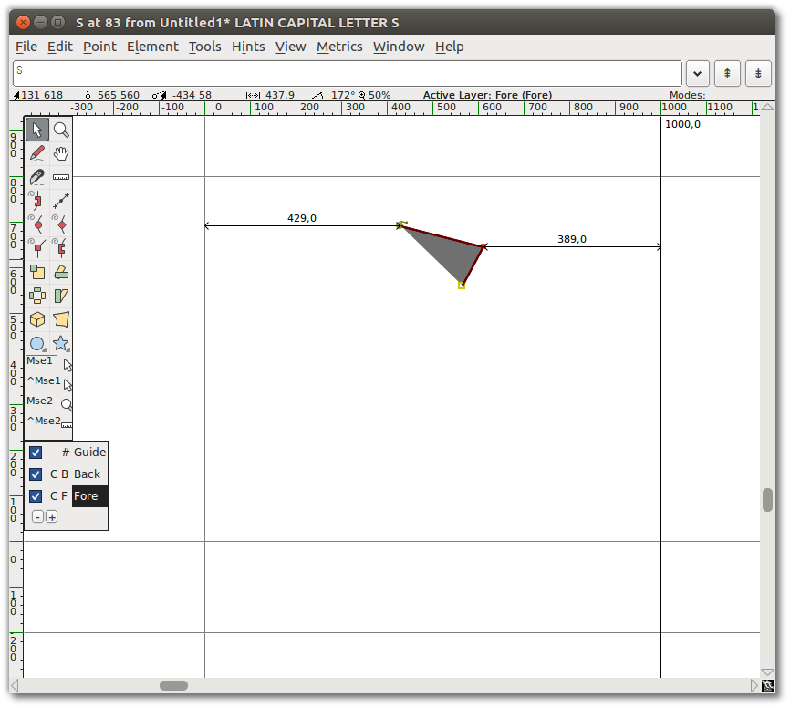
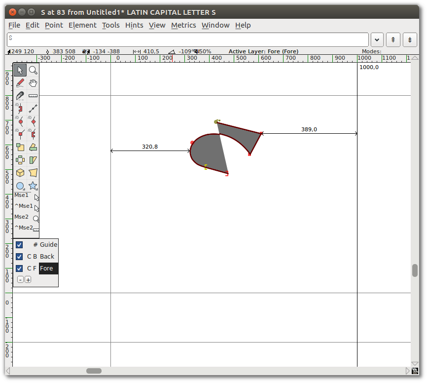
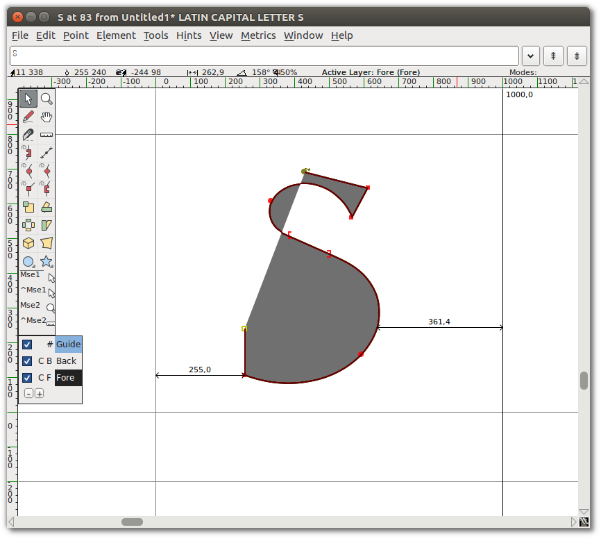
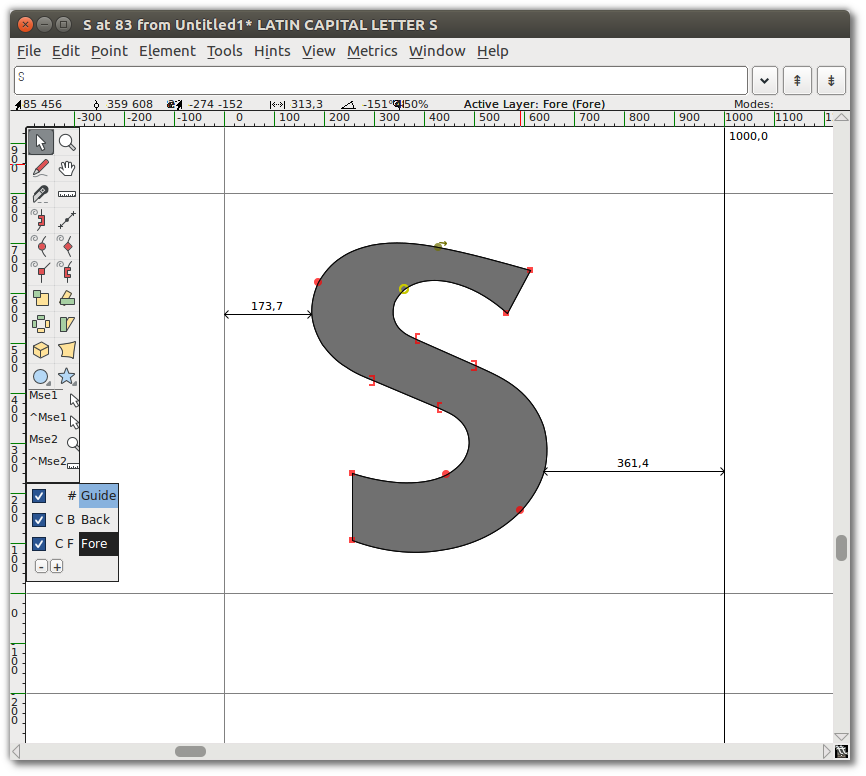
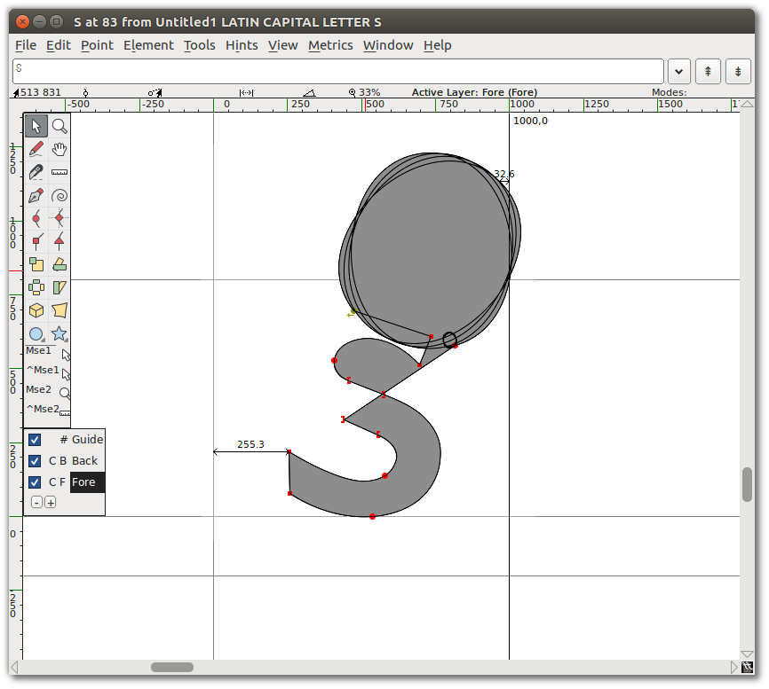
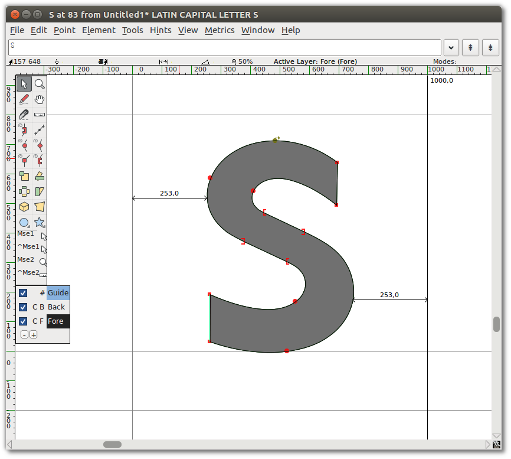
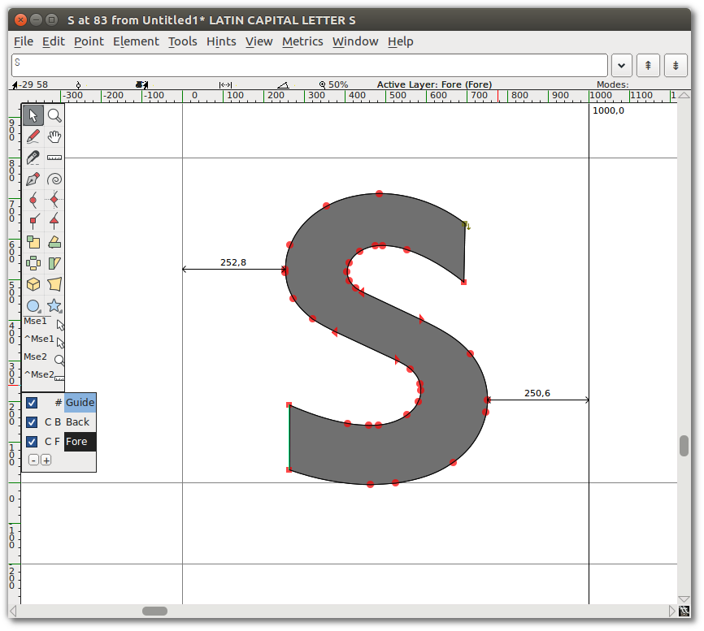

Spiro es un conjunto de herramientas para diseñar curvas con un método alternativo a las curvas de B&eacute;zier más tradicionales.
Spiro tiene un enfoque diferente que puede ayudarte a realizar tus curvas de una manera diferente para ayudar a resolver tus problemas conceptuales. ¡Por favor, experimenta!

## El conjunto de herramientas Spiro

Muchas de las mismas herramientas de dibujo están disponibles en el modo Spiro que las descritas en el capítulo [“Uso de las herramientas de dibujo de FontForge”], pero algunas de ellas funcionan de manera muy diferente cuando estás en modo Spiro.

Hay cinco tipos diferentes de puntos Spiro:

1. Puntos G4, utilizados para una curva más suave
2. Puntos G2, utilizados para una curva más cerrada
3. Puntos de esquina, para uniones de esquina abruptas
4. Puntos de restricción anterior, utilizados cuando el contorno del trazado cambia de una curva a una línea recta
5. Puntos de restricción siguiente, utilizados cuando el trazado cambia de una línea recta a una curva

## Dibujando una ‘S’ con Spiro

Pasar por el ejercicio de dibujar una ‘S’ con Spiro te hará sentir cómodo con Spiro.

<b>Consejo:</b> Al dibujar en modo Spiro, empieza siempre con un punto G4 o G2.
Empezar con los otros tipos de puntos realmente no funciona en FontForge.

Empieza con un punto G4 en el punto más alto de tu ‘S’, seguido de un punto de esquina, luego otro punto de esquina. Trabaja en el sentido de las agujas del reloj alrededor de la forma de la letra.

Sigue esto con un G4, un punto de restricción anterior, y un punto de restricción siguiente.

A continuación, añade otro punto G4, seguido de dos puntos de esquina más.

Luego un G4, seguido de una restricción anterior, seguido de una restricción siguiente.

Luego, añade un punto G4 más, y finalmente, cierra la forma en el punto de inicio haciendo clic en él usando la herramienta de punto G4.

¡Ahora casi tienes una ‘S’! Empieza a mover los puntos para que tu S se vea como quieres.

Vaya, ¿qué pasó?

No te preocupes &mdash; Spiro a veces hace cosas raras. Simplemente pulsa "<i><b>Undo</b></i>" (Deshacer), o sigue moviendo los puntos para volver a encarrilar las cosas.

Ahora, deberías ver algo como esto:

Cambia del modo Spiro al modo B&eacute;zier. Notarás que hay muchos puntos en la curva resultante &mdash; es posible que quieras limpiar algunos de ellos.

Para limpiar esos puntos extra, ve al menú "_**Element**_" (Elemento) y selecciona "_**Simplify**&nbsp;⇨&nbsp;**Simplify**_".
Luego ve a "_**Element**&nbsp;⇨&nbsp;**Add&nbsp;Extrema**_". Finalmente, ve a "_**Element**&nbsp;⇨&nbsp;**Round**&nbsp;⇨&nbsp;**To&nbsp;Int**_".
Después de estas operaciones de limpieza, verás algo como esto:

Puedes continuar experimentando con el modo Spiro para tener una idea de cómo difiere del dibujo B&eacute;zier.
La terminología es diferente, pero al igual que con otras herramientas de dibujo y ajuste de FontForge, la práctica te llevará a conseguir las cosas que quieres.

[“Instalando FontForge”]: Installing_Fontforge.html
[“Uso de las herramientas de dibujo de FontForge”]: Using_the_Fontforge_Drawing_Tools.html
