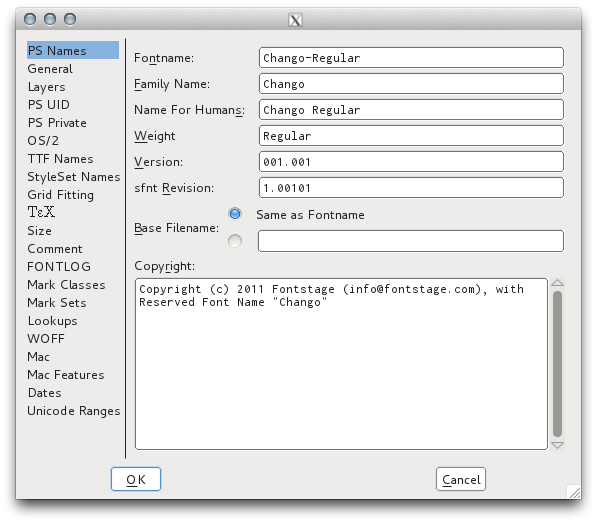

## Elemento, Información de la Fuente

La ventana de Información de la Fuente es omnipresente en los editores de fuentes, y FontForge sigue de cerca la Especificación OpenType.
Puede parecer críptica al principio, pero usarla puede ayudarte a familiarizarte más con el formato OpenType, y, a su vez, leer sobre el formato OpenType hace que el diálogo sea más accesible.

## Numeración de versiones

A los desarrolladores de software les gusta usar el [Versionado Semántico](http://semver.org) (Semantic Versioning) para sus programas, y esta también es una buena idea para tus fuentes.
En cierto modo, las fuentes son una "API" para que el texto acceda a algunos sentimientos asociativos en los lectores.

Una versión MAYOR (MAJOR) sería después de un rediseño completo. Compara [Exo](http://www.google.com/fonts/specimen/Exo) y [Exo 2](http://www.google.com/fonts/specimen/Exo+2).
Si tienes un documento usando Exo, no querrás saltar a Exo 2, porque el sentimiento evocado, la 'voz' o 'sabor', es (sutilmente) diferente.
Añadir soporte para una o más escrituras nuevas que sean bastante similares en altura, o un número sustancial de idiomas, también podría constituir una revisión MAYOR, al igual que cualquier otra cosa que cambie sustancialmente las métricas verticales u horizontales.
Sin embargo, si se hace un diseño complementario para 2 escrituras, puede ser mejor lanzar 2 o 3 familias, una con cada escritura escalada apropiadamente y la(s) otra(s) escritura(s) escalada(s) como fuentes secundarias para una composición tipográfica de respaldo simple de textos multilingües.

Una versión MENOR (MINOR) sería cualquier cosa que cambie sutilmente las métricas, como las métricas verticales, los márgenes laterales horizontales o un kerning mejorado, o hacer correcciones menores a algunos glifos, porque tales actualizaciones harán que los documentos que usan la fuente se reajusten (aunque sutilmente en muchos casos). Aquí hay un ejemplo de ["Roboto Rebooted: Why Google Updates Its Font Like The Rest Of Its Products"](http://www.fastcodesign.com/3033126/roboto-rebooted-why-google-plans-to-update-its-font-like-the-rest-of-its-products):

Añadir solo unos pocos o una docena de glifos para "completar" la cobertura de un conjunto de caracteres previamente intencionado o para añadir soporte para solo unos pocos idiomas más es probablemente MENOR, especialmente si no cambia las métricas verticales.

Un cambio a nivel de PARCHE (PATCH) sería cualquier cosa que mejore la fuente sin cambiar las métricas o cambie el diseño de un glifo de una manera visible que no afecte el diseño final del texto.
Tu lanzamiento 1.001 podría no tener fsType establecido en 0 o no haber pasado por fontcrunch, y cambiar ambas cosas en un lanzamiento 1.0.1 no será visible ni reajustará nada.
Lamentablemente, el tercer número de versión de PARCHE no está disponible en los campos de metadatos de versión de fuente OpenType.
En su lugar, incrementa el número de versión MENOR para tales cambios en hinting o metadatos.

Además, la versión no debe tener más de 3 decimales, y esto puede representarse con 5 en un archivo TTX.
Ej. `2.001` es típico, y puede aparecer como `2.00099` en TTX XML.

Si lanzas fuentes libres, las características de [GitHub Releases](https://www.google.com/search?q=github+releases) son muy útiles.

## Nombramiento de familia (Family Naming)

Microsoft trabaja duro para asegurar que un programa escrito para una versión anterior de Windows continúe ejecutándose en las últimas versiones, atrayendo a la gente a actualizar. Esto significa que el modelo básico de fuentes TrueType introducido en Windows 3 todavía está con nosotros, y Windows no soporta familias de fuentes con más de los 4 estilos básicos (Regular, Cursiva, Negrita, Negrita Cursiva).

Esto significa para los diseñadores de fuentes que nuestros nombres de familia de fuentes deben configurarse de manera que todas nuestras fuentes puedan usarse en todos los sistemas operativos. El formato OpenType permite esto, complementando los valores de Nombre de Familia y Estilo con valores de "Preferred Family Name" (Nombre de Familia Preferido) y "Preferred Style Name" (Nombre de Estilo Preferido) que tendrán prioridad en el software compatible con OpenType.

Esta [Hoja de cálculo de Google Docs sobre Nombramiento de Familia](https://docs.google.com/spreadsheets/d/1ckHigO7kRxbm9ZGVQwJ6QJG_HjV_l_IRWJ_xeWnTSBg/edit#gid=0) se basa en información compartida por el experto en fuentes polaco Adam Twardoch y discutida en el [foro de Fontlab](http://forum.fontlab.com/index.php?topic=313.0).
Sustituye al [ejemplo de especificación OpenType](https://www.microsoft.com/typography/otspec/namesmp.htm).