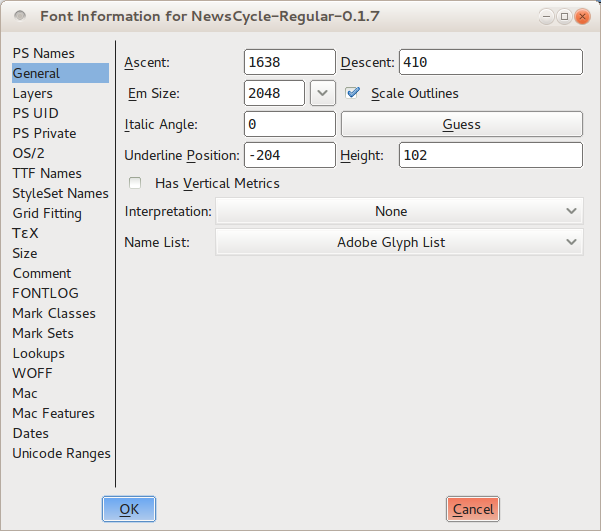
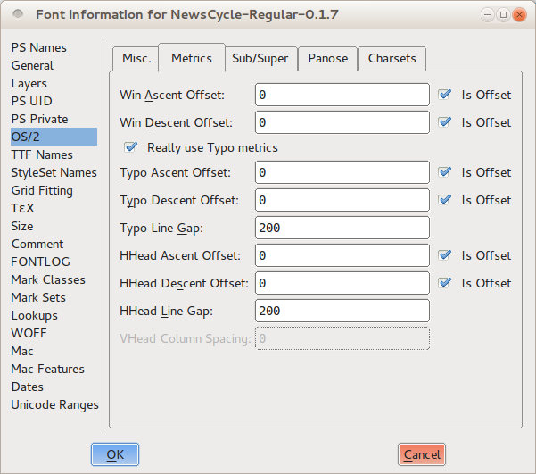

Cuando tengas el espacio entre palabras y la 'n' y la 'o' configuradas, puedes empezar a mirar el interlineado (espacio entre líneas). Sin embargo, una decisión completa y final sobre el interlineado no es posible hasta que tengas letras mayúsculas y algo de puntuación.

## Piensa en el espacio entre líneas intencionalmente

Como ocurre con el espaciado de letras y palabras, tener demasiado o muy poco interlineado puede hacer que tu fuente se vea extraña en el uso del mundo real. Por encima de todo, encontrar el equilibrio correcto de interlineado es una cuestión de pensar en la pregunta intencionalmente y de probar una gama de opciones en el camino hacia la toma de una decisión final.

Como regla general, la mayoría de los nuevos diseñadores de fuentes tienden a pecar de tener muy poco interlineado en su fuente, así que si no estás seguro, añadir espacio adicional suele ser una buena idea.

También debes considerar el alcance de la cobertura de idiomas de tu proyecto al considerar el interlineado. Si pruebas el interlineado de tu fuente solo con caracteres sin acento, es probable que te decidas por un valor de interlineado que no deja espacio para los acentos. Si estás seguro de que tu fuente nunca se usará con caracteres acentuados, esto podría ser aceptable &mdash; pero las probabilidades son que tu fuente <em>se usará</em> para componer texto acentuado. En ese caso, un interlineado demasiado pequeño hará que los acentos de una línea se topen con la parte inferior de los glifos de arriba, y dejará al lector con un texto difícil (si no imposible) de leer.

Una estrategia para probar si el interlineado de tu fuente es adecuado para caracteres acentuados es emplear texto de muestra de varios idiomas.

Para idiomas con muchas marcas diacríticas (como el checo), el interlineado debe ser más alto que para los idiomas que no usan diacríticos. Los ejemplos anteriores muestran checo (arriba) e inglés con el mismo interlineado bastante amplio.

## Experimenta con el interlineado de tu fuente en FontForge

En FontForge, puedes establecer y ajustar el interlineado de tu proyecto de fuente desde la ventana de Información de la Fuente. Abre esta ventana eligiendo <em>Font Info</em> (Información de la Fuente) en el menú "Element" (Elemento), luego haz clic en la pestaña General. Observa los valores que FontForge ha listado para Ascent (Ascendente) y Descent (Descendente). A menos que ya hayas hecho cambios manuales, estos dos números sumados deberían ser iguales al valor de Em Size (Tamaño Em) listado en la línea de abajo.

Ahora cambia a la pestaña "OS/2". En casi todas las computadoras, el interlineado de tu fuente estará determinado por los valores de Ascendente y Descendente que introduzcas en esta pestaña, bajo el encabezado Métricas.

Hay tres conjuntos de valores: Win Ascent y Descent, Typo Ascent y Descent, y HHead Ascent y Descent. Deberías establecer todos los Ascents para que sean iguales al valor de Ascent que anotaste en la pestaña General. A continuación, deberías establecer todos los Descents para que sean iguales al valor de Descent que anotaste en la pestaña General, con una excepción importante: debes hacer que el número Typo Descent sea <em>negativo</em>. Deja el valor igual, pero por un signo menos delante de él. Finalmente, desmarca todas las opciones "is offset" (es desplazamiento).

Estos ajustes te darán un punto de partida sensato. Ahora puedes proceder a probar tu fuente con este interlineado y hacer ajustes incrementales hasta llegar a un resultado agradable a la vista.

Si encuentras que tu interlineado es demasiado apretado y no quieres o no puedes hacer las métricas verticales más grandes, puedes escalar los glifos hacia abajo para ganar más espacio para el interlineado.
