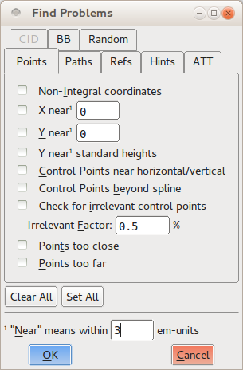
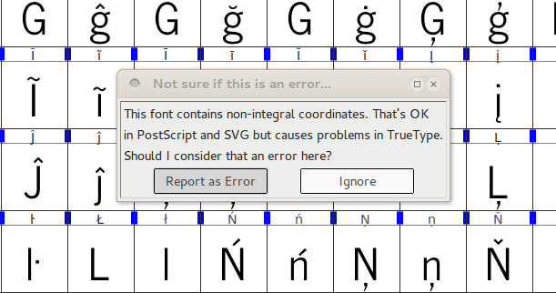
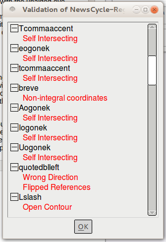
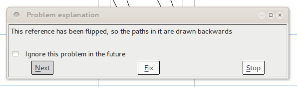

En un mundo perfecto, tu fuente estaría lista para compilar e instalar en cualquier computadora moderna sin ningún esfuerzo especial, pero la realidad es más desordenada &mdash; particularmente durante el proceso de diseño. Las fuentes pueden tener errores técnicos que impiden que funcionen o se muestren correctamente. Por ejemplo, las curvas que se intersectan a sí mismas no se renderizarán correctamente porque no tienen un "adentro" y un "afuera". Los diversos formatos de archivo de fuente también esperan que los glifos se adhieran a ciertas reglas que simplifican la colocación del texto en la pantalla, y las fuentes que rompen las reglas pueden causar problemas inesperados. Un ejemplo de este tipo de problema es que todos los puntos en una curva deben tener coordenadas que sean números enteros. Finalmente, hay errores estilísticos que no son técnicamente incorrectos, pero que querrás reparar &mdash; como líneas que están destinadas a ser perfectamente horizontales o verticales, pero que accidentalmente están ligeramente desviadas.

FontForge ofrece herramientas que puedes usar para localizar (y, en muchos casos, reparar) las tres categorías de problemas. Validar tu fuente para eliminar estos errores no solo asegurará que pueda ser instalada y disfrutada por los usuarios, sino también que el proyecto terminado exhiba pulido.

## Buscar problemas

La primera herramienta se llama <em>Find Problems</em> (Buscar Problemas), y se encuentra bajo el menú Element (Elemento). Primero debes seleccionar uno o más glifos &mdash; ya sea desde la vista de fuente, la vista de contorno o la vista de métricas &mdash; luego abre la herramienta Find Problems. La herramienta te presenta un surtido de problemas potenciales en ocho pestañas separadas.

Puedes seleccionar qué problemas te interesa buscar marcando la casilla de verificación junto a cada uno, y en algunos casos proporcionando un valor numérico para comparar la fuentes. Cuando haces clic en el botón OK, la herramienta examinará todos los glifos seleccionados e informará cualquier problema que encuentre en un cuadro de diálogo.

Los problemas que la herramienta Find Problems puede buscar se clasifican en estos ocho grupos:

* Problemas relacionados con puntos
* Problemas con rutas y curvas
* Problemas con referencias
* Problemas con hinting
* Problemas con ATT
* Problemas específicos de fuentes con clave CID
* Problemas con cuadros delimitadores (bounding boxes)
* Otros problemas diversos

No todas las comprobaciones son necesarias; algunas se aplican solo a escrituras o idiomas específicos (como los de la pestaña "CID"), mientras que otras se aplican solo a características de fuentes opcionales específicas (como las comprobaciones en la pestaña referencias). Pero debes verificar que tu fuente pase esas pruebas que examinan los glifos en busca de características obligatorias, y varias pruebas que buscan un comportamiento opcional pero comúnmente esperado. Varias de las otras pruebas brindan retroalimentación y orientación durante el proceso de diseño, y vale la pena explorarlas por esa razón.

### Lo primero es lo primero: prueba de características obligatorias

En la pestaña "Points" (Puntos), selecciona la prueba <em>Non-Integral Coordinates</em> (Coordenadas no enteras). Esta prueba asegura que todos los puntos en cada glifo (incluyendo tanto puntos en la curva como puntos de control) tengan coordenadas enteras. No todos los formatos de salida de fuente requieren este comportamiento, pero algunos sí.

En la pestaña "Paths" (Rutas), selecciona las opciones <em>Open paths</em> (Rutas abiertas) y <em>Check outermost paths clockwise</em> (Verificar rutas más externas en sentido horario). Estas son características obligatorias en todas las fuentes; la primera busca cualquier curva que no sea una forma cerrada, y la segunda asegura que las curvas externas de cada glifo se tracen en orden horario. Es una muy buena idea marcar <em>Intersecting paths</em> (Rutas que se intersectan) también; aunque los formatos de fuente modernos pueden soportar dos rutas que se intersectan, no se permiten curvas que se intersecten consigo mismas. Además, si un glifo tiene rutas que se intersectan a sí mismas, entonces FontForge no puede realizar la prueba <em>Check outermost paths clockwise</em>.

En la pestaña "Refs" (Refs), selecciona las seis pruebas. Todas estas comprobaciones se relacionan con referencias, en las que un glifo incluye rutas de otro glifo. Por ejemplo, una letra acentuada incluye una referencia a la letra original (sin acento), más una referencia al carácter de acento. Todas las pruebas en la pestaña "Refs" son obligatorias para al menos un formato de salida común, y todas son buenas ideas.

De manera similar, selecciona todas las pruebas en la pestaña "ATT". Estas pruebas buscan nombres de glifos faltantes, reglas de sustitución que se refieren a glifos inexistentes y otros problemas relacionados con nombres de glifos o características OpenType. Los problemas contra los que protegen son poco comunes, pero todos harán que la fuente se considere inválida por uno o más sistemas informáticos, por lo que vale la pena incluirlos.

### Haz la vida más fácil para tus usuarios: prueba de buen comportamiento

Las pruebas enumeradas anteriormente asegurarán que tu fuente se instale y renderice correctamente de acuerdo con las reglas establecidas por los diversos formatos de fuente, pero hay un puñado de otras pruebas que deberías considerar agregar &mdash; especialmente al final del proceso de diseño &mdash; simplemente porque verifican convenciones comunes seguidas por la mayoría de la tipografía moderna.

En la pestaña "Points", selecciona <em>Control points beyond spline</em> (Puntos de control más allá del spline). Esta prueba buscará puntos de control que se encuentren más allá de los puntos finales del segmento de curva en el que residen. Rara vez hay una razón para que un punto de control se encuentre fuera de la curva, por lo que estas instancias generalmente significan accidentes. También es una buena idea seleccionar <em>Points too far apart</em> (Puntos demasiado separados), que buscará puntos que estén a más de 32,767 unidades del siguiente punto más cercano. Esa distancia es mayor de lo que la mayoría de las computadoras pueden manejar internamente, y un punto tan lejano es casi seguramente involuntario (a modo de comparación, un solo glifo tiende a dibujarse en una cuadrícula de aproximadamente 1,000 unidades), por lo que eliminar dichos puntos es importante.

En la pestaña "Paths", tanto las pruebas <em>Check Missing Extrema</em> (Verificar extremos faltantes) como <em>More Points Than [val]</em> (Más puntos que [val]) pueden ser valiosas. La primera busca puntos en los extremos &mdash; es decir, el punto más alto, el punto más bajo y los puntos más a la izquierda y a la derecha del glifo. Los formatos de fuente modernos sugieren fuertemente que cada ruta tenga un punto en cada uno de sus extremos horizontales y verticales; esto hace la vida más fácil cuando la fuente se renderiza en pantalla o en la página. La comprobación buscará puntos extremos faltantes. La segunda prueba es una comprobación de sanidad sobre el número de puntos dentro de cualquier glifo. El valor predeterminado de FontForge para esta comprobación es 1,500 puntos, que es el valor sugerido por la documentación de PostScript, y es lo suficientemente bueno para casi todas las fuentes.

Como su nombre sugiere, la pestaña "Random" (Aleatorio) enumera pruebas diversas que no encajan en las otras categorías. De estas, las tres finales son valiosas: <em>Check Multiple Unicode</em> (Verificar múltiples Unicode), <em>Check Multiple Names</em> (Verificar múltiples nombres), y <em>Check Unicode/Name mismatch</em> (Verificar desajuste Unicode/Nombre). Buscan errores de metadatos en el mapeo entre nombres de glifos y ranuras Unicode.

### Ayúdate a ti mismo: ejecuta pruebas que pueden ayudar al diseño

Muchas de las otras pruebas en la herramienta Find Problems pueden ser útiles para encontrar y localizar inconsistencias en tu colección de glifos &mdash; cosas que no están mal o son inválidas, pero que tú, como diseñador, querrás pulir. Por ejemplo, la prueba <em>Y near standard heights</em> (Y cerca de alturas estándar) en la pestaña "Points" compara glifos con un conjunto de medidas verticales útiles: la línea base, la altura del glifo "x", el punto más bajo de la descendente en la letra "p", y así sucesivamente. En una tipografía consistente, la mayoría de las letras se adherirán al menos a un par de estas medidas estándar, por lo que las probabilidades son que un glifo que no está cerca de ninguna de ellas necesite mucho trabajo.

La prueba <em>Edges near horizontal/vertical/italic</em> (Bordes cerca de horizontal/vertical/cursiva) en la pestaña "Paths" busca segmentos de línea que son casi exactamente horizontales, verticales o en el ángulo de cursiva de la fuente. Hacer que tus líneas casi verticales sean perfectamente verticales significa que las formas se renderizarán nítidamente cuando se use la fuente, y esta prueba es una forma confiable de rastrear los segmentos no del todo correctos que podrían ser difíciles de detectar a simple vista.

Puedes usar otras pruebas para localizar puntos en la curva que están demasiado cerca uno del otro para ser significativos, para comparar los márgenes laterales de glifos de forma similar, y para realizar una gama de otras pruebas que revelan cuando tienes glifos con rarezas. Parte del proceso de refinamiento es tomar tus diseños iniciales y hacerlos más precisos; como otros aspectos del diseño de fuentes, esta es una tarea iterativa, por lo que usar las herramientas integradas reduce algo de la repetición.

## Validar fuente

La otra herramienta de validación de FontForge es el validador de toda la fuente (`Validate font`), que ejecuta una batería de pruebas y comprobaciones en toda la fuente. Debido a que el validador se utiliza para examinar una fuente completa, solo puedes iniciarlo desde la ventana de vista de fuente; lo encontrarás en el menú Element (Elemento), bajo el submenú Validation (Validación). El validador está diseñado para ejecutar solo aquellas pruebas que examinan la fuente en busca de corrección técnica &mdash; esencialmente las pruebas descritas en la sección "prueba de características obligatorias" anterior. Pero, ejecuta las pruebas contra toda la fuente, y lo hace mucho más rápidamente de lo que puedes avanzar a través del proceso tú mismo usando la herramienta Find Problems.

La primera vez que ejecutas el validador durante una sesión de edición particular, aparecerá un cuadro de diálogo preguntándote si debe marcar las coordenadas de puntos no enteros como un error. La respuesta segura es elegir "Report as an error" (Informar como un error), ya que apegarse a coordenadas enteras es una buena práctica de diseño. Cuando el validador completa su escaneo de la fuente (que será meros segundos después), abrirá un nuevo cuadro de diálogo llamado Validation of [nombre de fuente]. Esta ventana enumerará cada problema que el validador ha encontrado, presentado en una lista ordenada por glifo.

Pero, esta ventana no es simplemente una lista de errores: puedes hacer doble clic en cada elemento de la lista, y FontForge saltará al glifo relevante y resaltará el problema exacto, completo con una explicación de texto en su propia ventana. Luego puedes solucionar el problema en el editor de glifos, y el elemento de error asociado desaparecerá inmediatamente de la lista de errores del validador. En muchos casos, el error será algo que FontForge puede reparar automáticamente, y la ventana de explicación tendrá un botón "Fix" (Arreglar) en la parte inferior. Puedes hacer clic en él y realizar la reparación sin esfuerzo adicional.

Para algunos problemas, no hay una solución automática, pero ver el problema en la pantalla te ayudará a solucionarlo de inmediato. Por ejemplo, una curva que se intersecta a sí misma tiene un lugar específico donde la ruta se cruza sobre sí misma &mdash; puede haber sido demasiado pequeño para que lo notes de un vistazo, pero hacer zoom te permitirá remodelar la ruta y eliminar el problema.

Para otros problemas, puede que no haya un punto específico en el que se encuentre el error. Por ejemplo, si una curva se traza en la dirección incorrecta (es decir, en sentido antihorario cuando debería ser en sentido horario), toda la curva se ve afectada. En esas instancias donde FontForge no puede solucionar automáticamente el problema y no hay un punto específico en el glifo para que el validador resalte, es posible que tengas que buscar alrededor para corregir manualmente el problema.

Finalmente, hay algunas pruebas realizadas por el validador que podrían no ser un problema para el formato de salida final que tienes en mente &mdash; por ejemplo, la prueba de coordenadas no enteras mencionada anteriormente. En esos casos, puedes hacer clic en la casilla de verificación "ignore this problem in the future" (ignorar este problema en el futuro) en la ventana de explicación del error, y suprimir ese mensaje de error particular en futuras ejecuciones de validación.

## Soluciona problemas mientras editas

La mayoría de los errores que la herramienta Find Problems y el validador de toda la fuente buscan pueden corregirse durante el proceso de edición, así que no sientas ninguna necesidad de posponer la solución de problemas mientras trabajas. Por ejemplo, el submenú View &gt; Show (Ver > Mostrar) tiene opciones que resaltan áreas problemáticas durante la edición; el menú Element contiene comandos como <em>Add Extrema</em> (Añadir Extremos) que agregarán los puntos extremos esperados en la mayoría de los formatos de archivo de salida, y casillas de verificación para indicar si la ruta seleccionada está orientada en la dirección horaria o antihoraria. Si volteas una forma (horizontal o verticalmente) en el editor de glifos, notarás que su dirección se invierte automáticamente también. Si haces clic en el comando <em>Correct Direction</em> (Corregir Dirección) en el menú Element, FontForge corregirá la orientación horaria/antihoraria inmediatamente. Adquirir el hábito de hacer pequeñas correcciones como esta mientras trabajas te ahorrará un poco de tiempo durante la etapa de validación más tarde.

# ¿Funciona el diseño?

Las tipografías pueden 'funcionar' mejor o peor de dos maneras: legibilidad (readability) y legibilidad (legibility).

*Nota del traductor: En inglés se distingue entre "legibility" (reconocimiento de caracteres individuales) y "readability" (facilidad de lectura de textos largos). En español ambos términos suelen traducirse como "legibilidad", aunque a veces se usa "lecturabilidad" para "readability". Aquí se explicará la distinción.*

La legibilidad (legibility) significa que los diseños de los glifos son lo suficientemente distintos para ser reconocidos instantáneamente de manera correcta. Aquí hay algunos pares que a menudo son demasiado similares:

* la letra "L" y el número "1"
* la letra "O" y el número "0"
* la letra "Z" y el número "2"
* los números "1" y "7”

La lecturabilidad (readability) significa que todos los glifos funcionan bien juntos para una experiencia de lectura familiar y cómoda. Crear documentos de prueba es la mejor manera de asegurar esto. Si tienes un alfabeto completo, entonces puedes componer texto real &mdash; por ejemplo usando [FontFriend](http://somadesign.ca/projects/fontfriend/) para arrastrar y soltar tu fuente en un artículo de noticias largo que desees leer, y luego imprimirlo.

Sin embargo, si tu fuente solo contiene una fracción del alfabeto, puedes usar un generador de texto de prueba como [LibreText](https://github.com/garethsprice/libretext/) y cualquier procesador de textos, aplicación de autoedición o programa de ilustración general (como [Inkscape](http://www.inkscape.org)) para crear documentos de prueba.

# Probando la fuente en diferentes entornos

Al probar fuentes en Microsoft Windows, la [extensión de propiedades de fuente](https://www.microsoft.com/typography/TrueTypeProperty21.mspx) puede ser útil para revisar rápidamente los metadatos internos de la fuente, como los números de versión.

Si instalas fuentes en desarrollo que hacen que Windows se comporte de manera errática, [John Hudson](http://typedrawers.com/discussion/1322/otf-fonts-from-glyphs-not-working-with-windows-word) describió cómo limpiar fuentes corruptas en TypeDrawers:

> Reinicia Windows en modo de consola de recuperación. En la consola, navega a la carpeta Windows/Fonts, y elimina todas las entradas para la fuente Rhodium. Luego navega a Windows/System32 y elimina el archivo 'FNTCACHE.DAT' **(no el .dll)** Luego reinicia Windows. El archivo .dat de caché de fuentes se reconstruirá, y luego puedes reinstalar una copia limpia de la fuente Rhodium y ver si se comporta. (No te preocupes si todavía recibes un mensaje diciendo que la fuente ya está instalada: en esa etapa Windows te está mintiendo).
