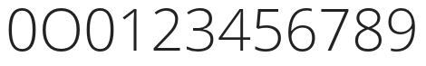
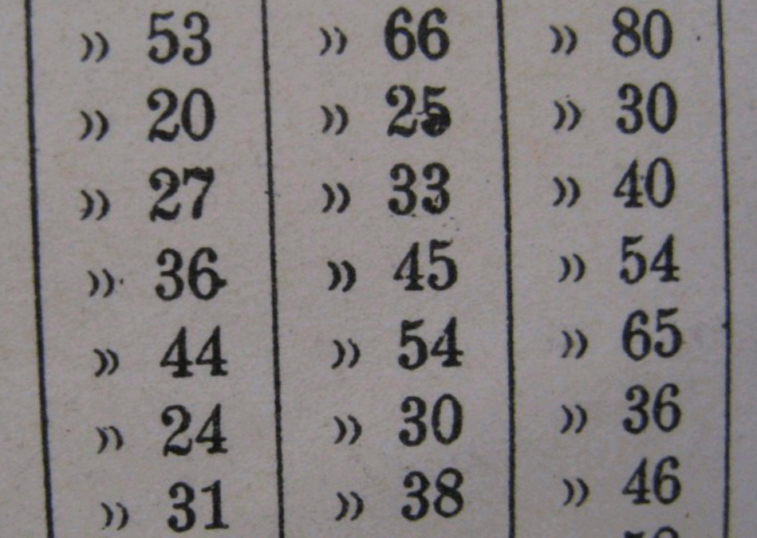
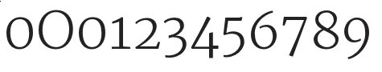

Los numerales (o cifras) son a menudo difíciles para los diseñadores de fuentes &mdash; y por varias razones. Una es que los numerales tienen un número muy grande de curvas. Otra es que los numerales a menudo usan convenciones en sus formas que son diferentes de (o incluso violan) las convenciones visuales vistas en el resto del diseño de la fuente. Además, los numerales pueden tener un número muy grande de trazos (como hacen el 8 y el 5), o pueden tener grandes espacios en blanco (como el 1, 7, y a veces 2 y 4). Ambas situaciones pueden ser difíciles de manejar. Finalmente, está el problema de cómo asegurarse de que tu cero se vea diferente de la O mayúscula.

Puede ser útil mirar los numerales encontrados en una amplia variedad de fuentes para familiarizarse más con las formas en que los diseñadores hacen frente a estos problemas.

En aquellos numerales con un número denso de trazos (como el 8), puedes encontrar que los diseñadores permiten que los anchos de los trazos sean un poco más delgados de lo que es típico de las letras en la fuente. Un enfoque similar se puede ver en el diseño de la 'g' de doble altura (doble ojal).

Por el contrario, para compensar los numerales con grandes proporciones de espacio en blanco, es probable que algunos trazos se vuelvan más pesados de lo que sería típico.

En el caso de distinguir el cero de la O mayúscula, hay una amplia gama de soluciones &mdash; como hacer el cero más estrecho que la O, o un cero que sea perfectamente redondo, o tal vez (especialmente en una fuente monoespaciada) tener una barra a través del cero.

Tener el cero más estrecho que la O mayúscula mientras comparte su altura es el enfoque común. Este enfoque es típico de las cifras alineadas, que son el estilo más común para los numerales. Ejemplos de fuentes que usan este enfoque incluyen: muchas Garamonds, Futura, y la fuente web de Google Open Sans. A continuación se muestra Open Sans mostrando el cero, O mayúscula, cero y luego otros numerales.

Un círculo perfectamente redondo o casi perfectamente redondo es menos común, pero existe. Ejemplos de fuentes que usan este enfoque incluyen la fuente web de Google Vollkorn así como otros tipos comerciales como Mrs Eaves, Vendeta y Fleischman BT Pro. Las fuentes que usan cifras proporcionales de estilo antiguo tienen más probabilidades de presentar este enfoque. A veces también se verá un cero a la altura de x pero que es más estrecho.

Los numerales también vienen en hasta 11 estilos identificables cuando incluyes fracciones, superíndices y subíndices. Veremos los 5 más comunes.

## Cifras de estilo alineado (Lining style)

Los estilos de número más comunes encontrados en fuentes son Alineadas Tabulares y Alineadas Proporcionales. Alineado se refiere a las alturas que usan los números. Si es un estilo alineado las alturas para todos los números serán ópticamente las mismas. La diferencia entre números Alineados Tabulares y Alineados Proporcionales es que en Alineados Tabulares todos los números también comparten los mismos anchos. Este estilo es útil para hojas de cálculo y cualquier otro propósito donde sea útil que los números permanezcan apilados en líneas ordenadas tanto horizontal como verticalmente.

Los números alineados proporcionales tienen la ventaja de tener la capacidad de verse más visualmente uniformes porque las formas y el espaciado de los números pueden variar para compensar la densidad de trazos diferente.

## Cifras elzevirianas o de estilo antiguo

Los números tabulares son una invención relativamente nueva en términos históricos. Antes de que existieran había números proporcionales de estilo antiguo. Los números de estilo antiguo son útiles si quieres que los números se mezclen y compartan el estilo de un texto.

Los números de estilo antiguo tabulares son bastante raros. Pueden ser útiles en un informe anual donde quieres la sensación de un número de estilo antiguo pero el espaciado tabular típico de ese tipo de documento. La imagen de arriba es de una tarjeta de catálogo de biblioteca de máquina de escribir.

## Cifras de estilo híbrido

Los numerales híbridos no comparten la altura de mayúsculas ni la altura de x de la fuente, sino que ocupan su propia altura. El término "híbrido" se refiere a una mezcla de los numerales de estilo antiguo y alineados. Ejemplos de fuentes que usan numerales de estilo híbrido incluyen Georgia y las fuentes web de Google Merriweather y Donegal. El cero, O mayúscula, cero, 1, 2, 3, etc glifos de Merriweather se muestran a continuación.

