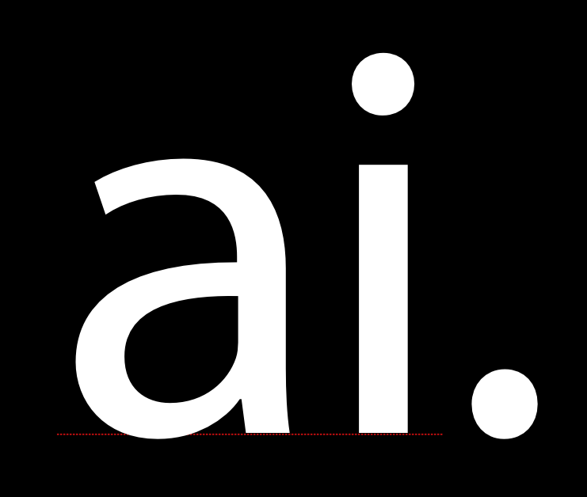
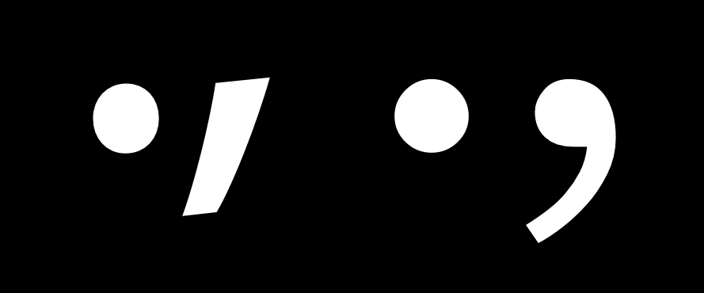
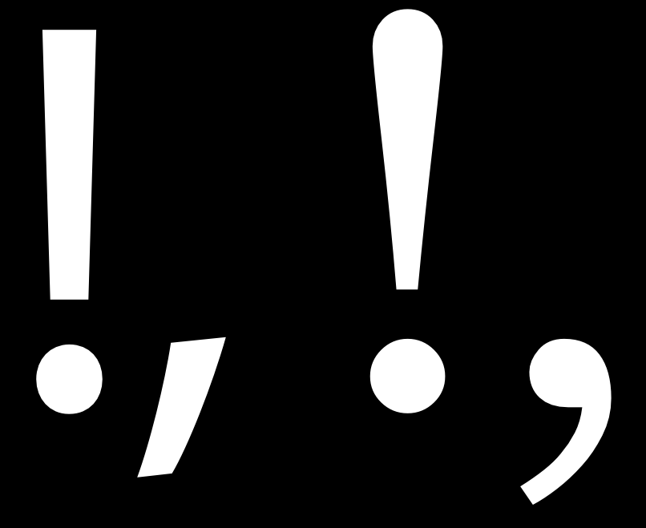
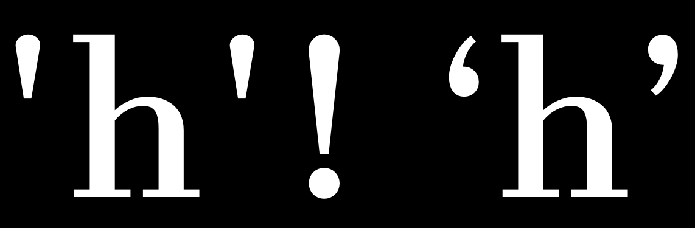
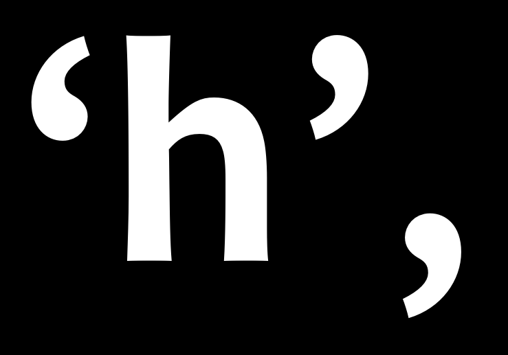
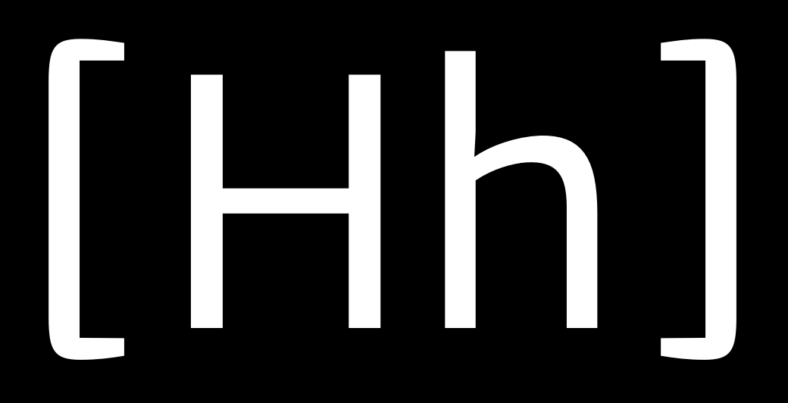

La puntuación y otros símbolos tipográficos tienen una historia propia, separada y aparte del desarrollo del alfabeto. Pero, encontrarás que el mismo proceso de diseño todavía se aplica, incluyendo reutilizar y adaptar elementos componentes, e iterativamente probar tus elecciones de diseño.

## Glifos de puntuación simples

Lo primero que hay que hacer al diseñar la puntuación es crear el carácter '.', que se conoce como punto final o punto.

La forma de este glifo a menudo se toma del punto sobre la 'i', que a veces se llama tilde (tittle). Después de copiar el punto, es posible que desees hacerlo un poco más grande. Probar varios tamaños diferentes en texto impreso o en pantalla es aconsejable.

Una vez que establezcas un tamaño con el que estés contento, este punto se puede utilizar como base para una amplia variedad de otra puntuación, incluyendo estos glifos:  ; : ? ! ¡ ¿ · …

El siguiente glifo para hacer es la coma. La forma de la coma puede variar en un grado casi sorprendente. Puede ser valioso para ti mirar una amplia gama de diseños de comas antes de diseñar la tuya.

La imagen a continuación muestra dos de las formas más comunes que la coma puede tomar.

La parte superior de la coma es a menudo ligeramente más ligera que el punto, porque si es igual puede parecer demasiado pesada. En la imagen de muestra, la coma a la derecha es un buen ejemplo de esta compensación que se aplica. Otro error común a tener en cuenta con este glifo es hacerlo demasiado corto.

Cuando tengas tu coma será bastante fácil hacer el punto y coma (;).

## Signo de exclamación y signo de interrogación

El signo de exclamación puede ser engañoso en el sentido de que <em>parece</em> simple de hacer. Si miras una gama de tipografías verás que a veces el diseño es de hecho bastante simple.

Sin embargo, este es un glifo que tiene una sorprendente cantidad de oportunidades para expresar diseño. A menudo es el caso que incluso en una fuente que tiene muy poco contraste, la barra sobre el punto es algo más pesada en la parte superior que en la inferior. La forma del signo de exclamación generalmente se relaciona con el diseño de la coma en algún grado.

El signo de interrogación también puede ser bastante difícil de hacer, porque requiere que equilibres una curva abierta sobre el punto de abajo.

Al igual que con el signo de exclamación, es aconsejable mirar e incluso probar una gama de soluciones diferentes antes de elegir una para tu diseño.

El diseño de los glifos c, C, G, s y S puede proporcionar alguna base para el diseño de este glifo, pero puedes decidir elegir una forma que sea distinta también.

## Símbolos adicionales

Las comillas simples o verticales &mdash; &apos; y &quot; &mdash; son distintas de las comillas tipográficas: ‘ ’ y “ ” ‚ „ .

Las comillas simples pueden seguir la forma de la barra sobre el punto en el signo de exclamación, pero también se pueden diseñar por separado.

Generalmente las comillas tipográficas están bastante estrechamente relacionadas con la coma; sin embargo, deben ser más largas que la coma y a menudo curvarse más.

Los corchetes [ ] son relativamente simples de hacer porque son muy rectangulares en forma. Sin embargo, su diseño debe reflejar las elecciones que has hecho en el resto de la tipografía.

La pregunta principal para decidir es qué tan altos y profundos serán. La convención es que deben exceder la altura de las mayúsculas muy ligeramente y descender por debajo de la línea base aproximadamente a 3/4 de la profundidad de tus descendentes de minúsculas.

Estas elecciones también se reflejarán en el diseño de los paréntesis () y las llaves {}. El peso de los fustes en estos tres símbolos debe ser menor que el peso de los fustes tanto de las mayúsculas como de las letras minúsculas.

Ten cuidado: al probar los caracteres [ ] # en la ventana de métricas, es posible que no aparezcan. Esto se debe a que están reservados por el programa. En lugar de escribir [ ] y # , debes escribir /bracketleft /bracketright y /numbersign .

Los paréntesis deben basarse en el diseño de formas relacionadas, como D, C y G.

Las llaves son notables en que su diseño varía en mayor grado. Las llaves tienen esto en común con el signo de interrogación. La distribución del peso en las llaves puede ser como la distribución del peso de los números, en el sentido de que a veces puede violar las reglas que sigues en el resto del diseño.
