Los espacios entre caracteres son una parte importante e integral del diseño de una fuente.

El diseño del espaciado de letras de una fuente debe llevarse a cabo como una parte integral de todo el proceso de diseño de una fuente. Un buen espaciado es necesario para que una fuente funcione bien.

En FontForge, la Ventana de Métricas (Metrics Window) te permite diseñar las métricas de tu fuente, alterar el espaciado entre ellos y probar cómo se ven los glifos juntos. Las ventanas de métricas se pueden abrir desde el menú ‘Window’ (Ventana), o usando el comando <kbd>Ctrl</kbd>&nbsp;+&nbsp;<kbd>K</kbd>.

El espacio entre cualesquiera dos glifos tiene dos componentes: el espacio después del primer glifo y el espacio antes del segundo glifo. Estos espacios entre glifos se componen de los ‘márgenes laterales’ (márgenes izquierdo y derecho) de cada par de glifos. Cada glifo tiene un margen lateral izquierdo y un margen lateral derecho; en el ejemplo a continuación de la ‘a’ minúscula de Open Sans, el margen lateral derecho tiene un valor de 166 unidades, y el margen lateral izquierdo tiene un valor de 94 unidades.

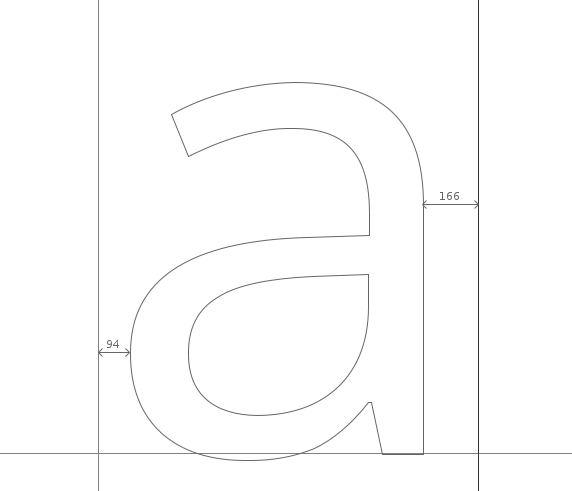

## <strong>Funciones Básicas de la Ventana de Métricas</strong>

Los márgenes laterales de los caracteres se pueden editar en la Ventana de Métricas de FontForge de cinco maneras:

- Arrastrando manualmente cada límite de margen lateral.
- Arrastrando manualmente un carácter. Ten en cuenta que arrastrar un carácter solo afectará al valor del margen lateral izquierdo.
- Editando directamente su valor en las tablas de métricas de la Ventana de Métricas.
- Incrementando / decrementando usando el teclado.
- Usando comandos en el menú Metrics de la Ventana de Métricas.

### Ajustando Valores de Margen Lateral Con El Teclado

Un método para ajustar valores métricos de forma rápida y precisa en FontForge es usando las teclas arriba, abajo, izquierda y derecha de un teclado. Las teclas arriba y abajo se usan para incrementar / decrementar valores y <kbd>Alt</kbd>&nbsp;+&nbsp;<kbd>Arriba</kbd>, <kbd>Alt</kbd>&nbsp;+&nbsp;<kbd>Abajo</kbd>, <kbd>Alt</kbd>&nbsp;+&nbsp;<kbd>Izquierda</kbd> y <kbd>Alt</kbd>&nbsp;+&nbsp;<kbd>Derecha</kbd> se usan para navegar por los diferentes campos de valor de la Ventana de Métricas.

## Principios Generales

Como principio general, los caracteres simétricos como 'A' 'H' 'I' 'M' 'N' 'O' 'T' 'U' 'V' 'W' 'X' 'Y' 'o' 'v' 'w' 'x' tendrán márgenes laterales simétricos. Por ejemplo, los márgenes laterales izquierdo y derecho de una 'H' serán del mismo valor. Ten en cuenta que esta no es una regla estricta, sino general.

<b>【Nota】:</b> Esta regla también se menciona en <a href="Creating_o_and_n.html">Creación de las letras 'o' y 'n'</a>.

A medida que espacies los caracteres que diseñas, debes confiar en tus ojos. La conclusión es 'diseñar, mirar, ajustar, mirar de nuevo'.

Para el principiante absoluto, no asumas que se logran resultados confiables confiando en el espacio medido. Por ejemplo, aunque las medidas entre dos caracteres pueden ser desiguales, el ojo puede verlas como iguales. Un ejemplo obvio de esto se puede ver al intentar espaciar los caracteres 'H' y 'O'. Así, para el ejemplo a continuación, los márgenes laterales de la 'H' y la 'O' son iguales, pero parecen desiguales. En la línea inferior, los márgenes laterales no son iguales pero el espaciado parece equilibrado.

## <strong>Comandos del Menú Metrics Para Editar Métricas</strong>

"_**Center&nbsp;in&nbsp;Width**_" (Centrar en Ancho) &mdash; Esto centra el glifo actual dentro de su ancho actual.

"_**Window&nbsp;Type**_" (Tipo de Ventana) &mdash; La Ventana de Métricas de FontForge se puede configurar para comportarse de dos maneras para el ajuste de métricas;

- "_**Advance&nbsp;Width&nbsp;Only**_" (Solo Ancho de Avance) &mdash; en este modo, la vista de métricas solo se puede usar para ajustar los anchos de avance de los glifos.
- "_**Both**_" (Ambos) &mdash; En este modo, la vista de métricas ajustará el ancho de avance o los valores de kerning.

"_**Set&nbsp;Width**_" (Establecer Ancho) &mdash; este comando te permite cambiar el ancho del glifo actual.

"_**Set&nbsp;LBearing**_" (Establecer Margen Izquierdo) &mdash; te permite cambiar el valor del margen lateral izquierdo.

"_**Set&nbsp;RBearing**_" (Establecer Margen Derecho) &mdash; te permite cambiar el valor del margen lateral derecho.

## <strong>Un Enfoque Básico Para el Espaciado</strong>

El siguiente método está diseñado para que comiences de manera efectiva hacia el diseño de las métricas de tu fuente.

Comenzando con una cadena de caracteres 'o' minúscula en la ventana de métricas, los márgenes laterales izquierdo y derecho se pueden ajustar hasta que el espaciado de los caracteres se vea y se sienta correcto. Una forma de buscar esta 'corrección' es buscar que el espacio en blanco entre los caracteres 'o' equilibre el espacio en blanco dentro de los caracteres 'o'. En general, con la excepción de las fuentes inclinadas o cursivas, los márgenes laterales izquierdo y derecho de una 'o' minúscula deben ser de igual valor. Una vez que estés contento con el espaciado de tu cadena de caracteres 'o', introduce el carácter 'n' de tu fuente (ver abajo) y luego busca ajustar los márgenes laterales de la 'n' para que su espaciado encaje en el equilibrio de la cadena de caracteres 'o' (ver abajo). Ten en cuenta que debido a la naturaleza de la forma en que nuestros ojos ven, el margen lateral derecho de una 'n' siempre será un valor menor que el margen lateral izquierdo, y los márgenes laterales de la 'o' serán menores que los márgenes laterales de la 'n'.

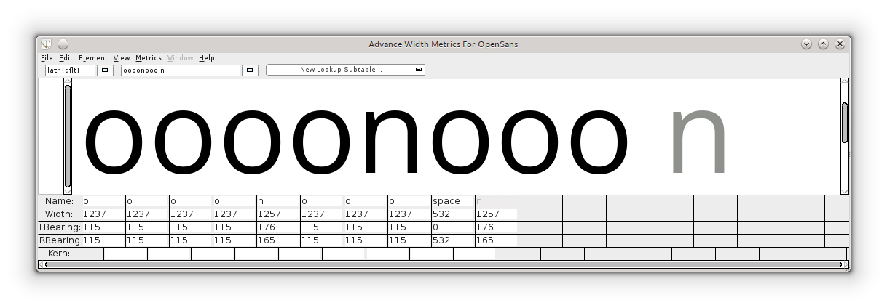

Una vez que tanto la 'n' como la 'o' estén espaciadas adecuadamente, sus márgenes laterales se pueden usar para crear los márgenes laterales para una matriz de otros caracteres: por ejemplo:

- El margen lateral izquierdo de la 'o' se puede usar para el margen lateral izquierdo de la 'c', 'd', 'e' y 'q'.
- El margen lateral derecho de la 'o' se puede usar para el margen lateral derecho de la 'b' y 'p'.
- El margen lateral derecho de la 'n' se puede usar para el margen lateral derecho de la 'h' y 'm'.
- El margen lateral izquierdo de la 'n' se puede usar para el margen lateral izquierdo de la 'b', 'h', 'k', 'm', 'p' y 'r'.

<b>【Nota】:</b> lo anterior debe usarse solo como una guía que se puede usar como un punto de partida súper efectivo para encontrar valores correctos para estos márgenes laterales.

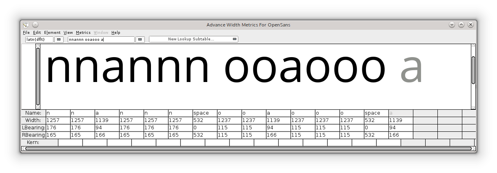

Desde aquí tiene sentido espaciar el resto de los márgenes laterales de los caracteres minúsculos contra cadenas de caracteres 'n' y 'o', como se ve en el diagrama anterior. De nuevo, confía en tus ojos para alcanzar el equilibrio correcto de caracteres.

## <strong>Caracteres Mayúsculos</strong>

Los caracteres mayúsculos se pueden espaciar usando los mismos principios anteriores. Por ejemplo, comienza con la cadena 'Hooooo' y ajusta el margen lateral derecho de la 'H' hasta que se sienta equilibrado contra la cadena de caracteres 'o'. Con el margen lateral izquierdo de la 'H' siendo igual al margen lateral derecho, la 'O' mayúscula se puede espaciar contra la 'H' (ver abajo).

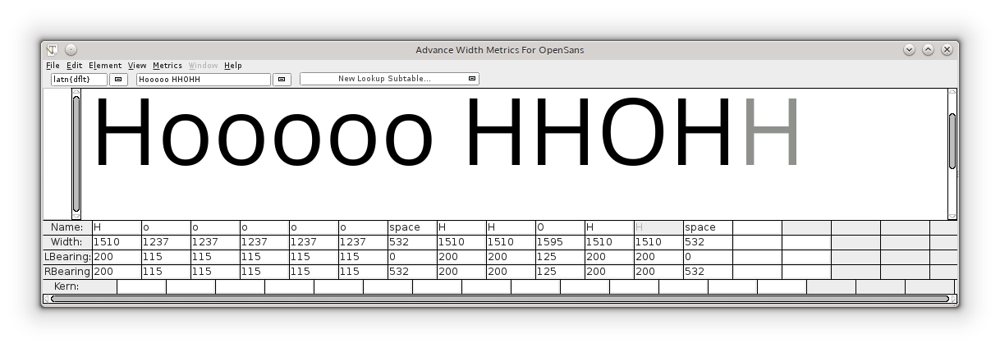

Desde aquí todos los demás caracteres se pueden espaciar contra los caracteres que ya han sido espaciados. Cabe señalar que este método se puede usar como un buen punto de partida para espaciar una fuente, pero es probable que también se necesite un ajuste fino más minucioso del espaciado para lograr niveles más altos de buen espaciado de letras. Otras cadenas de caracteres que son útiles en esto pueden ser matrices como 'naxna', 'auxua', 'noxno' y 'Hxndo'.

## <strong>Kerning</strong>

[Kerning](Glossary.md#Kerning) es el ajuste del espaciado entre pares de caracteres específicos. El kerning permite el espaciado individual de pares de caracteres que se aplica además del espaciado proporcionado por los márgenes laterales de un carácter. Ejemplos comunes de pares de caracteres donde a menudo se necesita kerning para mejorar el espaciado serían 'WA', 'Wa', 'To' y 'Av'. En los ejemplos a continuación, podemos ver que, sin kerning, el espaciado entre los pares de letras 'To' y 'Av' es demasiado ancho, mientras que, con kerning, el espacio entre estos pares de caracteres está mucho más equilibrado con la sensación del espaciado del resto de la fuente.

La Ventana de Métricas en FontForge se puede usar para diseñar tanto valores de margen lateral como valores de kerning. Los valores de kerning se pueden aplicar a una fuente de varias maneras en FontForge. Dos de estas se muestran a continuación: kerning con clases y kerning con pares individuales.

## <strong>Menú Metrics de FontForge</strong>

"_**Window&nbsp;Type**_" (Tipo de Ventana) &mdash; La ventana de Métricas de FontForge se puede configurar para comportarse de dos maneras diferentes para permitir el ajuste de kerning:

- "_**Kerning&nbsp;Only**_" (Solo Kerning) &mdash; En este modo, la vista de métricas solo se puede usar para ajustar el kerning.
- "_**Both**_" (Ambos) &mdash; En este modo, la vista de métricas ajustará el ancho de avance o los valores de kerning.

"_**Kern&nbsp;By&nbsp;Classes**_" (Kerning por Clases) &mdash; Este comando proporciona al usuario un diálogo para manipular clases de kerning.

"_**Kern&nbsp;Pair&nbsp;Closeup**_" (Primer Plano de Par de Kerning) &mdash; Este comando proporciona al usuario un diálogo desde el cual puedes ajustar pares de kerning ya existentes o crear nuevos pares (ver abajo).

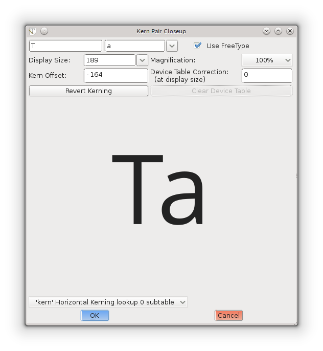

## <strong>Ajustando Valores de Kerning Con El Teclado</strong>

Al igual que con el ajuste de valores de margen lateral, los valores de kerning se pueden editar rápida y precisamente en FontForge usando las teclas <kbd>Arriba</kbd>, <kbd>Abajo</kbd>, <kbd>Izquierda</kbd> y <kbd>Derecha</kbd> de un teclado. Las teclas <kbd>Arriba</kbd> y <kbd>Abajo</kbd> se usan para incrementar / decrementar valores y <kbd>Alt</kbd>&nbsp;+&nbsp;<kbd>Arriba</kbd>, <kbd>Alt</kbd>&nbsp;+&nbsp;<kbd>Abajo</kbd>, <kbd>Alt</kbd>&nbsp;+&nbsp;<kbd>Izquierda</kbd> y <kbd>Alt</kbd>&nbsp;+&nbsp;<kbd>Derecha</kbd> se usan para navegar por los diferentes campos de valor de la ventana de métricas.

## <strong>Kerning de Pares Individuales</strong>

Este es el nivel más básico de creación de pares de kerning en FontForge. En la Ventana de Métricas, el valor de kerning entre dos caracteres se puede ajustar manualmente arrastrando el carácter de la derecha hacia o desde el carácter de la izquierda, o editando el valor de kerning directamente en la tabla de métricas de la ventana. Para cambiar los valores de kerning arrastrando caracteres, usa el controlador de herramienta de kerning que aparece cuando el cursor del mouse se cierne entre dos caracteres (ver captura de pantalla a continuación). El valor de kerning en la tabla de métricas se puede editar ingresando valores manualmente o incrementando / decrementando el valor usando las teclas <kbd>Arriba</kbd> / <kbd>Abajo</kbd> de tu teclado.

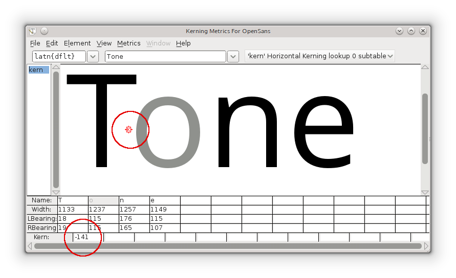

## <strong>Kerning Con Clases</strong>

¡El kerning de clases puede ahorrarte mucho tiempo!

Una 'clase de kerning' en FontForge se puede crear para construir grupos de caracteres que tendrán todos el mismo valor de kerning aplicado. Por ejemplo, se puede crear una clase &mdash; llamémosla 'o_left_bowl' &mdash; en la que los caracteres 'o', 'c', 'd', 'e', 'q' siempre tendrán el mismo valor de kerning cuando sean precedidos por, por ejemplo, el carácter 'T'.
La 'T' también podría ser ella misma un miembro de otra clase que probablemente incluiría otros caracteres como Tcaron y Tbar.

El Kerning de Clase es un tipo de búsqueda (lookup) GPOS.
Esta información de kerning se encuentra yendo a "_**Element**&nbsp;⇨&nbsp;**Font&nbsp;Info**_" (Elemento > Información de fuente), y luego "_**Lookups**_" (Búsquedas), y luego seleccionando la pestaña "_**GPOS**_".
(Puedes hacer esto en cualquier momento para volver a donde lo dejaste).

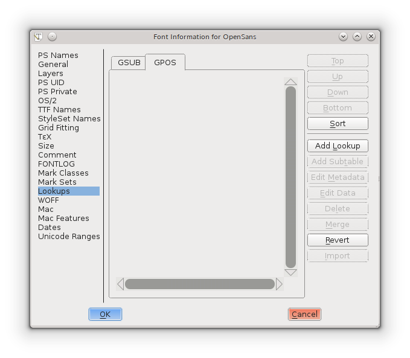

Presiona el botón "_**Add&nbsp;Lookup**_" (Añadir Búsqueda), y elige Type: "_**Pair&nbsp;Position&nbsp;(Kerning)**_" (Posición de Par (Kerning))

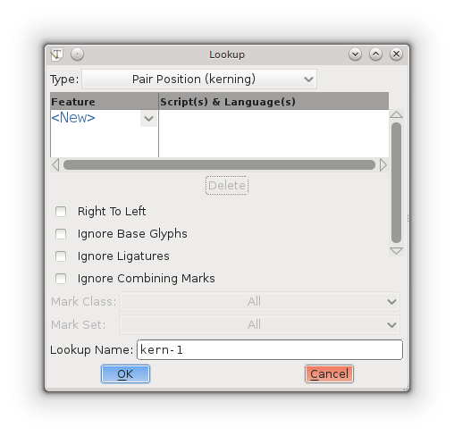

NO hagas clic en el botón "_**&lt;New&gt;**_"; haz clic en la flecha "**🔽**" junto a él, y selecciona "_**Horizontal&nbsp;Kerning**_".
Notarás que "_**&lt;New&gt;**_" cambiará a "_**&lt;Kern&gt;**_".
Acepta el _**Lookup&nbsp;Name**_ (Nombre de Búsqueda) predeterminado, o cámbialo si lo deseas, y presiona el botón "_**OK**_".

Regresas a la pestaña "_**GPOS**_", y ahora tienes una tabla de búsqueda seleccionada.
Cada conjunto de clases de kerning vive en su propia subtabla.
Para crear una subtabla, presiona el botón "_**Add&nbsp;Subtable**_" (Añadir Subtabla).
Puedes hacer "_**OK**_" al nombre predeterminado.

Luego se te muestra una ventana con muchas opciones:

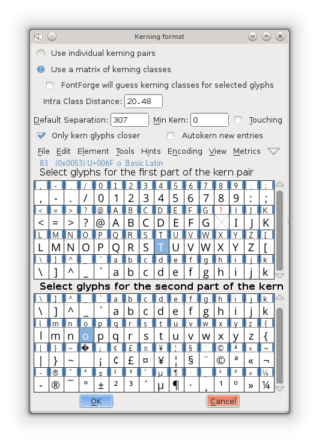

En la parte superior se te pide que elijas entre "_**Use&nbsp;individual&nbsp;kerning&nbsp;pairs**_" (Usar pares de kerning individuales) o "_**Use&nbsp;a&nbsp;matrix&nbsp;of&nbsp;kerning&nbsp;classes**_" (Usar una matriz de clases de kerning).

Si elegiste clases, se te presentará un diálogo siguiente donde puedes crear tus clases.
**Si quieres hacer kerning a referencias junto con los originales, elige clases.**

Ten en cuenta que puedes elegir habilitar a FontForge para 'adivinar' o 'autokern' los valores de kerning entre las clases que estás creando en el diálogo.
Si usas FontForge para adivinar valores de kerning, indudablemente necesitarás una cantidad de prueba y error y experimentación, pero puede tener sentido usar la función de autokern como una forma rápida de hacer kerning a tu fuente y ver qué mejoras puede traer esto.

Deja el resto de los parámetros como están hasta que tengas razón para probar valores diferentes.

Después de hacer clic en "_**OK**_" en el diálogo anterior, se te presentará la siguiente ventana donde puedes ajustar la cantidad de kerning entre estas dos clases.
Por ejemplo, en la segunda captura de pantalla a continuación, se han creado dos clases, una clase que contiene el carácter 'T' y una clase que contiene el carácter 'o'.

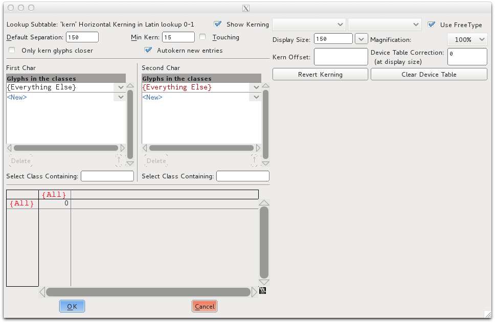

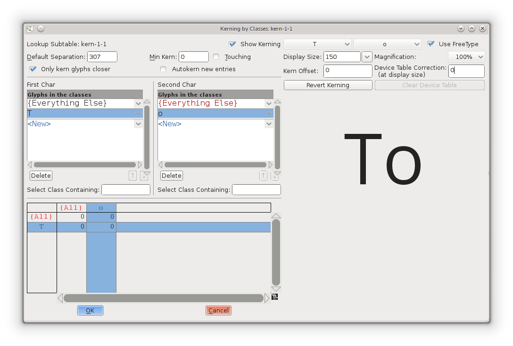

Puedes seleccionar todos los glifos y eliminar clases más tarde, o puedes seleccionar solo los glifos que quieres hacer kerning.
Seleccionas todos los glifos que quieres ajustar al mismo tiempo, y FontForge los pondrá en clases &mdash; a menos que estés trabajando con diferentes sistemas de escritura que no quieres hacer kerning juntos (como Latín, Griego, Cirílico…).

Cuando presionas el botón "_**OK**_", obtienes una ventana grande con algunos parámetros en la parte superior, dos listas de clases y una matriz abajo.
Cuando seleccionas un cuadro en la matriz, puedes ver cómo se hace kerning al par.
Si no te gusta, puedes ajustar el Kern Offset (Desplazamiento de Kern), en el cuadro sobre la visualización del par de glifos.

Si algo sale mal, y saldrá, presiona el botón "_**Cancel**_".
Luego haz doble clic en la subtabla (presiona el signo más junto a la tabla si no lo ves) y estarás de vuelta en la ventana grande.
Si haces mucho trabajo sin problemas, es una buena idea presionar "_**OK**_" y volver, para no perder tu trabajo cuando algo salga mal.

La ventana de métricas se puede usar más tarde como una comprobación final.
Si bien se pueden hacer ajustes en esa ventana, sigue preguntando si quieres hacer kerning a la clase o al par y cosas exigentes como esa.
¿Por qué no probarlo y ver si te gusta?
Pero debes saber que a algunos usuarios experimentados no les gusta, y hacen todo el kerning como se indica arriba:
"_**Element**&nbsp;⇨&nbsp;**Font&nbsp;Info**_", y luego "_**Lookups**_", y luego seleccionando la pestaña "_**GPOS**_", expande presionando el signo <kbd>+</kbd>, haz doble clic en la subtabla.

## Kerning Manual

Si los valores de autokern necesitan ser ajustados (¡y lo necesitarán!) entonces esto se puede hacer de varias maneras.

- A través de la ventana de diálogo 'kerning por clases'.
- Usando la Ventana de Métricas.
- Usando el comando 'Kern Pair Closeup' del menú Metrics.
