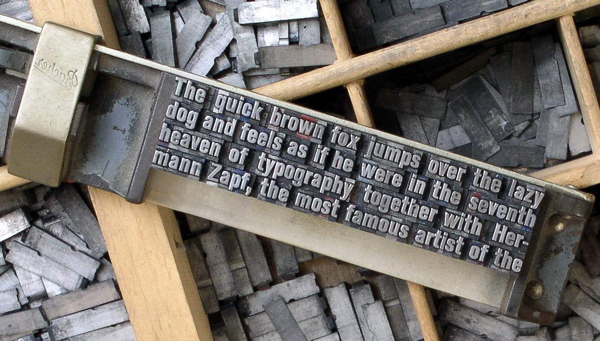
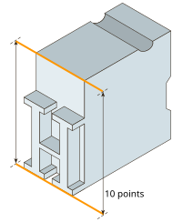
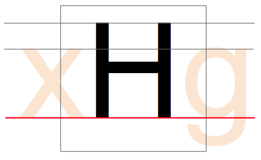
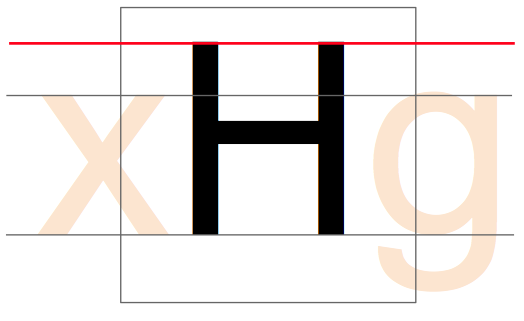
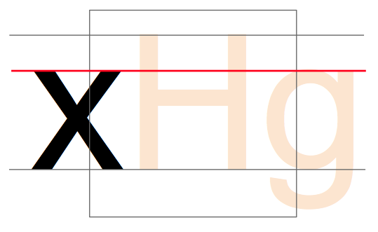

&mdash; También llamado ‘tamaño em’ o ‘UPM’ (**U**nits **P**er e**M**). En un tipo de letra, cada carácter se encaja en su propio contenedor espacial. En los tipos metálicos tradicionales, este contenedor era el propio bloque metálico de cada carácter. La altura de cada pieza de carácter era uniforme, lo que permitía colocar los caracteres ordenadamente en filas y bloques (véase abajo).

La altura de la pieza tipográfica se conoce como ‘em’, y tiene su origen en la anchura del carácter ‘M’ mayúscula; se hizo para que las proporciones de esta letra fueran cuadradas (de ahí la denominación ‘em cuadrada’). El tamaño em es sobre el que se calcula el tamaño de punto de los tipos metálicos. Así, un tipo de 10 puntos tiene una em de 10 puntos (véase abajo).

En tipografía digital, la em es una cantidad de espacio definida digitalmente. En una fuente OpenType, el tamaño UPM &mdash; o em se establece generalmente en 1000 unidades. En las fuentes TrueType, el UPM es por convención una potencia de dos, generalmente fijada en 1024 o 2048.

Cuando se utiliza la fuente para escribir, la em se escala al tamaño de punto deseado. Esto significa que para un tipo de 10 pt, las 1000 unidades, por ejemplo, se escalan a 10 pt.

Así que si tu 'H' mayúscula tiene 700 unidades de alto, tendrá 7 pt de alto en un tipo de 10 pt.

### Configurando eso en la ventana Glifo

Con el conocimiento de que tu fuente está usando un UPM de 1000, 1024 o 2048, necesitas configurar el dibujo de tus glifos para asegurarte de que todos los aspectos de tu tipo de letra encajan adecuadamente en ese cuadrado UPM.

El tamaño del cuadrado em se puede configurar desde "_**Elements**&nbsp;⇨&nbsp;**Font&nbsp;Info&hellip;**_" luego haga clic en la pestaña "_**General**_" y verá el ajuste *EM*, cuyo valor se distribuirá entre las alturas *Ascendente* y *Descendente*, respectivamente alturas por encima y por debajo de la línea de base.

La línea de base:

La altura H:

La altura x:

Más tarde, cuando diseñe su tipo de letra, tendrá que establecer los *Valores azules* que sirven para los contornos PostScript y también para el autohinter de FontForge &mdash; independientemente de los contornos con los que esté trabajando.

Encontrará la configuración en "_**Elements**&nbsp;⇨&nbsp;**Font&nbsp;Info&hellip;**_", en la pestaña "_**PS&nbsp;Private**_". FontForge puede adivinar inicialmente los valores basándose en sus contornos, pero tendrá que editarlos usted mismo para los excesos/descensos &mdash; vamos unos cuantos capítulos por delante de este concepto (véase [“Creación de ‘o’ y ‘n’”]); primero vamos a familiarizarnos con FontForge y sus funcionalidades de dibujo.

[“Creación de ‘o’ y ‘n’”]: Creating_o_and_n.html
