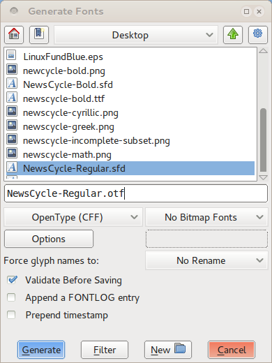
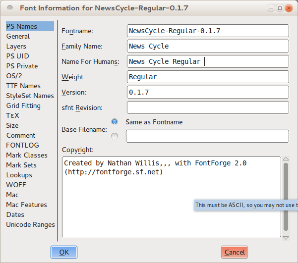
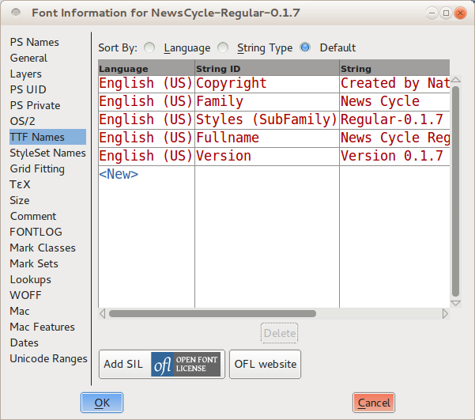
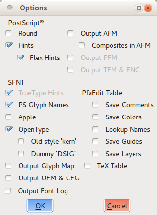

Aunque puedes realizar una amplia gama de pruebas dentro del propio FontForge, necesitarás generar archivos de fuente instalables para realizar pruebas en el mundo real durante el proceso de desarrollo. Además, tu objetivo final es, por supuesto, crear una fuente que puedas poner a disposición en un formato de salida para que otras personas la instalen y la usen. Utilizarás la herramienta <em>Generate Fonts</em> (Generar Fuentes) (que se encuentra en el menú File) para construir una fuente de salida utilizable, independientemente de si la estás haciendo para tus propios fines de prueba o para publicarla para el consumo de otros, pero querrás emplear algunos pasos adicionales al construir el producto terminado.

FontForge puede exportar tu fuente a una variedad de formatos diferentes, pero en la práctica solo dos son importantes: TrueType (que se encuentra con la extensión de nombre de archivo <em>.ttf</em>) y OpenType CFF (que se encuentra con la extensión <em>.otf</em>). Técnicamente, el formato OpenType puede abarcar una gama de otras opciones, pero el tipo CFF es el que tiene un uso generalizado.

## Generación rápida y sucia para pruebas

Para construir un archivo de fuente para fines de prueba &mdash; como examinar el espaciado en un navegador web &mdash; solo necesitas asegurarte de que tu fuente pase las pruebas de validación requeridas.

Puedes usar la herramienta <em>Validate Font</em> (Validar Fuente) que se encuentra en el menú Element (Elemento) para hacer esto (ver [Asegurándote de que tu fuente funcione, Validación](Making_Sure_Your_Font_Works_Validation.html) para una explicación más detallada), o puedes seleccionar todos los glifos (presiona <kbd>Ctrl</kbd> + <kbd>A</kbd> o elige "Select" &gt; "Select All" del menú "Edit") y luego ejecutar algunos comandos para aplicar algunos cambios básicos en masa. Sin embargo, asegúrate de guardar tu trabajo antes de continuar: algunos de los cambios requeridos para validar tu fuente para la exportación alterarán las formas de tus glifos de maneras sutiles.

Para fuentes OpenType, primero corrige la dirección de todas tus rutas. Presiona <kbd>Ctrl</kbd> + <kbd>Shift</kbd> + <kbd>D</kbd> o elige "Correct Direction" (Corregir Dirección) del menú "Element". A continuación, verifica para asegurarte de que no hayas dejado rutas sin cerrar. Elige "Find problems" (Buscar problemas) del menú "Element", selecciona la opción <em>Open paths</em> (Rutas abiertas) en la pestaña "Paths" y haz clic en OK para ejecutar la prueba. Una vez que tu fuente pase la prueba sin errores, estás listo para generar la salida OpenType.

Para fuentes TrueType, se requieren algunos pasos adicionales. Primero debes corregir la dirección de todas tus rutas como se describe anteriormente. A continuación, ajusta todos los puntos para que tengan coordenadas enteras, ya sea presionando <kbd>Ctrl</kbd> + <kbd>Shift</kbd> + <kbd>_</kbd> (guion bajo), o eligiendo <em>To Int</em> (A Entero) del menú "Element" &gt; "Round". Finalmente, abre la herramienta "Find Problems", selecciona la prueba <em>Open paths</em> como se describe anteriormente, y también selecciona todas las pruebas en la pestaña "Refs".

Después de que puedas ejecutar estas pruebas sin errores, necesitarás convertir tus rutas a curvas cuadráticas. Abre la ventana "Font Info" (Información de la fuente) desde el menú "Element". Haz clic en la pestaña "Layers" (Capas) y marca la opción <em>All layers quadratic</em> (Todas las capas cuadráticas). Haz clic en OK en la parte inferior de la ventana, y estarás listo para generar la salida TrueType.

### Construyendo los archivos de fuente

Abre la ventana <em>Generate Fonts</em> eligiéndola del menú "File". La mitad superior de la ventana muestra las opciones familiares de selección de archivos &mdash; una lista de los archivos encontrados en el directorio actual, un cuadro de entrada de texto para que ingreses un nombre de archivo, y botones para navegar a otras carpetas y directorios si es necesario. Esto es estrictamente un medio para ayudarte a encontrar rápidamente el lugar correcto para guardar tu archivo de salida, o para elegir un archivo de fuente existente si tienes la intención de sobrescribir un guardado anterior. Todas las opciones que necesitas mirar se encuentran en la mitad inferior de la ventana.

En el lado izquierdo hay un menú desplegable desde el cual seleccionas el formato de la fuente que deseas generar. Debes elegir <em>TrueType</em> o <em>OpenType (CFF)</em>, como se discutió anteriormente. En el lado derecho, asegúrate de que <em>No Bitmap Fonts</em> (Sin fuentes de mapa de bits) esté seleccionado. En la línea de abajo, asegúrate de que <em>No Rename</em> (Sin renombrar) esté seleccionado para la opción "Force glyph names to:". Puedes marcar la opción "Validate Before Saving" (Validar antes de guardar) si lo deseas (para detectar potencialmente errores adicionales), pero esto es opcional. Deja las opciones "Append a FONTLOG entry" y "Prepend timestamp" desmarcadas.

Haz clic en el botón "Generate", y FontForge construirá tu archivo de fuente. Puedes cargar la fuente en otras aplicaciones y ejecutar cualquier prueba, pero cuando estés listo para volver a editar, recuerda volver a abrir la versión guardada de tu fuente que creaste antes de generar tu salida <em>.ttf</em> o <em>.otf</em>.

## Generando para el lanzamiento final

Diseñar tu fuente es un proceso iterativo, pero eventualmente llegará el día en que debas declarar tu fuente terminada &mdash; o al menos lista para el consumo público. En ese punto, volverás a generar un archivo de salida .ttf o .otf (quizás incluso ambos), pero antes de hacerlo necesitarás trabajar a través de algunos pasos adicionales para crear la versión más compatible con los estándares y fácil de usar de tu archivo de fuente.

Primero, sigue los mismos pasos de preparación descritos en la sección sobre generación rápida y sucia para fines de prueba. En particular, recuerda cambiar tu fuente a <em>All layers quadratic</em> si estás creando un archivo TrueType.

### Eliminar superposiciones (Remove overlaps)

Como sabes, es una buena idea mantener tus formas de letras como combinaciones de componentes discretos mientras diseñas: fustes, panzas, serifas y otras piezas de cada glifo. Pero aunque esta técnica es genial para diseñar y refinar formas, quieres que tu fuente final y publicada tenga contornos simples de cada glifo en su lugar. Esto reduce un poco el tamaño del archivo, pero lo más importante es que reduce los errores de renderizado.

FontForge tiene un comando <em>Remove Overlap</em> (Eliminar Superposición) que combinará automáticamente los componentes separados de un glifo en un solo contorno. Selecciona un glifo (o incluso selecciona todos los glifos con <kbd>Ctrl</kbd> + <kbd>A</kbd>), luego presiona <kbd>Ctrl</kbd> + <kbd>Shift</kbd> + <kbd>O</kbd> o elige Remove Overlap del menú "Element" &gt; "Overlap". Sin embargo, vale la pena tener cuidado con una advertencia: FontForge no puede fusionar formas si una de las formas se traza en la dirección incorrecta (es decir, si la ruta más externa es antihoraria). Una ruta trazada en la dirección incorrecta es un error en sí mismo, sin embargo, que deberías arreglar de todos modos.

### Simplificar contornos y añadir puntos extremos

También debes simplificar tus glifos donde sea posible &mdash; no eliminando detalles, sino eliminando puntos redundantes. Esto reduce ligeramente los tamaños de archivo para cada glifo, lo que suma considerablemente sobre todo el conjunto de caracteres en la fuente.

Desde el menú "Element", elige "Simplify" &gt; <em>Simplify</em> (o presiona <kbd>Ctrl</kbd> + <kbd>Shift</kbd> + <kbd>M</kbd>). Este comando fusionará los puntos en la curva redundantes en todos los glifos seleccionados. En algunos casos, solo se eliminarán unos pocos puntos, en otros puede haber muchos. Pero debería realizar la simplificación sin cambiar notablemente la forma de ningún glifo. Si notas un glifo particular que <em>es</em> alterado demasiado por <em>Simplify</em>, siéntete libre de deshacer la operación. También puedes experimentar con el comando <em>Simplify More</em> también ubicado en el mismo menú; ofrece parámetros ajustables que podrían resultar útiles.

En cualquier caso, después de haber completado el paso de simplificación, necesitarás agregar cualquier punto extremo faltante. Elige <em>Add Extrema</em> (Añadir Extremos) del menú "Element" (o presiona <kbd>Ctrl</kbd> + <kbd>Shift</kbd> + <kbd>X</kbd>). Como se discutió anteriormente, es una buena idea colocar puntos en la curva en los extremos de cada glifo mientras editas. Sin embargo, aún debes realizar este paso al prepararte para la generación de salida final porque el paso <em>Simplify</em> ocasionalmente eliminará un punto extremo.

### Redondear todo a coordenadas enteras

El paso de preparación final a realizar es redondear todos los puntos (tanto puntos en la curva como puntos de control) a coordenadas enteras. Esto es obligatorio para generar salida TrueType, pero también es muy recomendable para salida OpenType. Puede resultar en un renderizado más nítido y un mejor ajuste a la cuadrícula cuando se muestran las fuentes, sin ningún trabajo de diseño adicional.

Para redondear todos los puntos a coordenadas enteras, elige "Element" &gt; "Round" &gt; <em>To Int</em>.

Tan pronto como se complete esta operación, puedes notar algo desconcertante. A veces, simplemente debido a las peculiaridades de las curvas involucradas, los procesos de redondeo a coordenadas enteras, simplificación de glifos y adición de extremos faltantes pueden trabajar unos contra otros. Un ejemplo de cuándo podría ocurrir esto es cuando un borde exterior curvo tiene un punto de control que se encuentra justo más allá de la horizontal o vertical; en esta situación, redondearlo a coordenadas enteras puede desplazar la curva ligeramente y cambiar dónde se encuentra el extremo.

No hay una solución única para este enigma; la única solución garantizada es repetir el ciclo de pasos para los glifos afectados hasta que se estabilicen en un punto donde las tres operaciones ya no interfieran entre sí. Esto puede tomar múltiples ciclos, pero es una ocurrencia rara.

### Validar

Tu fuente debe pasar las pruebas de validación requeridas antes de generar tu salida final. Al igual que con el paso de redondeo de puntos a coordenadas enteras, sin embargo, a veces las otras operaciones preparatorias pueden introducir errores, por lo que siempre es una buena idea ejecutar el validador de toda la fuente en esta etapa antes de construir la salida final. [Asegurándote de que tu fuente funcione, Validación](Making_Sure_Your_Font_Works_Validation.html) te dará más detalles sobre qué verificar.

### Una palabra sobre hinting

Hinting se refiere al uso de instrucciones matemáticas para renderizar las curvas vectoriales en una fuente de tal manera que se alineen bien con la cuadrícula de píxeles del dispositivo de salida rasterizado (ya sea que esa cuadrícula esté compuesta de puntos de tinta o tóner en papel, o puntos luminiscentes en un monitor de computadora).

FontForge te permite hacer hinting a tu fuente (e incluso proporciona una función <em>Autohint</em>), pero en la práctica este paso no es estrictamente necesario. Los sistemas operativos modernos a menudo tienen una mejor funcionalidad de ajuste a la cuadrícula integrada en sus motores de renderizado de texto de la que puedes crear tú mismo sin gastar considerable tiempo y esfuerzo. De hecho, Mac OS X y Linux <em>ignoran</em> cualquier hint incrustado en el archivo de fuente en sí. Si decides que tu fuente necesita hinting para el beneficio de los usuarios de Windows, tu mejor apuesta es construir la fuente sin hints incrustados, luego usar una aplicación especializada como [ttfautohint](https://www.freetype.org/ttfautohint/) para agregar hinting después del hecho.

Para más información, ver [este video sobre hinting CFF](http://vimeo.com/38364880) de Adobe en RoboThon.

Configurar el hinting PS con Python es posible: `private` es una lista de tuplas. (¡Gracias [Sungsit](https://github.com/fontuni/boon/issues/26#issuecomment-157640491)!)

    font.private['BlueValues'] = (-20, 0, 600, 620, 780, 800, 810, 830)
    font.private['OtherBlues'] = (-225, -210)
    font.private['StdHW'] = 100,
    font.private['StdVW'] = 137,

### Revisa tus metadatos

Por último, pero ciertamente no menos importante, una vez que tu fuente se haya preparado técnicamente a fondo para la exportación, debes hacer una pausa y actualizar los metadatos de la fuente, asegurándote de que se incluya información de metadatos importante y de que esté actualizada.

Primero, si este es el lanzamiento inicial de tu fuente, abre el cuadro de diálogo <em>Font Info</em> desde la ventana "Element", y selecciona la pestaña "PS Names". Completa primero el Family Name (Nombre de Familia) y Weight (Peso) de la fuente, luego copia esa información en el cuadro "Name for Humans" (Nombre para Humanos). Aunque usar números de versión no es obligatorio, es extremadamente útil para ti como diseñador diferenciar entre diferentes revisiones de tu trabajo. Ingresa "1.0" como el número "Version" si no estás seguro. A continuación, visita la pestaña "TTF Names" e ingresa la misma información.

Como es el caso con los números de versión, es útil a largo plazo para ti hacer entradas de registro para cada revisión. Ve a la pestaña "FONTLOG" y escribe una o dos oraciones breves explicando qué cambios, si los hay, han entrado en la revisión que estás construyendo para el lanzamiento. Si esta es tu entrada de registro inicial, también debes describir tu fuente y su propósito en una o dos oraciones.

Las fuentes, como todas las obras creativas, necesitan tener una licencia, para que los usuarios sepan qué pueden y no pueden hacer. FontForge tiene un botón en la pestaña "TTF Names" etiquetado "Add SIL Open Font License" (Añadir Licencia de Fuente Abierta SIL). La Open Font License (OFL) es una licencia de fuente diseñada para permitirte compartir tu fuente con el público con muy pocas restricciones sobre cómo y dónde se usa, mientras aún te protege como diseñador de que otros se atribuyan el crédito por tu trabajo o derivados creativos de tu fuente que se confundirán con el original. Hacer clic en el botón agregará cadenas "License" y "License URL" a los metadatos de TTF Names. Si tienes otra licencia que preferirías usar en lugar de la OFL, ingrésala en el campo "License" en su lugar.

Si has realizado cambios significativos en otras características de tu fuente, es una buena idea verificar dos veces las otras configuraciones de toda la fuente en la ventana Font Info, y asegurarte de que todo siga actualizado. La información de interlineado, por ejemplo, se encuentra en la pestaña "OS/2" bajo "Metrics".

### Construyendo los archivos de fuente

El proceso para generar los archivos de salida de fuente es el mismo cuando estás construyendo el lanzamiento final que cuando estás construyendo una copia rápida y sucia para pruebas, pero querrás prestar más atención a algunas de las opciones.

Abre la ventana <em>Generate Fonts</em> eligiéndola del menú "File". Nuevamente, la mitad superior de la ventana te permite elegir el directorio y el nombre de archivo para dar a tu archivo de salida &mdash; solo ten cuidado de no sobrescribir un guardado anterior.

En el menú desplegable del lado izquierdo, selecciona el formato de la fuente que estás generando &mdash; ya sea <em>TrueType</em> o <em>OpenType (CFF)</em>, como se discutió anteriormente. En el lado derecho, asegúrate de que <em>No Bitmap Fonts</em> esté seleccionado. En la línea de abajo, asegúrate de que <em>No Rename</em> esté seleccionado para la opción "Force glyph names to:". Puedes marcar la opción "Validate Before Saving" si lo deseas (para detectar potencialmente errores adicionales), pero esto es opcional. Deja las opciones "Append a FONTLOG entry" y "Prepend timestamp" desmarcadas.

A continuación, haz clic en el botón "Options". Selecciona las opciones <em>PS Glyph Names</em>, <em>OpenType</em> y <em>Dummy DSIG</em> en la ventana que aparece, y deselecciona todo lo demás.

Haz clic en el botón "Generate", y FontForge construirá tu archivo de fuente. Una nota final: es importante no sobrescribir la versión guardada de tu trabajo de FontForge con las modificaciones que hiciste en esta sección únicamente para generar tu salida <em>.ttf</em> o <em>.otf</em>. Por ejemplo, pierdes muchos componentes de glifos individuales cuando realizas la operación <em>Remove overlaps</em>. Pero la próxima vez que reanudes el trabajo en tu fuente, definitivamente querrás continuar donde lo dejaste en la versión original llena de componentes de glifos individuales.

En consecuencia, si decides guardar la versión modificada de tu archivo FontForge, asegúrate de renombrarlo de una manera memorable, como <em>MiFuente-TTF.sfd</em> o <em>MiFuente-OTF.sfd</em>. Pero, no necesitas necesariamente guardar estas variaciones orientadas a la salida de tu archivo en absoluto &mdash; en la práctica, la próxima vez que revises tu trabajo original en FontForge, trabajarás a través de los pasos de preparación de salida nuevamente de todos modos.

¡Las felicitaciones están en orden! Ahora has creado tu primera fuente. Todo lo que queda ahora es que compartas tu trabajo: subirlo a la web, publicarlo en tu blog e ir a contarle a tus amigos.

Sin duda, volverás y continuarás revisando y refinando tu tipografía &mdash; después de todo, como has visto, el diseño de fuentes es un proceso altamente iterativo. Pero asegúrate de hacer una pausa y tomar este momento para disfrutar de lo que has logrado primero.
