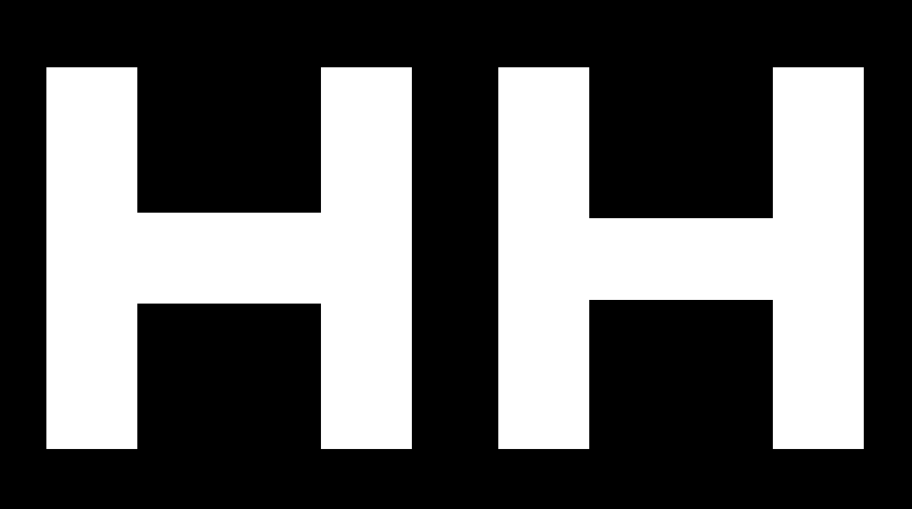
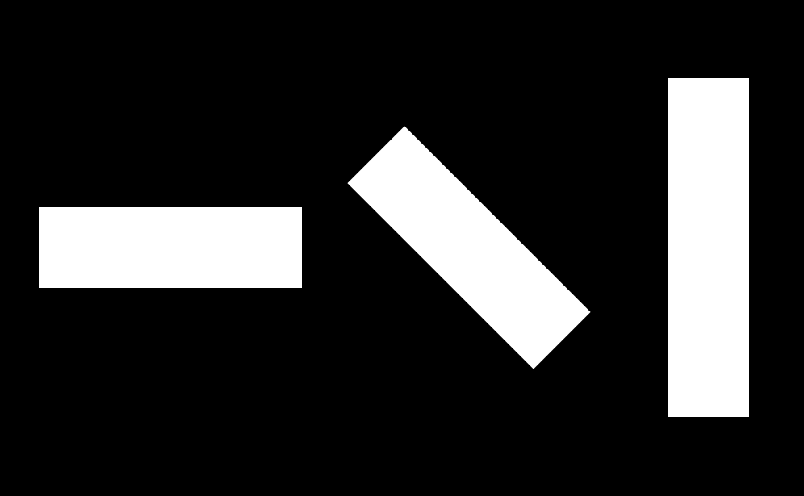
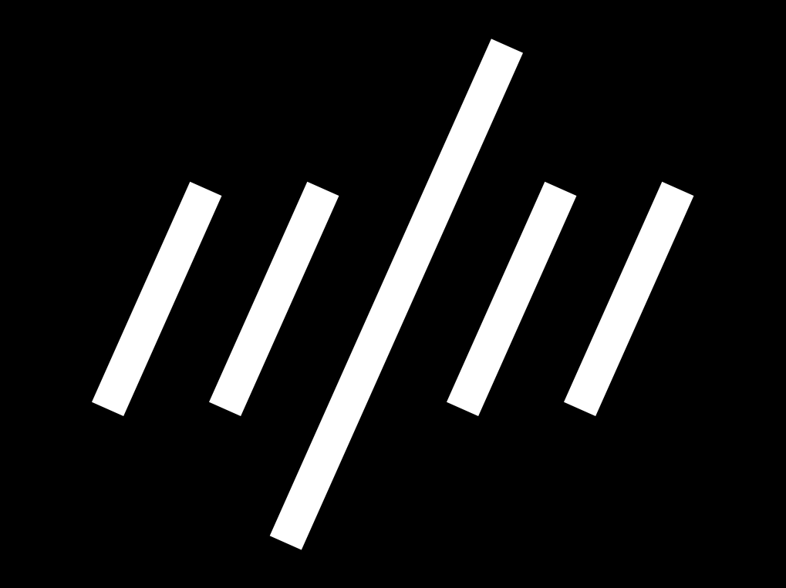
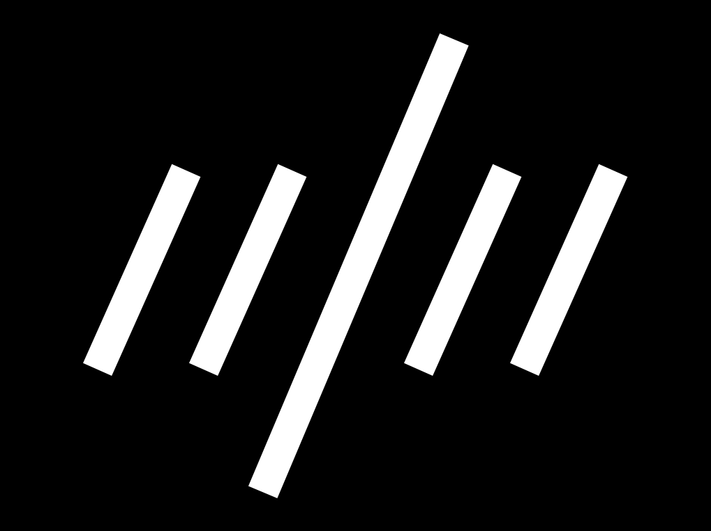
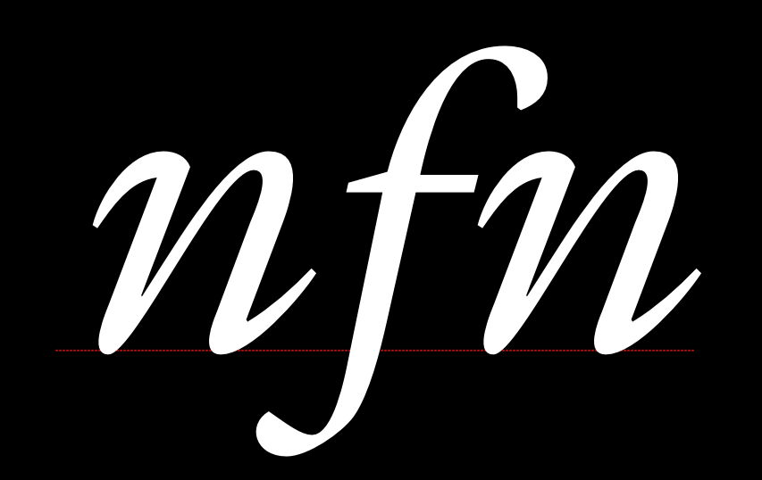
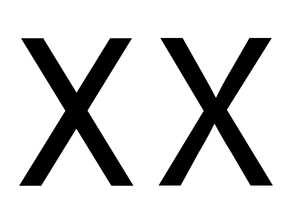
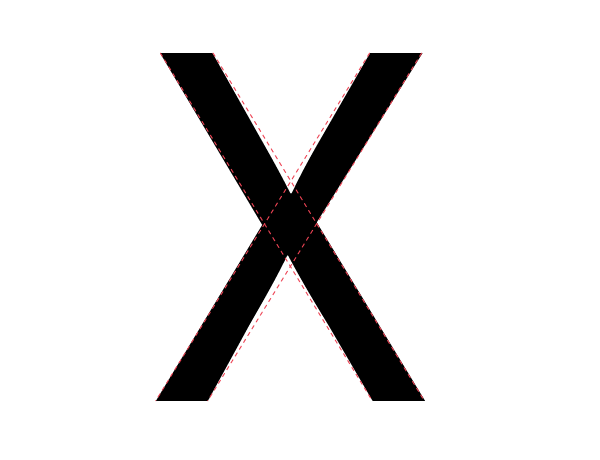
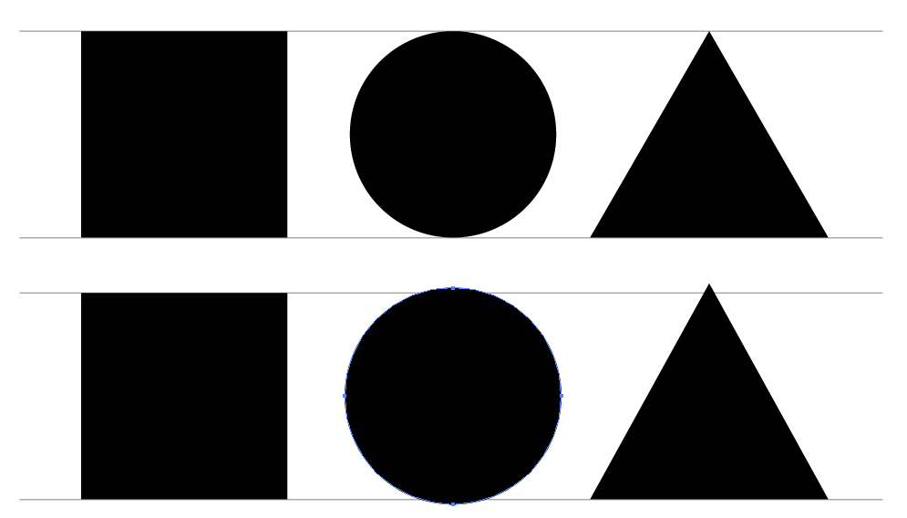

El diseño tipográfico es el proceso de probar iterativamente las opciones individuales que, en conjunto, dan lugar a un diseño completo. Probarás tu fuente para ver si la combinación de decisiones que has tomado:

* Permite leer el tipo de letra
* Hace que la fuente te parezca correcta
* Hace que la fuente sea útil para las tareas que quieres que realice.

A medida que vayas probando el diseño, tendrás que confiar en tus percepciones y diseñar algo práctico. Gran parte del diseño tipográfico requiere que las letras sean similares y que se repitan las formas.

Resulta tentador suponer que si mide las partes y los espacios entre los glifos, obtendrá resultados fiables. Aunque es muy útil, este enfoque tiene limitaciones reales. Si hay algo que no le parece correcto, deberá hacer los ajustes necesarios. Además, debe confiar en que hacer cambios hasta que «parezca correcto» es lo correcto.

Esto se debe a que todos los lectores están sujetos a una serie de ilusiones ópticas naturales. Hay que tener en cuenta estas ilusiones modificando las formas de las letras hasta que le parezcan correctas.

Puede hacerse una idea de dónde mirar y qué elementos ajustar en estos [Videos de revisión tipográfica](https://vimeo.com/typereview/videos).

## Ejemplos de ilusiones

Algunas ilusiones tienen que ver con el peso percibido de las líneas, otras con la longitud percibida de las líneas y otras con la percepción de las formas por parte del ojo.

### Peso horizontal frente a vertical

El ejemplo de la izquierda muestra una «H» con barras que tienen exactamente el mismo grosor. Esto parece incorrecto. ¿Se nota?

El otro de la derecha tiene una barra horizontal que se ha adelgazado para que parezca igual de gruesa.

Los glifos en los que hay que realizar ajustes ópticos son numerosos e incluyen A, E, F, L, H, f, t y z.

### Espesor de la diagonal

Del mismo modo, si tiene barras de la misma anchura y una de ellas está colocada en diagonal, la barra diagonal parecerá ligeramente más pesada que la vertical y ligeramente más fina que la horizontal. Si quieres que se vea bien, tendrás que ajustarla para que sea más ligera como la del ejemplo horizontal, pero sólo un poco menos.

Los glifos en los que esta percepción humana puede ser relevante son bastante numerosos, pero incluyen k, K, N, Q, R,
v, V, w, W, x, X, y, Y, 7, 2, &amp;, ł, Ł, &oslash;, &Oslash;, &radic;, ∕, &lsaquo;, &rsaquo;,
&laquo;, &raquo;, ½, ⅓, ¼, &le;, &ge;, y &times;.

### Longitud y ángulo diagonal percibido

Las formas más largas deben inclinarse menos que las más cortas para que parezca que tienen la misma inclinación.

En la siguiente imagen, las líneas diagonales tienen el mismo ángulo. La más larga parece tener un ángulo diferente.

En la siguiente imagen, se ha ajustado la inclinación de la línea más larga:

Veamos ahora una cursiva real, aplicando estas correcciones a los glifos:

### Cruce de diagonales

Cuando una barra cruza otra diagonal o una línea recta, necesitará ajustes para no aparecer como desalineada.

En el ejemplo anterior, la X de la izquierda tiene dos barras sin ajustar que se cruzan. En el ejemplo de la derecha se han ajustado para que aparezcan alineadas.

Como se puede ver en esta X con línea de puntos encima, la X que aparece visualmente alineada implica un desplazamiento.

Los glifos en los que esta ilusión es relevante incluyen x, X, k, K, ×, #, y la letra islandesa ‘eth’
(&eth;).

### Altura percibida

La forma de un glifo contribuirá a la altura que debe tener para que parezca que tiene la misma altura que los demás glifos. Los glifos redondos deben sobrepasar un poco la altura de los glifos planos. Los glifos con formas más puntiagudas deben sobrepasar un poco la altura de los glifos planos. Cuanto más puntiaguda sea la forma, más tendrá que sobrepasar para que parezca correcta.

En la imagen anterior, las tres formas de arriba están sin ajustar, es decir, tienen alturas idénticas. Las tres formas de la parte inferior se han ajustado para que parezcan más similares en altura.

Esta ilusión es válida para cualquier glifo que tenga partes redondas o puntiagudas. Entre ellos se incluyen O, Q, C, S, A, V, W, etc.

## Estás totalmente capacitado para corregir estas ilusiones.

Como puedes ver tanto la ilusión como el efecto de corregirla, podrás hacer estas correcciones por ti mismo. Sólo tienes que confiar en tus impresiones.

## Prueba de idoneidad

Al igual que eres capaz de ver las ilusiones ópticas y corregirlas, también tienes la capacidad de saber si una fuente funciona para el uso (o usos) específico que tengas en mente. Ahí es donde también debe confiar en su criterio.

Por otra parte, cabe señalar que no se puede evaluar ningún tipo de letra aparte de cómo se utiliza y para qué se utiliza. Por eso es esencial empezar a hacer pruebas desde el principio del proceso de diseño, y seguir haciéndolas hasta que considere que el proyecto está terminado.

¿Cómo serán estas pruebas? Las pruebas serán sencillas al principio, lo que le permitirá probar las primeras opciones de diseño. A medida que el diseño se vaya completando, las pruebas tendrán que seguir el ritmo y permitirte evaluar el éxito o el fracaso relativo de las opciones más recientes que hayas tomado o, mejor aún, comparar dos (o tres, o más&hellip;) opciones que estés considerando.

A veces se dará cuenta de que tiene que volver atrás y cambiar una opción de diseño que pensaba que ya funcionaba bien. Es normal. Crear un tipo de letra requiere equilibrar muchas variables, y a menudo surgen sorpresas. Cuanto más diseñe fuentes, más experiencia tendrá a la hora de tomar estas decisiones arbitrarias.

Cuando nos acercamos al final del proceso, si el tipo de letra se va a utilizar de forma sencilla, las pruebas también deben seguir siendo sencillas. Sin embargo, si una fuente se va a utilizar de muchas maneras o en una amplia gama de entornos de impresión o de pantalla, entonces debe probarse en toda esa gama de situaciones, lo que incluye imprimir varias muestras de la fuente.

Puede ahorrar tiempo de diseño tener una idea bien definida del uso final que se pretende. Sin embargo, esto no siempre es posible y sus ideas pueden evolucionar. La clave está en pensar y definir los casos de uso de la forma más completa posible, y luego asegurarse de que las pruebas siguen el ritmo de las preguntas que te planteas al diseñar la fuente.

## Más información

* <http://typographica.org/on-typography/making-geometric-type-work/>
* <http://typedrawers.com/discussion/1085/the-letter-s>
