El diseño de un tipo de letra en FontForge implicará el uso de una serie de herramientas y utilidades, comenzando por un conjunto de herramientas de dibujo que pueden resultar familiares a los usuarios con experiencia en gráficos vectoriales &mdash; aunque existen diferencias notables.
Primero buscaremos entender cómo funcionan las curvas de B&eacute;zier, antes de ver las propias herramientas de dibujo de FontForge.

## Entendiendo las curvas de B&eacute;zier

El concepto de “curvas de B&eacute;zier” se refiere a una representación matemática particular utilizada para producir curvas suaves digitalmente. Generalmente, se utilizan el orden *Cúbico* y *Cuadrático* de estas curvas &mdash; aunque FontForge también soporta curvas *Spiro*, que son una representación alternativa para el diseñador.

En este capítulo, solo discutiremos los trazados *Cúbicos*, ya que es lo que generalmente se usa al dibujar glifos. Los trazados *Spiro* se discutirán en el siguiente capítulo, y las curvas *Cuadráticas* solo se encuentran en fuentes TrueType y raramente se usan en el dibujo &mdash; más bien se generan en el momento de la construcción.

Un trazado B&eacute;zier típico está compuesto por un ancla, con dos manullas que marcan la dirección general &mdash; la longitud de cada manulla determina la longitud de la curva en cada lado &mdash; observa abajo.

### Diferentes tipos de puntos

#### Puntos de curva (mostrados como puntos redondos)

Los *puntos de curva* tienen dos manullas, cada una de ellas vinculada a la otra para que la línea entre ellas siempre se mantenga recta, con el fin de producir una curva suave en cada lado.

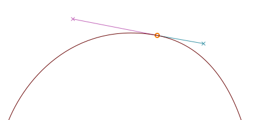

<h4 class="quiet">Puntos de curva H/V (mostrados como puntos en forma de rombo)</h4>
Los *puntos de curva H/V* (‘horizontal/vertical’) son una variante de los puntos de curva que se ajustan al eje horizontal o vertical &mdash; una herramienta esencial para hacer bien las formas B&eacute;zier (más sobre esto en la siguiente sección).

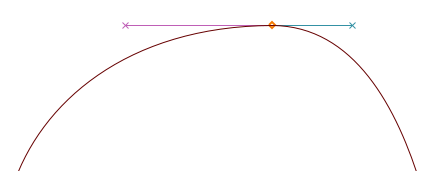

#### Esquinas o puntos de esquina (mostrados como puntos cuadrados)

Las *esquinas* pueden tener 0, 1 o 2 manullas B&eacute;zier. La posición de cada manulla es independiente de las otras, lo que lo hace adecuado para discontinuidades en el contorno.
Sin manullas, las esquinas producirán líneas rectas.

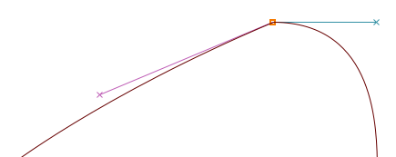

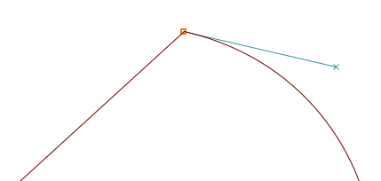

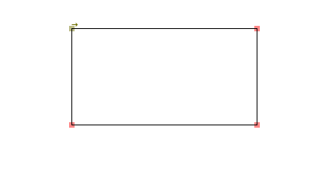

#### Puntos tangentes (mostrados como puntos triangulares o ‘flechas’)

Si quieres empezar desde una línea recta y luego comenzar a curvar suavemente, querrás usar *puntos tangentes*.
Una *tangente* deja una línea recta en un lado, mientras que la manulla B&eacute;zier en el otro lado es su dirección &mdash; esto asegura una transición continua entre la línea y la curva.

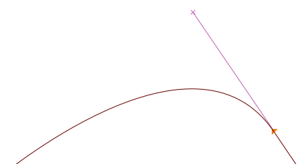

### Haciéndolo bien

Para producir curvas adecuadas &mdash; con puntos de control mínimos y rasterización facilitada, las anclas siempre deben colocarse en **los extremos de la curva**. Sin embargo, en los lugares donde tengas roturas en tus formas de letras, la línea que determina el trazado debe ser **horizontal o vertical**.

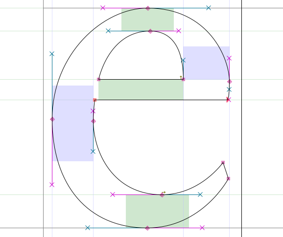

<b>Nota:</b> Si tus puntos de control no están colocados en los extremos, FontForge señalará el extremo real con un icono de mira (`⊕`):

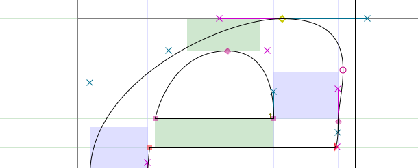

Puedes arreglar esto copiando tu contorno actual a otra capa, luego mueve los puntos de control para que esté dispuesto correctamente &mdash; de lo contrario, la herramienta de Validación de FontForge añadirá el punto en los extremos automáticamente, momento en el que puedes fusionar tu ancla mal colocada con <i>Clic derecho > Merge</i>. 
Se dirá más sobre esto más adelante en el <a href="Making_Sure_Your_Font_Works_Validation.html">capítulo de Validación</a>.

Para elaborar, hay dos casos en los que tendrás que renunciar a los trazados B&eacute;zier horizontales/verticales:

- Si quieres cambiar la pendiente general de tu curva, como con la parte superior izquierda de la ‘a’ abajo que se mantiene casi plana:
  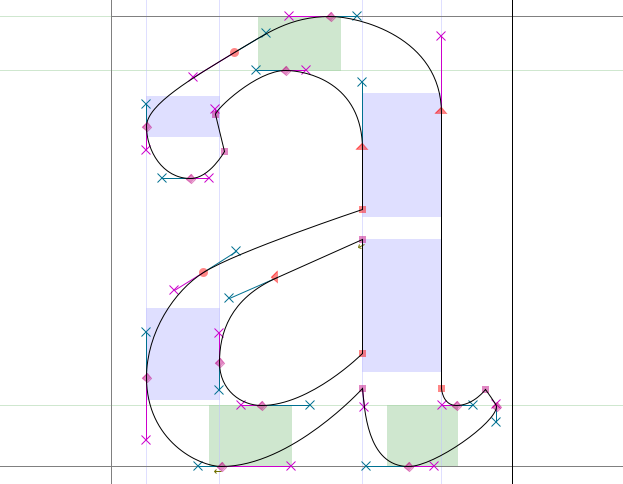
- Si quieres colocar roturas en tus formas de letras, como con la parte inferior izquierda de la ‘g’ abajo &mdash; ahí es típicamente donde querrás usar una *Esquina* (además de para dibujar líneas):
  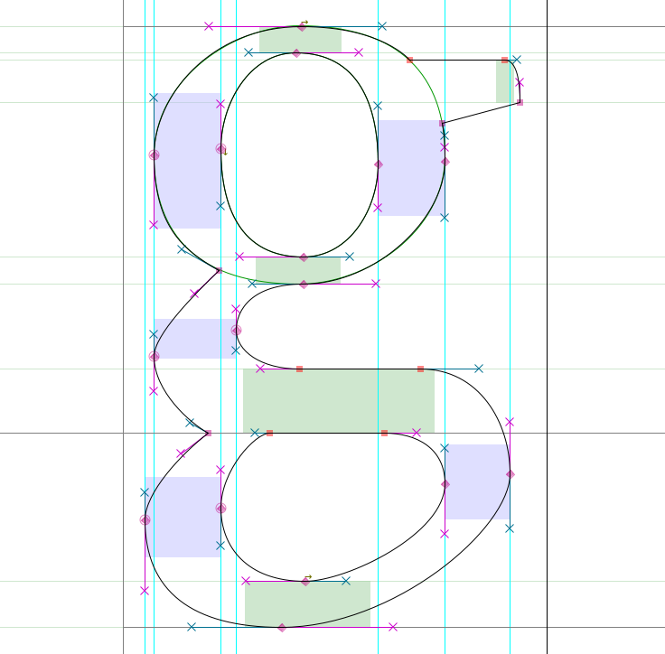

<b>Nota:</b> Como puedes ver, al establecer roturas con una <i>Esquina</i>, la dirección de cada manulla debe ser tangente a la curva donde llega.

## Dominando las herramientas de dibujo de FontForge

Desde la ventana principal, haz doble clic en uno de los cuadros de glifos para lanzar la Ventana de Glifo.

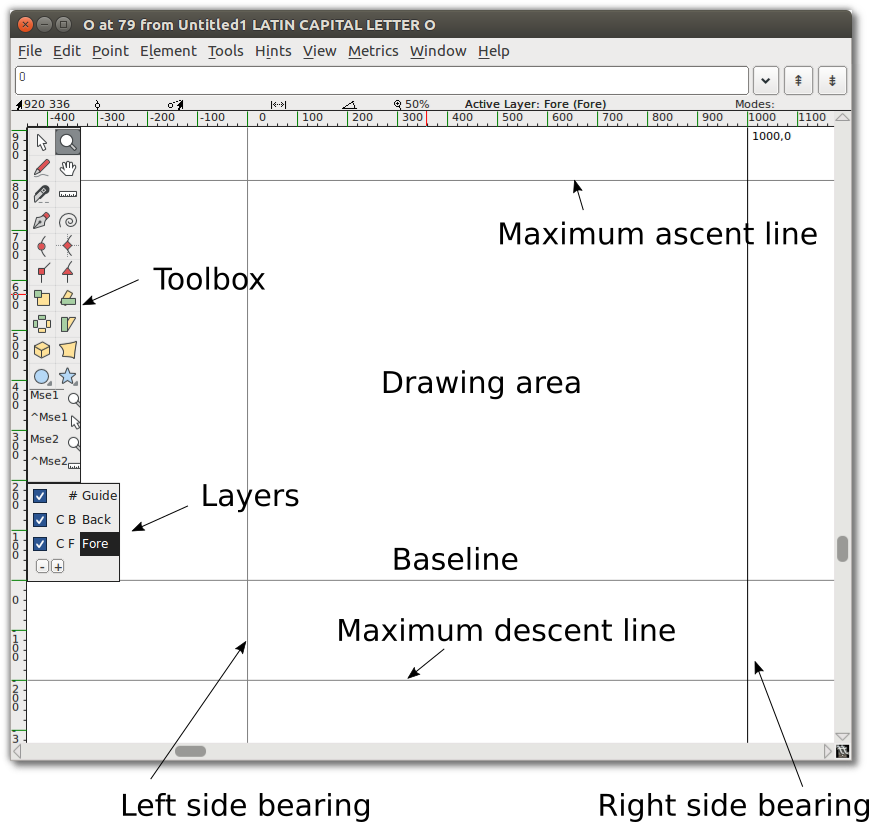

<b>Nota:</b> Los números a lo largo de la parte superior donde se cruzan el eje x e y indican, de izquierda a derecha:

<ul>
<li>La ubicación actual (x,y) de tu cursor en el lienzo</li>
<li>La ubicación del punto seleccionado más recientemente</li>
<li>La posición relativa de tu cursor con respecto al punto seleccionado</li>
<li>La distancia entre tu cursor y el punto seleccionado</li>
<li>El ángulo desde el punto seleccionado hasta el cursor (relativo a la línea base)</li>
<li>El nivel de ampliación actual, seguido del nombre de la capa activa.</li>
</ul>

<b>Precaución:</b> A veces, parece que FontForge no responde cuando estás dentro de la Ventana de Glifo. Puede ser que haya un cuadro de diálogo abierto oculto detrás de ella &mdash; así que simplemente muévela y procesa el cuadro de diálogo.

Una *Línea* consta de 2 puntos.

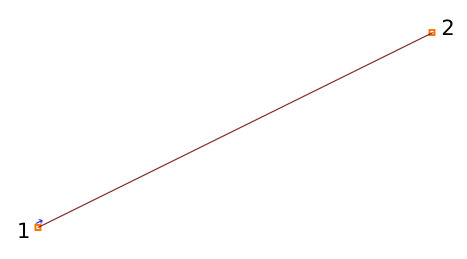

Un *Spline* consta de 4 puntos: 2 puntos finales del spline y 2 ‘manullas’, que describen la pendiente del spline en esos puntos finales.

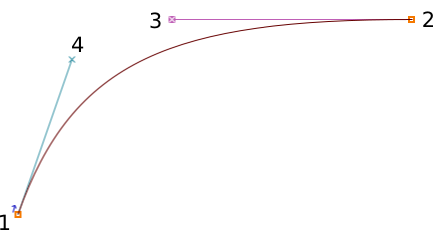

### Copiar, pegar, cortar y eliminar puntos, splines y líneas

Al igual que con la mayoría de los programas de dibujo, FontForge te permite Copiar, Cortar, Pegar o Eliminar cualquier punto, línea o spline. Estos comandos están disponibles en el menú Editar, o usando las pulsaciones de teclas típicas de tu SO (también mostradas junto a cada comando en el menú).

## Familiarizándote con las herramientas de dibujo

Ahora que conoces el lienzo, es hora de familiarizarse con las herramientas.

### Puntero y Zoom

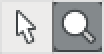

El Puntero y el Zoom se comportan de manera similar a las herramientas equivalentes en otras aplicaciones.
El puntero es una herramienta de selección, utilizada para seleccionar puntos, trazados y otros objetos en el lienzo.
La herramienta Zoom te permite acercar (Z) fácilmente; para alejar: ve al menú Ver y selecciona *Zoom out* (Alejar) (X) o *Fit* (Ajustar).

Ten en cuenta que también puedes cambiar momentáneamente a la herramienta de puntero mientras usas otra manteniendo pulsada la tecla <kbd>Ctrl</kbd>.

### La herramienta de Mano alzada

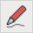

La herramienta de Mano alzada te permite esbozar trazados irregulares.

En el área de dibujo, haz clic y mantén pulsado, luego muévete para dibujar. Vuelve a cambiar a la herramienta de puntero, y podrás seleccionar puntos en el trazado que has dibujado.

Cuando seleccionas uno de los puntos en el trazado, se convertirá en un círculo amarillo. Si el punto seleccionado está en una curva, mostrará sus puntos de control con una manulla magenta y una manulla cian. Puedes agarrar cualquiera de las manullas y arrastrarla para cambiar la forma de la curva.

### Las herramientas de puntos

Bien, ahora vamos a usar las herramientas de puntos.

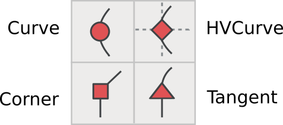

Para añadir un punto a un trazado, selecciona primero cualquiera de estas herramientas, luego haz clic en el trazado y dale un pequeño empujón. Obtendrás un nuevo punto en la línea.

La herramienta de punto de Curva se utiliza para añadir un punto en un segmento curvo.
La herramienta de punto HVCurva restringe los nuevos puntos para que tengan puntos de control horizontales o verticales &mdash; esto es importante para establecer puntos extremos.
La herramienta de punto de Esquina te permite hacer un giro brusco en el trazado.
La herramienta de punto Tangente te permite pasar de un segmento recto a un segmento curvo a lo largo del trazado.

### La herramienta Pluma

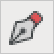

La herramienta Pluma te permite añadir un punto en la curva y arrastrar sus puntos de control.

### Spiro

Seleccionar la herramienta Spiro te pone en el modo de dibujo Spiro. El dibujo Spiro te permite dibujar curvas que se reajustan a medida que reposicionas los nodos. Algunas personas prefieren esto al enfoque estándar (conocido como edición B&eacute;zier), pero si estás acostumbrado a la edición B&eacute;zier puedes encontrar que hace algunas cosas inesperadas.

### Cuchillo

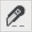

La herramienta Cuchillo te permite cortar splines en dos. Esto es útil si has dibujado una forma, pero solo necesitas parte de ella.

### Regla

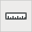

La herramienta regla te da información de medición y coordenadas. Cuando se usa, muestra un ‘tooltip’ flotante junto al cursor. Si pasas el cursor sobre un punto, el tooltip te da información de medición y coordenadas aún más detallada. Si lo acercas a un spline, te da información sobre la curvatura y el radio. Lo más útil es que si haces clic y arrastras la herramienta de regla, verás la distancia que has arrastrado el cursor, más cada intersección que has cruzado.

### Las herramientas de transformación

Hay seis herramientas de transformación:

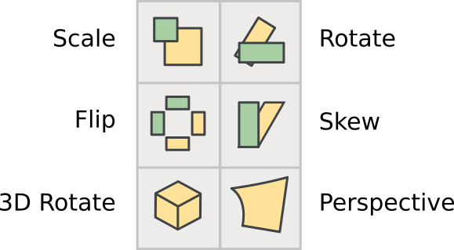

**Nota:** Para todas las herramientas de Transformación, si haces doble clic en la herramienta, puedes introducir valores numéricos.

La herramienta Escalar te permite reescalar un objeto a mano alzada. Mantener pulsada la tecla <kbd>Shift</kbd> te permite escalar un objeto restringiéndolo a la proporción.

La herramienta Rotar te permite rotar libremente un objeto. Rota el objeto seleccionado alrededor de la posición donde haces clic inicialmente.

La herramienta Rotar 3D te permite rotar un objeto en la tercera dimensión, y proyecta el resultado en el plano x-y.

La herramienta Voltear te permite voltear una selección horizontal o verticalmente. El punto en el que haces clic con el ratón es el punto de origen de la transformación.

**Nota:** Después de voltear un punto probablemente querrás aplicar "_**Element**&nbsp;⇨&nbsp;**Correct&nbsp;Direction**_" (Elemento -> Dirección correcta).

La herramienta Sesgar te permite sesgar horizontalmente la selección, ya sea en el sentido de las agujas del reloj o en el sentido contrario (withershins es cómo se refiere el cuadro de diálogo al sentido contrario a las agujas del reloj).

La herramienta Perspectiva te da otra forma de distorsionar una forma de manera no lineal.

**Nota:** No hay opción numérica para la transformación de perspectiva.

### Las herramientas Rectángulo/Elipse y Polígono/Estrella

Estas herramientas te permiten dibujar formas geométricas primitivas, lo que es más rápido que construir esas formas a partir de segmentos de línea separados.

Al hacer clic en el área del chevrón en estas herramientas, tendrás la opción de cambiar a la herramienta alternativa.
Si haces doble clic en cualquiera de las herramientas, puedes abrir las opciones del tipo de forma.

Opciones de rectángulo: estilo de esquina y cuadro delimitador (esquina o desde el centro).

Opciones de elipse: cuadro delimitador o desde el centro.

Opciones de polígono: número de vértices.

Opciones de estrella: número de puntas de la estrella y profundidad de las puntas por porcentaje. Cuanto mayor sea el ajuste de porcentaje, más largos serán los brazos de la estrella.

### Mse1 y Mse2

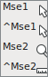

Debajo de la barra de herramientas, puedes ver la herramienta actual y las operaciones disponibles para ambos botones del ratón:

- Botón izquierdo (Mse1)
- Botón izquierdo + <kbd>Ctrl</kbd> (^Mse1)
- Botón rueda del ratón (Mse2)
- Botón rueda del ratón + <kbd>Ctrl</kbd> (^Mse2)

De esta manera, puedes usar algunas herramientas diferentes sin tener que hacer clic repetidamente en la barra de herramientas.

<b>Precaución:</b> Parece que la funcionalidad Mse actualmente no funciona correctamente.

### Capas

El lienzo de FontForge tiene tres capas por defecto: la capa Guía, la capa Fondo y la capa Primer plano. Las capas Guía se utilizan para insertar guías (como guías de altura x o altura de mayúsculas).
Las capas de primer plano y las capas de fondo se utilizan ambas para dibujar, pero solo la capa de primer plano superior se renderizará en tu fuente final.

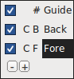

Una casilla de verificación indica si cada capa es visible, y puedes desmarcarla para hacer una capa invisible. La C (o Q) indica si estás utilizando curvas Cúbicas o Cuadráticas.

El #, B o F se refiere a si el tipo de cada capa es una capa Guía, capa Fondo o capa Primer plano, lo cual es significativo si añades más capas propias. Puedes crear y eliminar capas adicionales usando los botones más (+) o menos (&minus;) en esta sección de la barra de herramientas.
El tipo de capa y el tipo de curva también se pueden controlar haciendo clic derecho (una vez que tengas capas adicionales).

## Dibujo básico

A continuación, repasaremos algunos flujos de trabajo básicos de dibujo, que a menudo necesitarás.

### Cortar una forma dentro de otra

1. Empieza usando la herramienta Rectángulo para dibujar un rectángulo dentro del área de dibujo de la ventana Glifo.
2. A continuación, usa la herramienta Elipse para dibujar una elipse dentro del rectángulo que acabas de dibujar.
   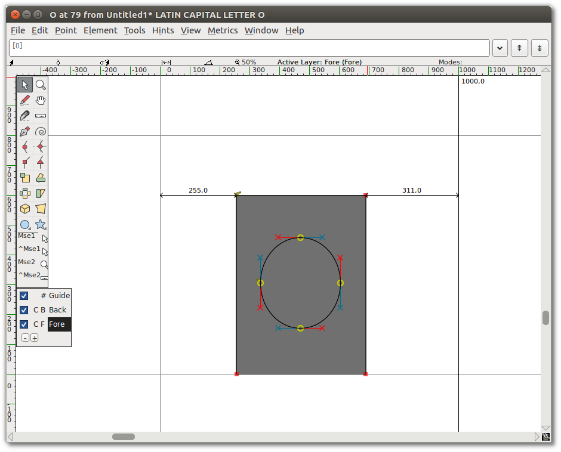
3. Ve al menú "_**Element**_" (Elemento) y elige "_**Correct&nbsp;Direction**_" (Dirección Correcta). Verás que las dos formas se fusionaron, y que esencialmente perforaste un agujero en el centro del rectángulo.
   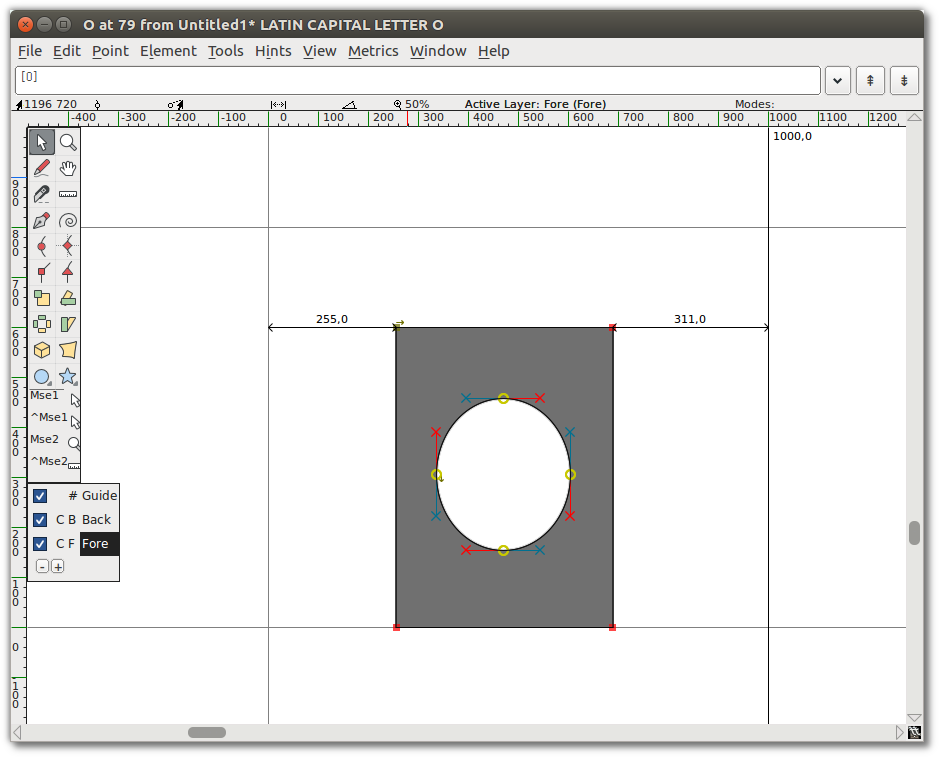

### Eliminar superposición

1. Añade una estrella que se superponga a la esquina del rectángulo.
   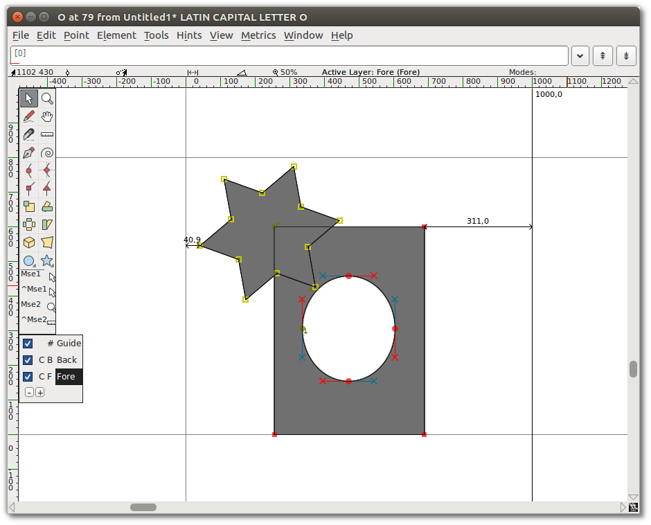
2. Selecciona la estrella y la forma anterior. Solo necesitas seleccionar un punto de cada forma superpuesta, pero está bien seleccionar puntos extra.
3. Ve a "_**Element**&nbsp;⇨&nbsp;**Overlap**&nbsp;⇨&nbsp;**Remove&nbsp;overlap**_" (Elemento -> Superposición -> Eliminar superposición). Verás que tus dos formas se han convertido en una.
   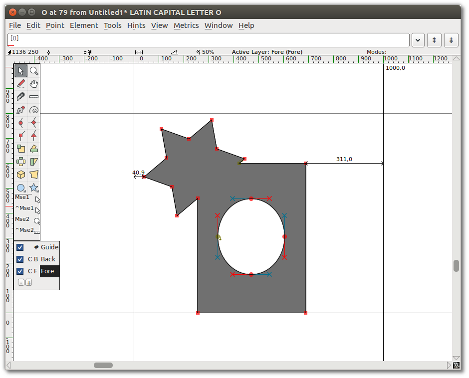

### Añadir un punto

Usando la herramienta Pluma, haz clic y mantén pulsado en el medio de un segmento de línea, luego arrastra el ratón para cambiar la forma.

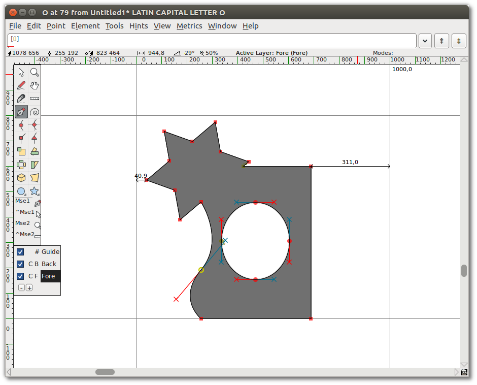

### Puntos tangentes

Selecciona el punto de la esquina inferior izquierda de tu nueva forma (la intersección de la curva y la línea recta). Desde el menú "_**Point**_" (Punto), verás que "_**Corner&nbsp;Point**_" (Punto de Esquina) está marcado. Selecciona "_**Tangent**_" (Tangente).
Esto cambia el nodo cuadrado a un triángulo, pero eso es todo lo que hace hasta que hagas el siguiente paso: extender los puntos de control.

Para hacerlo, elige "_**Element**&nbsp;⇨&nbsp;**Get&nbsp;Info**_" (Elemento -> Obtener Info), que abre la Ventana de Información del Punto. Desde la pestaña Ubicación en esa ventana, ve al conjunto de campos Next CP (Siguiente PC) y establece la Distancia en un número grande, como 75.
Haz clic en OK. Verás que la curva ahora entra suavemente en la línea recta.

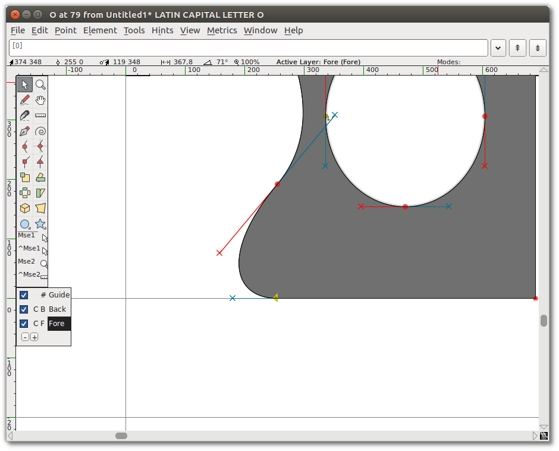

### Transformación

Ahora selecciona aproximadamente una cuarta parte de la forma &mdash; la estrella y parte de la elipse en el medio.

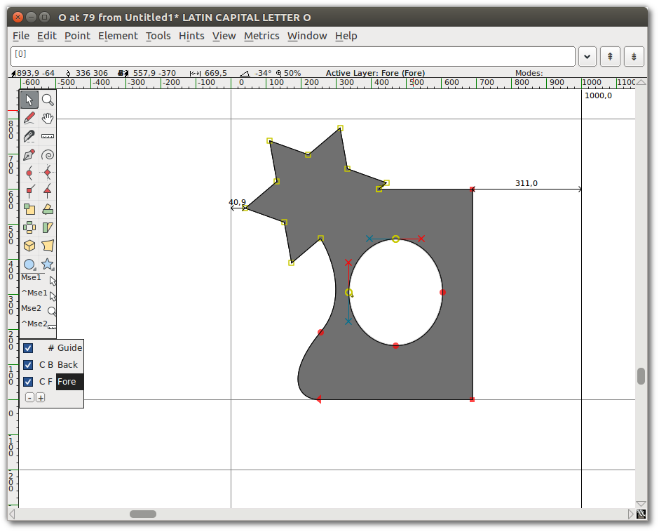

Elige la herramienta Rotar 3D, muévete al medio del área seleccionada, y haz clic y arrastra lentamente hasta que veas algo que te guste, luego suelta. Aquí tienes un ejemplo de Rotar 3D usado en la imagen de práctica:

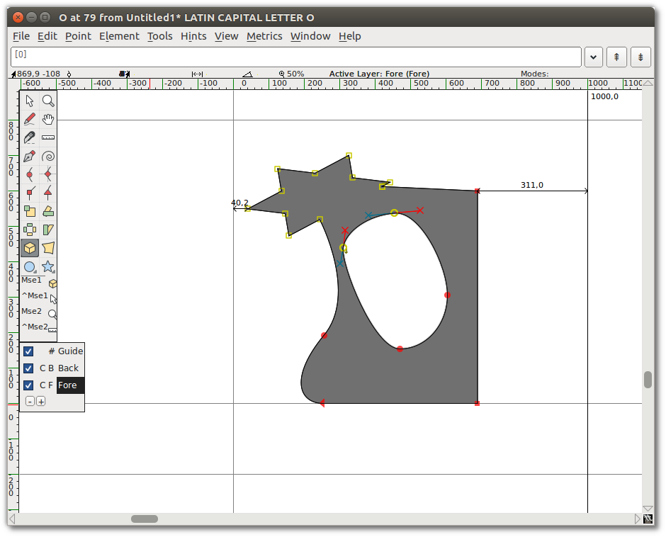

### Establecer forma y ancho del trazo

Hasta ahora has usado la herramienta de dibujo a Mano alzada para dibujar una línea. Si haces doble clic en la herramienta Mano alzada, obtienes el cuadro de diálogo Mano alzada que se muestra aquí, que contiene una ventana de dibujo. Aquí es donde seleccionas la forma y el tamaño de la pluma. Este cuadro de diálogo también aparece cuando eliges la opción "_**Expand&nbsp;Stroke**_" (Expandir trazo) en el menú "_**Element**_" (Elemento).

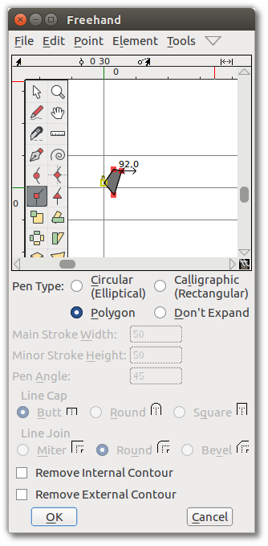

Usando la herramienta Esquina, dibuja un polígono y haz clic en OK.

Ahora, dibuja una línea con la herramienta de dibujo a Mano alzada. Cuando sueltes el botón del ratón, el nuevo trazado se traza automáticamente con la forma que elegiste en el cuadro de diálogo Mano alzada, como se muestra aquí.

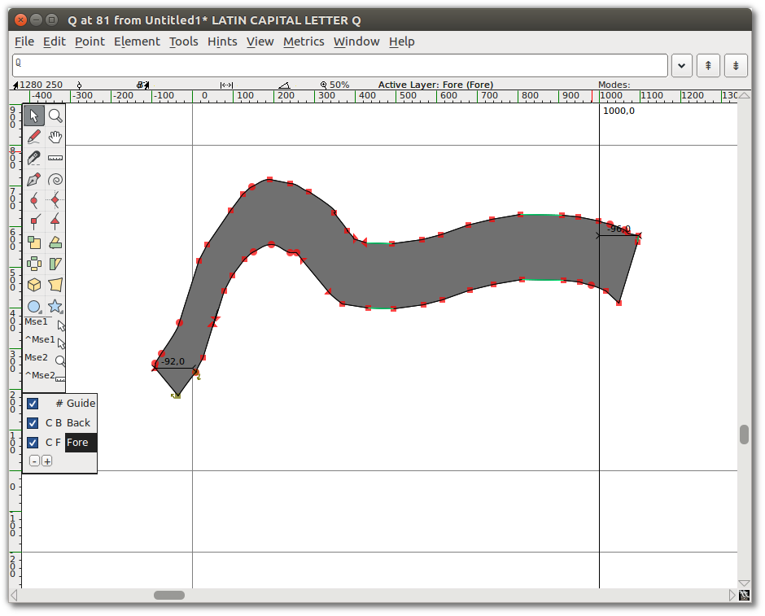

## ¡Sigue dibujando!

Deberías continuar experimentando con las herramientas de dibujo hasta que te sientas cómodo de que puedes usarlas para dibujar y transformar cualquier forma que necesites. En este punto, estás equipado para empezar a construir los componentes de los glifos, pero también deberías tomarte un tiempo para mirar el otro conjunto de herramientas de FontForge.
El siguiente capítulo, [“Dibujando&nbsp;con&nbsp;Spiro”](Drawing_With_Spiro.html), describe el modo de dibujo Spiro. El dibujo Spiro es lo suficientemente distinto de la edición de curvas de B&eacute;zier que requiere una explicación propia.

# Lecturas adicionales

Una [discusión en el foro TypeDrawers sobre Beziers](http://typedrawers.com/discussion/967) incluyó estos enlaces compartidos por Nina Stössinger en twitter:

* [Curvas de Bezier y diseño de tipos: Un tutorial](https://learn.scannerlicker.net/2014/04/16/bezier-curves-and-type-design-a-tutorial/) por Fábio Duarte Martins
* [¿Cuál es el gran problema con las manullas Bezier horizontales y verticales de todos modos?](https://www.photoshopfaceoff.com/design-tutorials/so-what-s-the-big-deal-with-horizontal-vertical-bezier-handles-anyway.html)
* [Lettering a mano: Cómo vectorizar tus formas de letras](http://design.tutsplus.com/tutorials/hand-lettering-how-to-vector-your-letterforms--cms-23248) por Scott Biersack
* [Conceptos básicos de tipos](http://typeworkshop.com/index.php?id1=type-basics&amp;id2=&amp;id3=&amp;id4=&amp;id5=&amp;idpic=15#pictloader) por Underware
* [El juego de Bézier](http://bezier.method.ac) por Marc MacKay
