¿Qué diferencia a la fuente tipográfica de la escritura a mano, la caligrafía, el lettering y los logotipos?

Lo que más diferencia al diseño tipográfico es la necesidad de que cada glifo del tipo de letra funcione con todos los demás glifos. A menudo, esto significa que el diseño y el espaciado de cada parte del tipo de letra acaban siendo una serie de cuidadosos compromisos. La mejor forma de concebir el diseño tipográfico es como la creación de una maravillosa colección de letras, pero no como una colección de letras maravillosas. En otras palabras, debemos pensar en el grupo y en cómo funcionará en conjunto y dar prioridad a esto sobre cualquier cuestión de lo que es maravilloso en una sola letra.

Esta necesidad de priorizar en el sistema y no en una sola parte también nos lleva a analizar nuestro proceso de diseño a nivel de sistema. Las características que abarcan las letras se convierten en las cosas en las que queremos centrarnos, sobre todo al principio del proceso de diseño.

La otra rareza del diseño tipográfico es que, en gran medida, las formas que diseñamos ya están significativamente establecidas. Nuestra tarea como diseñadores tipográficos no consiste tanto en crear una forma completamente nueva como en crear una nueva versión de una forma existente. Esto puede dejar perplejos a los nuevos diseñadores tipográficos. Encontrar la cantidad justa de cambios para emocionar pero no alienar al lector es complicado. A menudo, los diseñadores se atascan en el pensamiento específico de la letra. Este error puede evitarse fácilmente si uno se da cuenta desde el principio de que lo más significativo de un tipo de letra son las partes que más se repiten. El diseño tipográfico no consiste sólo en diseñar las características aplicadas a las formas comunes que todos reconocemos, sino también a las formas que se repiten con más frecuencia.

También es útil reconocer que estas características no sólo ayudan a crear la voz o la atmósfera de un tipo de letra, sino también a determinar para qué será o no útil el tipo de letra y, a veces, a determinar los contextos tecnológicos para los que un tipo de letra es adecuado.

Puede parecer intimidante o excesivamente abstracto pensar en el diseño de un tipo de letra de esta manera. Sin embargo, acostumbrarse a estas ideas es la clave para un proceso de diseño tipográfico más rápido, eficaz y satisfactorio.

Empecemos por identificar las principales características sistémicas en el diseño tipográfico.

### Construcción

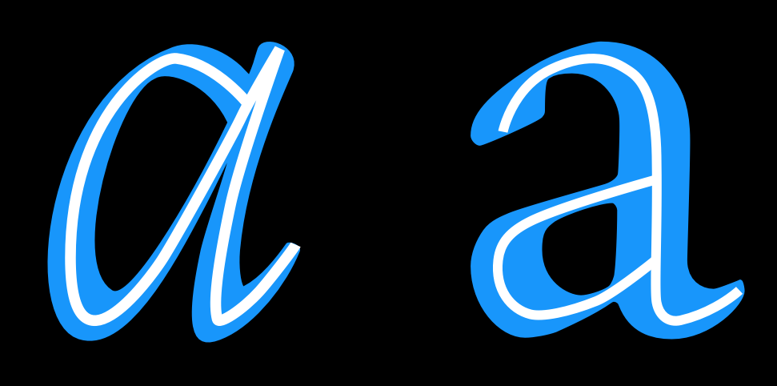

La construcción se refiere a la estructura de los trazos subyacentes que forman un glifo concreto. Quizá pueda imaginarse el esqueleto del glifo. El tipo de construcción que se va a utilizar es sin duda una de las cuestiones más importantes, porque afecta a muchas de las opciones restantes, sobre todo si el diseño va a resultar familiar a los lectores. En el ejemplo anterior, las líneas blancas del interior de las letras indican la construcción aproximada sugerida por la forma de las propias letras.

Sin embargo, la forma en que terminan los trazos (los ‘terminales’) y las ‘serifas’ (véase más adelante) no suelen formar parte de lo que se entiende por ‘construcción». La construcción es el esqueleto del glifo, mientras que el resto  &mdash;anchura, peso, terminales &mdash; forman parte de la carne.

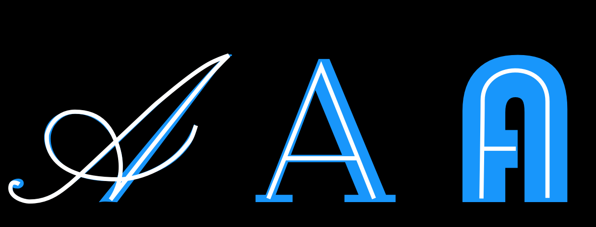

### Proporción de la altura x a la altura H

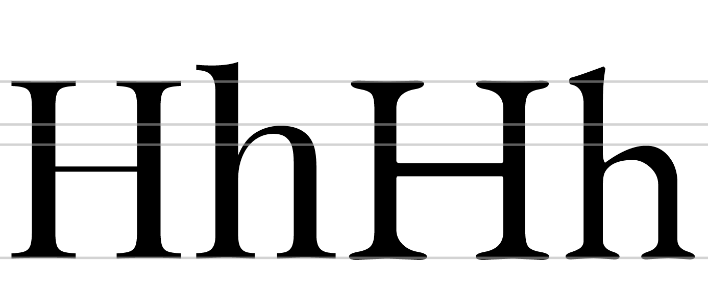

Las letras de la izquierda proceden de [Playfair Display], que tiene una altura x grande en relación con su altura de remate. Las letras de la derecha son de [EB Garamond], que tiene una altura x menor. En el ejemplo anterior, el tamaño de la H se ha ajustado para que coincidan.

### Altura de las ascendentes

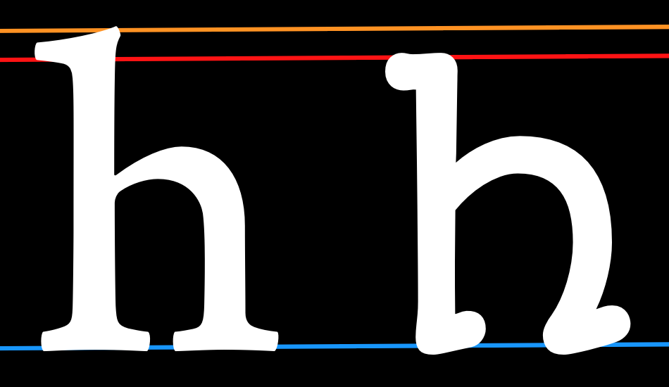

En el ejemplo anterior, las alturas x se han igualado para ilustrar la diferencia relativa entre las alturas de las ascendentes.

Las ascendentes suelen sobrepasar la altura H al menos un poco, sobre todo en los diseños de texto. En algunos casos, sin embargo, pueden igualar o incluso ser inferiores a la altura H. Las ascendentes largas pueden aportar elegancia al aspecto de un tipo de letra. Suelen ir acompañados de una altura x más pequeña.

### Profundidad de descendentes

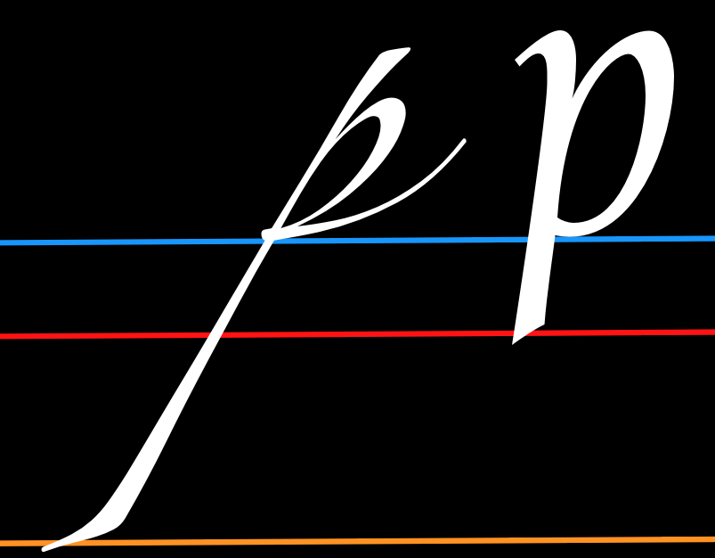

Al igual que las ascendentes, las descendentes largas pueden resultar elegantes.

En conjunto, ascendentes y descendentes largas pueden resultar difíciles de manejar. Si el tipo de letra se va a utilizar con alturas de línea pequeñas, el alargamiento significa que las letras pueden chocar entre las filas de texto.

## Anchura

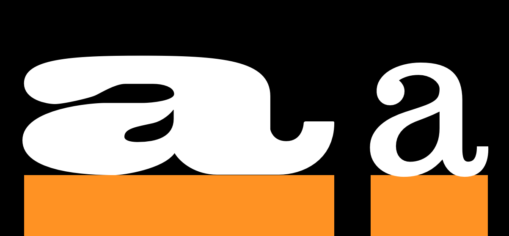

La anchura de un diseño tipográfico alterará no sólo su sensación, sino también su utilidad. El ejemplo de la derecha corresponde a un texto. El ejemplo de la izquierda corresponde a un diseño de pantalla pensado para llamar la atención. Las letras más estrechas que en el ejemplo de la cara de texto también son posibles y pueden utilizarse para ahorrar espacio o para que quepa más texto en un espacio más pequeño.

### Regularidad de anchura frente a variabilidad

Las letras de la fila superior de este ejemplo muestran una mayor variedad de anchura que las de la fila inferior.

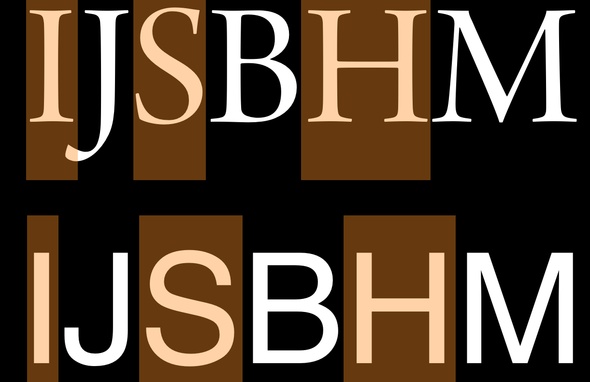

### Peso

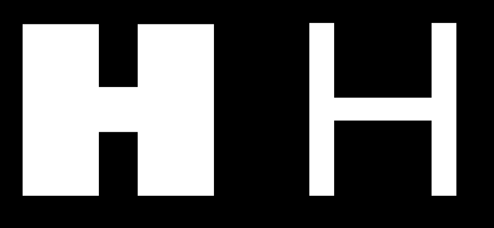

### Inclinación

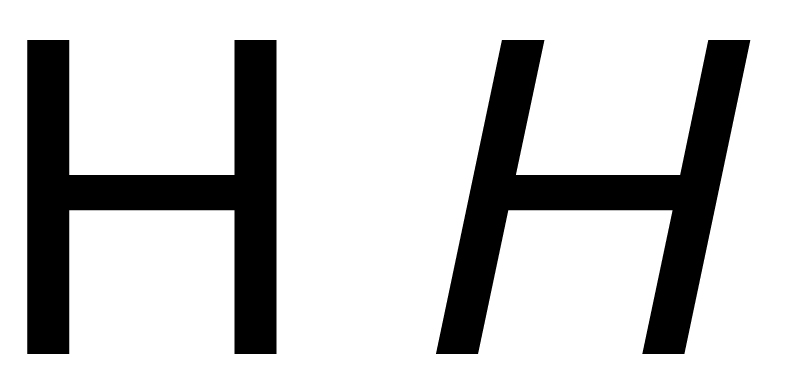

### Contraste

El contraste se refiere a la variación de la anchura del trazo dentro de un glifo. Observe en los dos glifos ‘O’ siguientes que el de la izquierda tiene una variabilidad mucho mayor en el grosor del trazo entre la parte superior y los lados del glifo. Ambos glifos tienen algo de contraste, pero el de la izquierda tiene mucho más que el de la derecha.

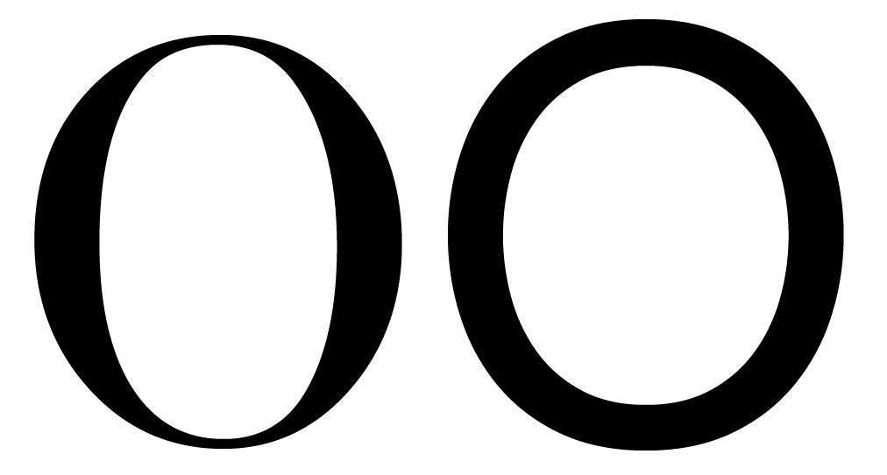

Los tipos con un peso (anchura de trazo) consistente en sus formas de letra o sin contraste visible producen una distinción pura del tipo contrastado. Al igual que la elección entre serifas o sin serifas, el contraste es una elección temprana del diseño tipográfico. Es interesante observar que los diseños con serifas ‘slab’ suelen utilizar una anchura de trazo constante en sus letras, y que el diseño de las serifas slab no tiene que ver sólo con las serifas, como parece. Hay que recordar que se aplican las reglas de la percepción (véase [“Trusting Your Eyes”](Trusting_Your_Eyes.html)) &mdash; el contraste tiene que ver con el aspecto del peso, pero no con su medida.

### Ángulo de contraste

En la imagen inferior, vemos que las partes finas de las formas de la letra ‘o’ minúscula son diferentes. En el glifo de la izquierda, los puntos finos se sitúan en un eje perfectamente vertical. En el glifo de la derecha, el eje es diagonal.

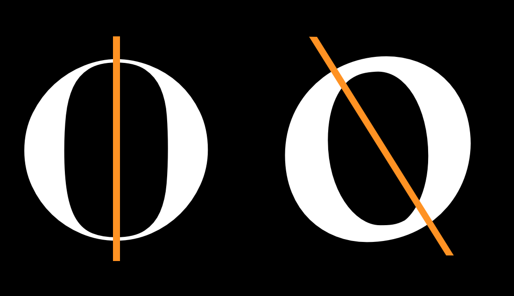

### Distribución del peso

Si su fuente utiliza muy poco o ningún contraste, no necesita pensar en ello. Sin embargo, la mayoría de las fuentes tienen al menos cierto grado de contraste. En estos casos, tienes una amplia variedad de opciones para elegir cómo distribuir el peso en tu fuente.

#### Vertical

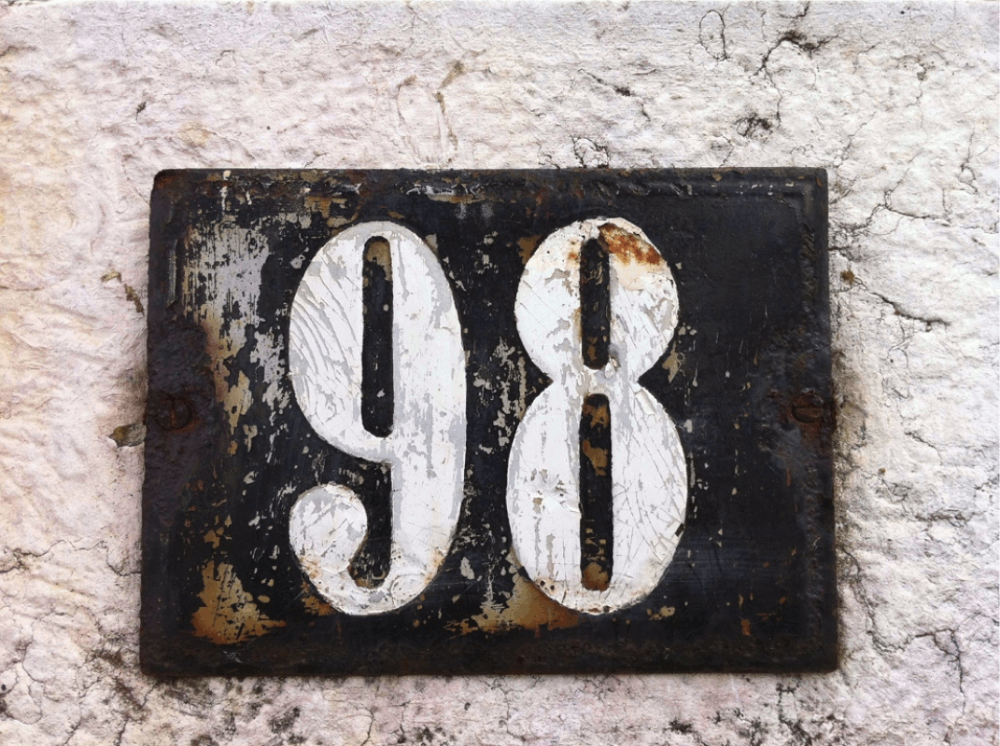

La distribución vertical del peso es muy común. El 9 y el 8 anteriores son un ejemplo especialmente intenso.

#### Horizontal

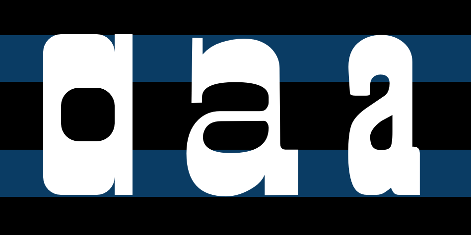

La distribución horizontal del peso es mucho menos común, pero sin embargo se ve en muchas fuentes.

#### Peso inferior

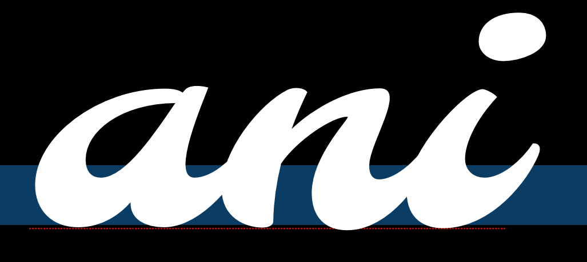

#### Peso superior

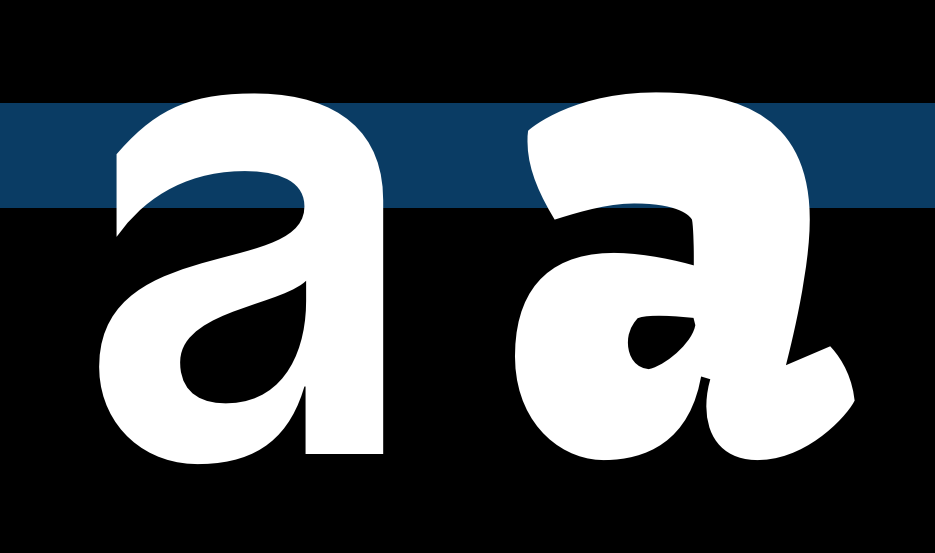

#### Irregular

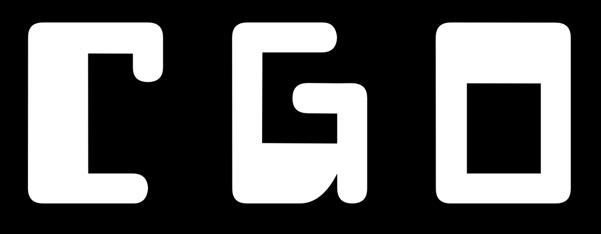

### Astas

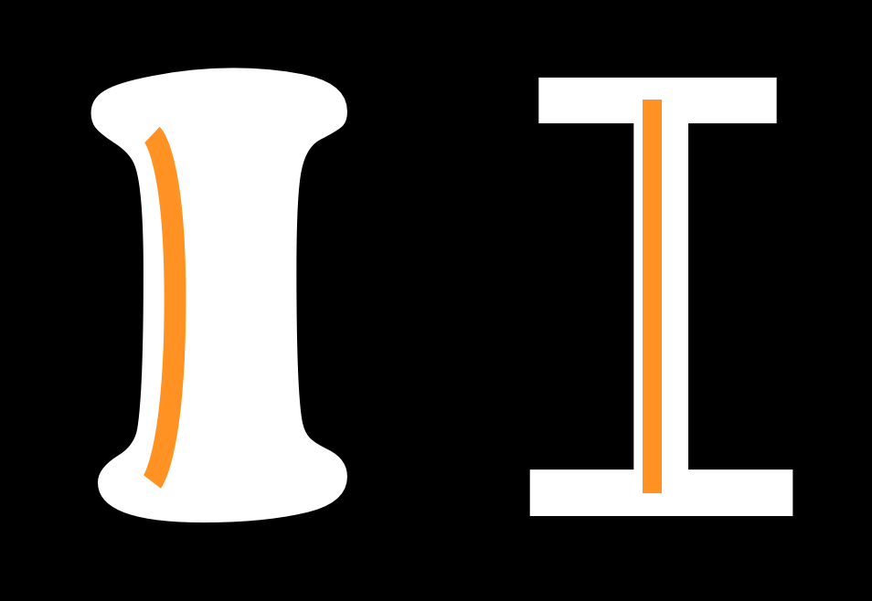

Es fácil asumir que las astas serán simplemente rectas y que esto no es una preocupación real, pero tanto el peso como la forma de las astas son cosas sobre las que puede y debe tomar decisiones deliberadas.

### Unión o lazo

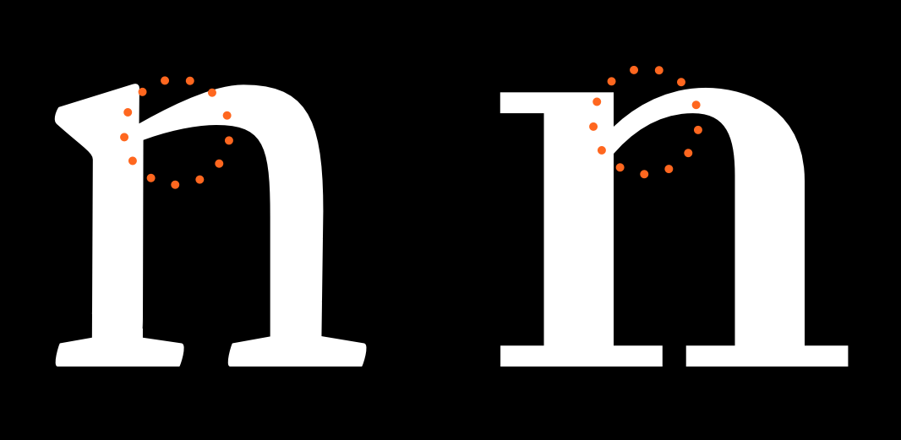

### Anillos o panzas

Tenga en cuenta que los anillos son la parte del trazo en las siguientes ilustraciones y no las formas interiores negras. Los trazos interiores se denominan “contraforma”, “contrapunzón” o “bucle”. Al diseñar tipos, a menudo se verá alterando su trabajo no por la forma o anchura del trazo, sino por la forma y tamaño de la contraforma.

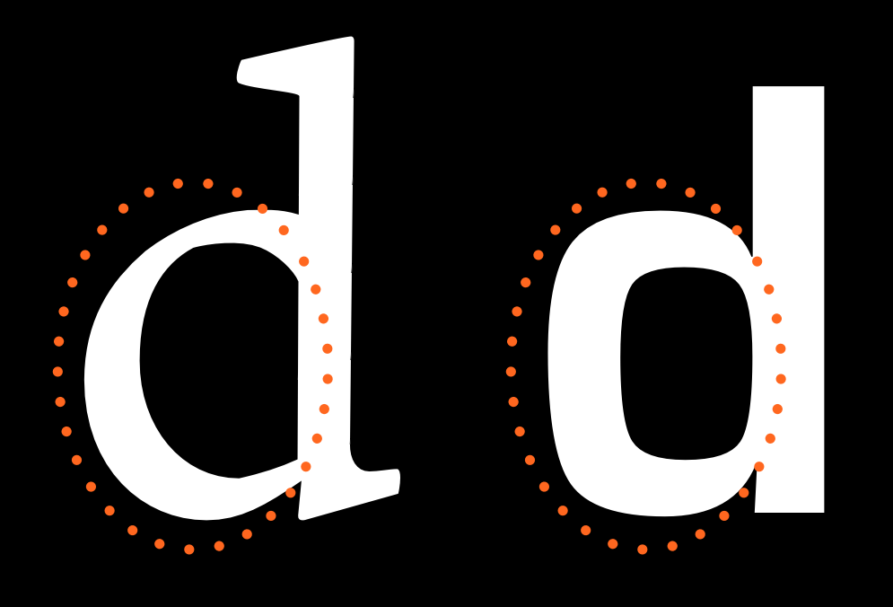

### Lágrima, ápice, gota o botón

Las lágrimas son las formas finales de los trazos. No son iguales que las gracias o remates. Suelen ser perpendiculares al ángulo del trazo en su extremo, o cizalladas horizontal o verticalmente. También pueden reflejar la forma del plumín u otra herramienta de trazado que evocan las formas de las letras.

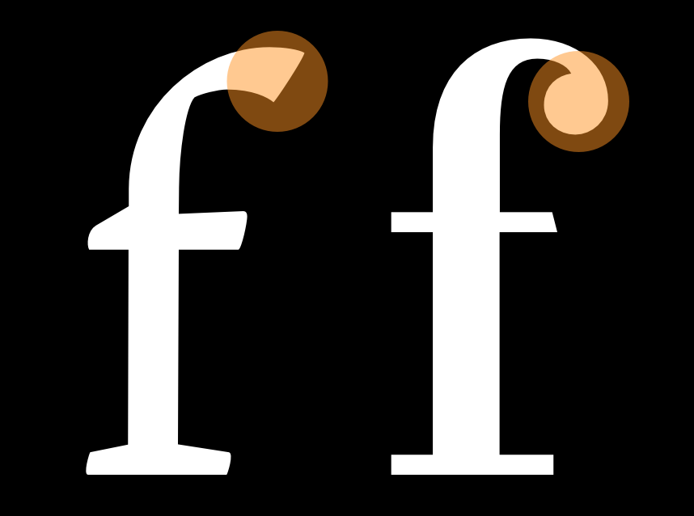

### Velocidad

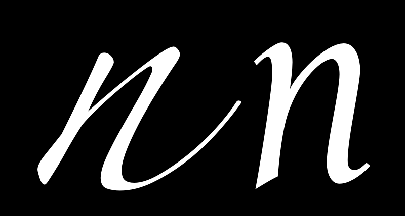

La ‘n’ de la izquierda parece escribirse mucho más rápido que la de la derecha. La velocidad se trata con más detalle en el capítulo [sobre la cursiva].

### Regularidad

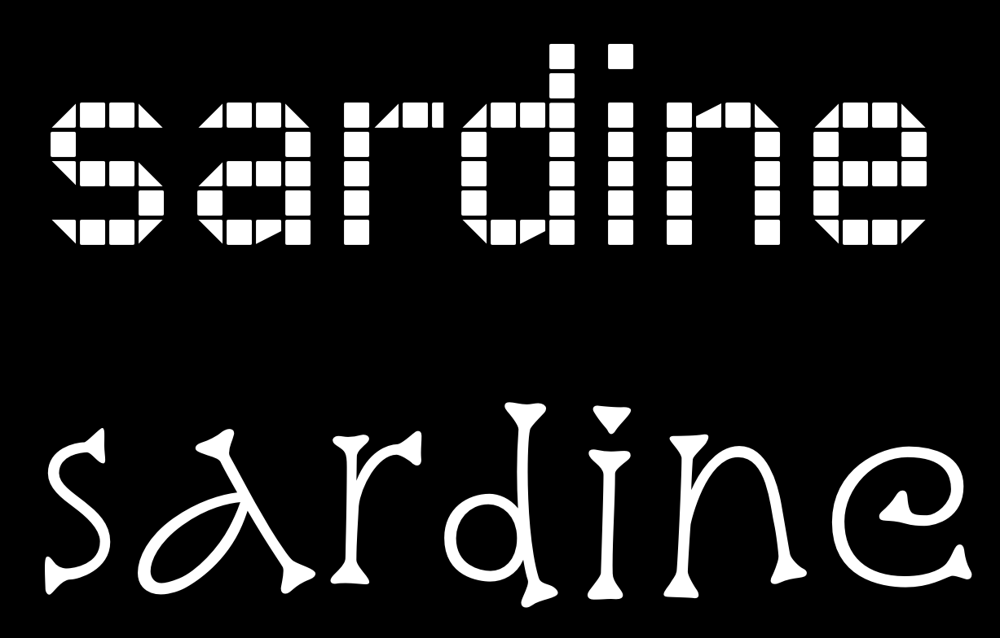

Las siguientes características no están presentes en todos los diseños tipográficos, sin embargo son variables que pueden formar parte de su diseño. Si este es el caso, vale la pena considerar el grado en que desempeñarán un papel como variable.

### Floritura

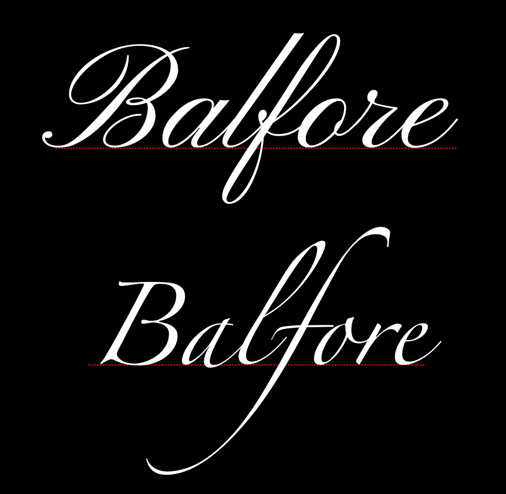

Fíjate que en la fuente de arriba la floritura está más presente en la alta y en la segunda la floritura está más en la baja.

### Serifa - ser o no ser

Las gracias o remates son uno de los aspectos más distintivos de un tipo de letra y, a menudo, la primera clasificación que se hace es entre serifas y san serifas.

Esta elección afecta al aspecto que tendrán los terminales finales. Las serifas pueden tener dos o una cara. Pueden ser perpendiculares al trazo o tener su propia dirección (como ser siempre horizontales o verticales). Las serifas pueden ir con o sin corchetes. Cualquier diseño de serifas es una mezcla de todo lo anterior aplicado de forma coherente al diseño tipográfico con algunas desviaciones para letras concretas, especialmente la ‘S’, ‘C’ y ‘Z’ (por ejemplo, un tipo con remates horizontales para todas las letras tendrá a menudo que la s, la c y la z tengan serifas verticales).

Existe una leyenda urbana que afirma que las tipografías serifas son más fáciles de leer que los san serif &mdash; es [solo un mito](http://asserttrue.blogspot.se/2013/01/the-serif-readability-myth.html), hasta nuevo aviso.

La forma de las serifas está relacionada con las formas de los terminales.

#### Apófige

Las partes de las esquinas de una serifa donde se conecta con el trazo principal se llaman ‘apófiges’. Un diseño concreto puede tenerlos para dar una sensación de suavidad a la serifa ([Times New Roman] es un ejemplo) o puede optar por no tener ningún apófige. Algunos diseños también utilizan apófiges sólo en un lado o con proporciones diferentes en los dos lados.

Se trata de un parámetro relativamente importante que da una sensación al tipo: elegancia (apófiges suaves o grandes de [Times New Roman]) o crespo (ausencia de apófiges de [Arvo]).

#### Serifas slab

También denominadas mecanográficas o egipcias, las fuentes con serifas slab son gruesas. No utilizan apófiges. En general, se considera que los diseños tipográficos con este tipo de serifas tienen menos contraste en sus glifos &mdash; [Rockwell], [Courier] o [American typewriter] lo reflejan.

Se puede suponer que las serifas se han utilizado para añadir ornamento o ritmo a un diseño tipográfico sin contraste. Pero no es una regla absoluta.

#### Terminales con serifas

Al igual que los terminales de las letras, la forma final de las serifas contribuye a la sensación que transmite el tipo de letra, ya sea suave o gruesa. Las terminaciones con serifas pueden ser suaves y redondeadas ([Courier]) o directas y angulosas ([Rockwell]).

### Decoración

Las propias formas de las letras pueden estar decoradas en su interior, o pueden ampliarse con formas decorativas superfluas... ¡o ambas cosas!

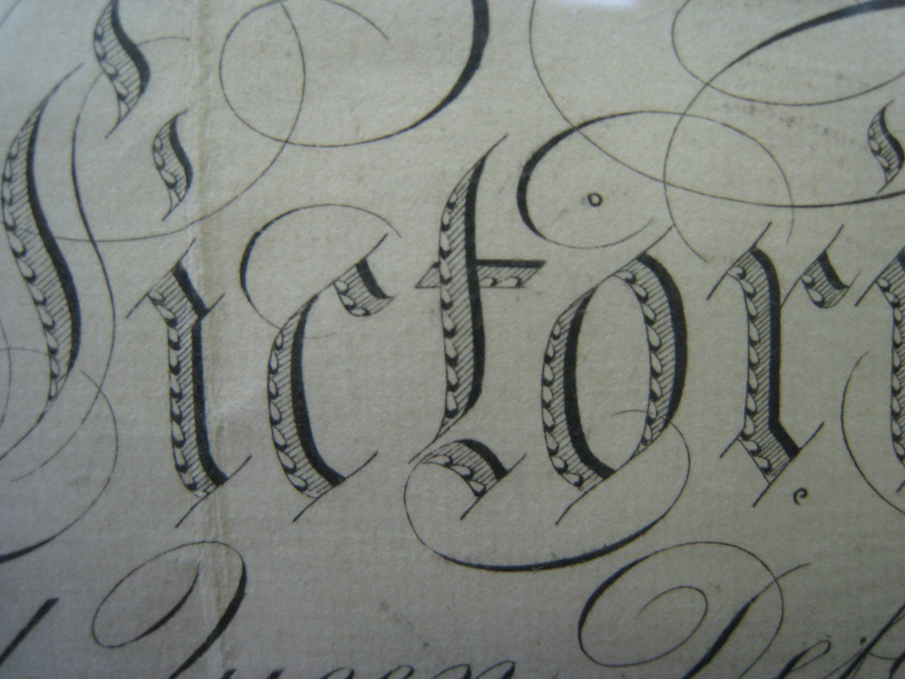

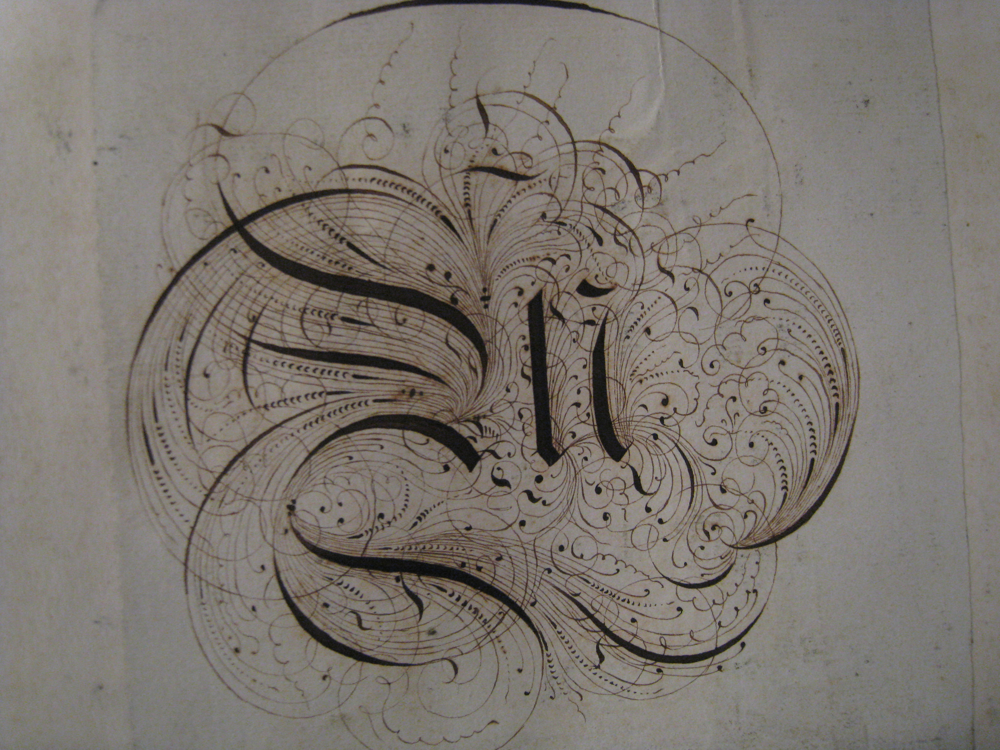

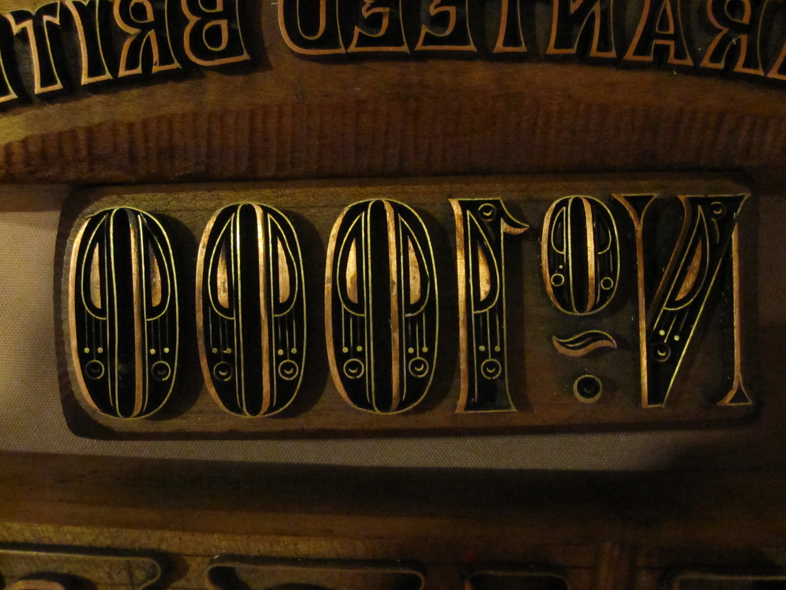

### Dimensión

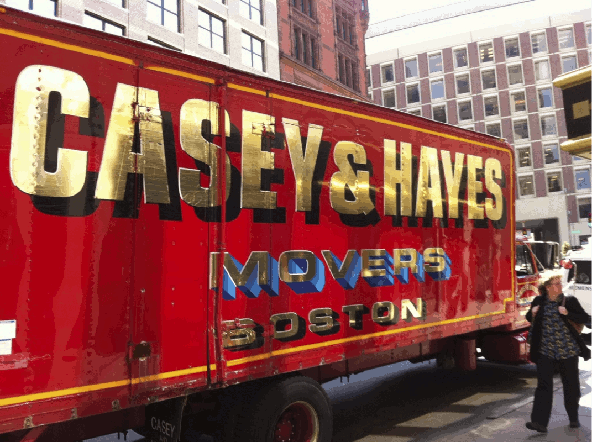

[Playfair Display]: https://www.fontsquirrel.com/fonts/playfair-display
[EB Garamond]: http://www.georgduffner.at/ebgaramond/
[“Confía en tus ojos”]: Trusting_Your_Eyes.html
[sobre la cursiva]: Italic.html
[Times New Roman]: https://practicaltypography.com/a-brief-history-of-times-new-roman.html
[Arvo]: https://fonts.google.com/specimen/Arvo
[Rockwell]: https://en.wikipedia.org/wiki/Rockwell_(typeface)
[Courier]: https://en.wikipedia.org/wiki/Courier_(typeface)
[American typewriter]: https://en.wikipedia.org/wiki/American_Typewriter

